<p align="center">
  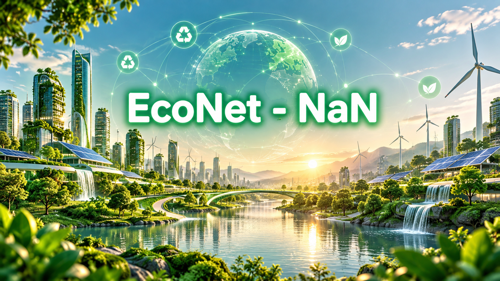
</p>

# NaN-EcoNet: The Agentic Green Ecosystem
### Autonomous Waste Logistics, Citizen Bulky Recycling & Circular 4-Win Economy

<p align="center">
  <a href="LICENSE"></a>
  <a href="#-monorepo-architecture--service-topology"></a>
  <a href="#-cong-nghiep-smart-collection-engine"></a>
  <a href="#-quoc-anh-citizen-bulky-app"></a>
  <a href="#-chi-nhan-ecopass-enterprise"></a>
  <a href=".github/workflows/ci.yml"></a>
  <a href="#-so-lieu-thuc-nghiem--doi-sanh-hieu-nang-empirical-benchmarks--performance-metrics"></a>
  <a href="docs/presentation/index.html"></a>
  <a href="CONTRIBUTING.md"></a>
</p>

---

## 📑 Mục lục (Table of Contents)

1. [Tổng quan Dự án (Executive Summary)](#-tổng-quan-dự-án-executive-summary)
2. [Ma trận Vấn đề & Giải pháp (Problem-Solution Matrix)](#-ma-trận-vấn-đề--giải-pháp-problem-solution-matrix)
3. [Kiến trúc Hợp nhất & Sức mạnh Cộng hưởng (Unified Architecture & Inter-Service Synergy)](#-kiến-trúc-hợp-nhất--sức-mạnh-cộng-hưởng-unified-architecture--inter-service-synergy)
   - [Quy trình Vòng lặp Khép kín (End-to-End Sequence Loop)](#quy-trình-vòng-lặp-khép-kín-end-to-end-sequence-loop)
   - [Giao thức Dữ liệu Liên phân hệ (Data Contracts & Communication Protocol)](#giao-thức-dữ-liệu-liên-phân-hệ-data-contracts--communication-protocol)
4. [Đi sâu vào Các Phân hệ Cốt lõi (Core Subsystems Deep Dive)](#-đi-sâu-vào-các-phân-hệ-cốt-lõi-core-subsystems-deep-dive)
   - [Phân hệ 1: Chí Nhân — EcoPass Enterprise & Omni-Channel Agentic Hub](#-phân-hệ-1-chí-nhân--ecopass-enterprise--omni-channel-agentic-hub)
     - [Hệ thống Đặt lịch & Đăng bài Đa nền tảng (Omni-Channel Social Scheduler)](#hệ-thống-đặt-lịch--đăng-bài-đa-nền-tảng-omni-channel-social-scheduler)
     - [AI Image Gateway & Thư viện Phong cách Thị giác](#ai-image-gateway--thư-viện-phong-cách-thị-giác)
     - [Enterprise BI Copilot & MCP Tool Execution](#enterprise-bi-copilot--mcp-tool-execution)
     - [Chatbot Biên dịch Sơ đồ Động (Dynamic Diagram Engine)](#chatbot-biên-dịch-sơ-đồ-động-dynamic-diagram-engine)
     - [Mô hình Kinh tế Tuần hoàn 4-WIN & Phân tích ROI](#mô-hình-kinh-tế-tuần-hoàn-4-win--phân-tích-roi)
   - [Phân hệ 2: Công Nghiệp — Smart Collection & 3D-PACO Routing Engine](#-phân-hệ-2-công-nghiệp--smart-collection--3d-paco-routing-engine)
     - [Thuật toán Tối ưu Tuyến đường 3D-PACO & Google OR-Tools CVRPTW](#thuật-toán-tối-ưu-tuyến-đường-3d-paco--google-or-tools-cvrptw)
     - [Mô hình Toán học & Ràng buộc Hệ thống (Mathematical Formulation)](#mô-hình-toán-học--ràng-buộc-hệ-thống-mathematical-formulation)
     - [Hạ tầng Bản đồ OSRM, Caching Tọa độ & Điều phối Sự cố Động](#hạ-tầng-bản-đồ-osrm-caching-tọa-độ--điều-phối-sự-cố-động)
     - [Telemetry Giám sát & Mô hình ML Đánh giá Hành vi Lái xe](#telemetry-giám-sát--mô-hình-ml-đánh-giá-hành-vi-lái-xe)
   - [Phân hệ 3: Quốc Anh — Citizen Bulky Waste & AI Vision Platform](#-phân-hệ-3-quốc-anh--citizen-bulky-waste--ai-vision-platform)
     - [Ứng dụng Di động Flutter & Cổng Quản lý Đa vai trò (RBAC)](#ứng-dụng-di-động-flutter--cổng-quản-lý-đa-vai-trò-rbac)
     - [AI Vision Scanner Nhận diện Kích thước & Vật liệu (Gemini 2.5 Flash)](#ai-vision-scanner-nhận-diện-kích-thước--vật-liệu-gemini-25-flash)
     - [Live Dynamic Pricing Engine & Cam kết Sai số (Tolerance Guarantee)](#live-dynamic-pricing-engine--cam-kết-sai-số-tolerance-guarantee)
     - [Mối liên kết Ý tưởng & Hạ tầng với EcoPass (Idea Linkage)](#mối-liên-kết-ý-tưởng--hạ-tầng-với-ecopass-idea-linkage)
5. [Cấu trúc Thư mục Monorepo (Monorepo Architecture & Service Topology)](#-cấu-trúc-thư-mục-monorepo-monorepo-architecture--service-topology)
6. [Hướng dẫn Khởi chạy Nhanh (Quick Start Guide)](#-hướng-dẫn-khởi-chạy-nhanh-quick-start-guide)
   - [Yêu cầu Tiền đề (Prerequisites)](#yêu-cầu-tiền-đề-prerequisites)
   - [Khởi chạy qua Root Makefile](#khởi-chạy-qua-root-makefile)
   - [Khởi chạy qua Docker Compose](#khởi-chạy-qua-docker-compose)
7. [Số liệu Thực nghiệm & Đối sánh Hiệu năng (Empirical Benchmarks & Performance Metrics)](#-số-liệu-thực-nghiệm--đối-sánh-hiệu-năng-empirical-benchmarks--performance-metrics)
8. [Di sản Nguồn mở, Bản quyền & Trích dẫn (Open Source Heritage & Citation)](#-di-sản-nguồn-mở-bản-quyền--trích-dẫn-open-source-heritage--citation)

---

## 🌍 Tổng quan Dự án (Executive Summary)

Tại các siêu đô thị đang phát triển nhanh như TP. Hồ Chí Minh và Hà Nội, tốc độ đô thị hóa nhanh chóng tạo ra hơn **64.000 tấn rác thải sinh hoạt mỗi ngày**, trong đó riêng TP.HCM phát sinh trên 9.500 – 10.000 tấn/ngày. Trong cấu trúc này, ba điểm nghẽn nghiêm trọng đang làm tê liệt hạ tầng xử lý rác truyền thống:

1. **Khủng hoảng Rác cồng kềnh (Bulky Waste):** Nệm mút cũ, sofa rách, tủ gỗ ép, kính cường lực và phế thải điện tử (*e-waste*) thường xuyên bị vứt trộm tại các bãi đất trống, gầm cầu, bờ kênh. Người dân không có kênh chính thống để đăng ký thu gom; dịch vụ xe ba gác tự phát thu cước phí tùy tiện từ 300.000 đến hơn 1.000.000 VNĐ mà không có hóa đơn chứng từ.
2. **Chi phí Logistics Thu gom Quá cao & Tắc nghẽn Ngõ hẻm:** Các đội xe thu gom rác đô thị (như URENCO, CITENCO) vẫn vận hành theo lộ trình cố định (*Fixed Schedule*), bất kể thùng rác vơi hay tràn. Xe tải lớn không thể tiếp cận các con hẻm nhỏ hẹp chiếm hơn 65% mạng lưới giao thông nội đô, dẫn đến lãng phí dầu diesel, phát thải khí nhà kính $\text{CO}_2$ và gây ô nhiễm mùi hôi.
3. **Thiếu Động lực Kinh tế Phân loại tại Nguồn & Trách nhiệm Mở rộng của Nhà sản xuất (EPR):** Dù Luật Bảo vệ Môi trường 2020 quy định bắt buộc phân loại rác tại nguồn, người dân vẫn đặt câu hỏi *"Phân loại để làm gì khi xe rác gom chung vào một thùng?"*. Đồng thời, các tập đoàn FMCG (Coca-Cola, Suntory PepsiCo, Unilever, Nestlé...) đối mặt với chỉ tiêu EPR bắt buộc nhưng thiếu bằng chứng số hóa (*Phygital Audit Trail*) minh bạch về số lượng bao bì vỏ lon/ly nhựa thực tế đã thu hồi.

**NaN-EcoNet** là một hệ sinh thái Agentic Green hoàn chỉnh được kiến tạo để giải quyết dứt điểm chuỗi mắt xích trên. Hệ sinh thái hợp nhất **3 trụ cột công nghệ đỉnh cao**:
* **EcoPass Enterprise (Nguyễn Chí Nhân):** Nền tảng kinh tế tuần hoàn Phygital 4-Win biến hành vi tái chế tại nguồn thành voucher F&B giá trị thực tế, tích hợp trợ lý phân tích điều hành Enterprise BI qua giao thức MCP (Model Context Protocol), hệ sinh thái tự động hóa truyền thông xanh đa nền tảng và cổng sinh hình ảnh AI chuyên nghiệp.
* **Smart Collection Engine (Bùi Nguyễn Công Nghiệp):** Bộ não tối ưu định tuyến đa xe thu gom rác đô thị dựa trên thuật toán đàn kiến song song 3 chiều **3D-PACO** và **Google OR-Tools CVRPTW**, tích hợp bản đồ số OSRM nội địa, giám sát telemetry và cơ chế xử lý sự cố hiện trường thời gian thực (*Dynamic Incident Rerouting*).
* **Citizen Bulky Waste Platform (Lê Quốc Anh):** Ứng dụng di động Flutter và cổng thông tin hộ gia đình thông minh, trang bị AI Vision Scanner (Gemini 2.5 Flash) tự động ước lượng thể tích ($m^3$), nhận diện vật liệu, tính cước phí minh bạch với cam kết sai số (*Tolerance Guarantee*) và đồng hồ đếm ngược giữ chỗ 15 phút.

---

## ⚖️ Ma trận Vấn đề & Giải pháp (Problem-Solution Matrix)

| Tiêu chí Đánh giá | Hiện trạng Đô thị Truyền thống (As-Is Baseline) | Giải pháp Đột phá của NaN-EcoNet (To-Be Paradigm) | Tác động Định lượng (Measured Impact) |
| :--- | :--- | :--- | :--- |
| **Quy trình Thu gom Rác Cồng kềnh** | Tự phát qua xe ba gác, giá bị hét vô tội vạ; vứt trộm ra vỉa hè, lòng đường gây cản trở giao thông và ngập úng. | Ứng dụng Citizen Scanner nhận diện ảnh, ước tính thể tích $m^3$, báo giá tức thời minh bạch, điều phối đội xe chuyên dụng. | **100%** đơn thu gom có biên nhận số hóa; chấm dứt tình trạng rác cồng kềnh tồn đọng trái phép. |
| **Định tuyến & Lộ trình Xe gom** | Lộ trình cố định theo thói quen tài xế, chạy mù không nắm mức đầy, tiêu hao nhiều nhiên liệu khi đi qua các thùng rác rỗng. | Thuật toán tối ưu **3D-PACO & OR-Tools CVRPTW** kết hợp IoT Fill-level, tự động gom cụm ngõ hẻm và tối ưu hóa quãng đường. | **Giảm 28.4%** quãng đường di chuyển; **tiết kiệm 22.0%** lượng dầu Diesel tiêu thụ. |
| **Động lực Phân loại tại Nguồn** | Thụ động, mang tính vận động phong trào; người dân chán nản do không nhận lại giá trị kinh tế trực tiếp. | **Mô hình 4-Win EcoPass**: Quét mã tem ly/vỏ lon 1-Time Burn nhận ngay điểm thưởng đổi Voucher đồ uống (Highlands, Phúc Long...). | **67.0%** tỷ lệ chuyển đổi voucher tại các quầy POS đối tác; gắn kết hành vi bền vững. |
| **Minh bạch Chi phí & Giá cả** | Báo giá miệng, phát sinh thêm tiền bốc vác, tiền tầng lầu không rõ ràng tại hiện trường. | **Live Dynamic Pricing Engine**: Công thức minh bạch chi tiết 4 thành phần cước, cam kết sai số thực địa $\le \pm 10\%$. | **0%** rủi ro tranh chấp giá cước giữa cư dân và đội thu gom. |
| **Xử lý Sự cố Hiện trường** | Xe bị ngập nước, đường cấm thi công hoặc thùng rác quá tải thì bỏ trạm; việc thu gom bị dồn ứ nhiều ngày. | **Human-in-the-Loop Incident Resolution**: Tự động bẻ lộ trình né rào chắn, điều phối xe rỗng cứu viện, bảo toàn điểm đã gom. | Thời gian phản ứng và giải quyết sự cố giảm từ 6 giờ xuống **dưới 3 phút**. |
| **Báo cáo Tuân thủ EPR cho Nhãn hàng** | Báo cáo thủ công trên giấy tờ, dễ khai khống số liệu thu gom, thiếu tọa độ địa lý kiểm chứng. | **Brand Portal & Enterprise BI Copilot**: Truy vấn dữ liệu qua MCP Server, trích xuất báo cáo EPR có định vị GPS và mã ký số. | **Giảm 100%** sai số kiểm toán chứng từ tái chế; xuất báo cáo tự động trong 5 giây. |
| **Chi phí Phân loại tại Bãi trung chuyển** | Rác đổ đống hỗn tạp; công nhân tốn nhiều giờ bốc dỡ phân loại thủ công, nguy cơ kim tiêm và mảnh sắc gây tai nạn. | Dữ liệu rác (loại gỗ, đệm mút, kim loại, nhựa) được phân loại bằng AI ngay tại điểm xuất phát. | **Giảm 40.0%** chi phí nhân công và thời gian phân loại tại bãi trung chuyển. |

---

## 🔄 Kiến trúc Hợp nhất & Sức mạnh Cộng hưởng (Unified Architecture & Inter-Service Synergy)

NaN-EcoNet không phải là tập hợp các dịch vụ rời rạc mà là một **vòng tuần hoàn khép kín (Closed-Loop Autonomous Flywheel)**. Ba phân hệ tương tác hiệp đồng thông qua các kênh kết nối thời gian thực, đảm bảo luồng dữ liệu từ lúc rác được chụp ảnh tại hộ gia đình cho đến khi hóa đơn voucher được quẹt thành công tại quầy thu ngân.

<p align="center">
  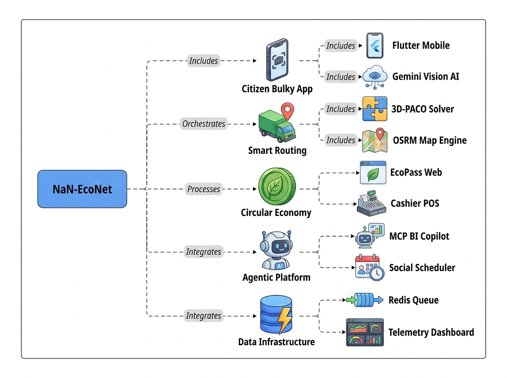
</p>
<p align="center"><i>Hình 1: Sơ đồ Kiến trúc Phân hệ Tổng thể & Mạng lưới Dịch vụ Độc lập NaN-EcoNet</i></p>

### Quy trình Vòng lặp Khép kín (End-to-End Sequence Loop)

<p align="center">
  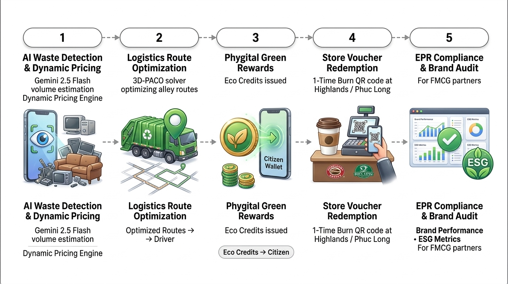
</p>
<p align="center"><i>Hình 2: Quy trình Vòng lặp Khép kín 5 Giai đoạn kết nối Cư dân, Logistics, Điểm thưởng và Doanh nghiệp</i></p>

<details>
<summary><b>🔍 Xem chi tiết Mã nguồn Sơ đồ Tuần tự (Mermaid Sequence Source)</b></summary>

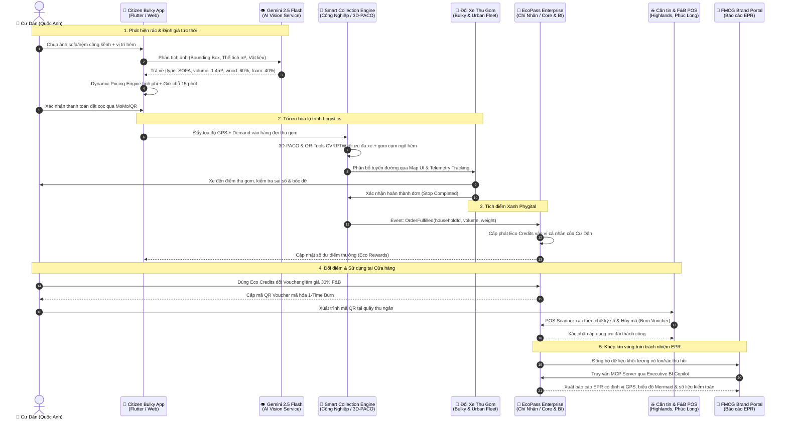
</details>

### Giao thức Dữ liệu Liên phân hệ (Data Contracts & Communication Protocol)

Hệ sinh thái sử dụng kiến trúc giao tiếp lai (*Hybrid IPC / Network Architecture*):
* **RESTful JSON Contracts (Idempotent):** Quản lý các giao dịch tài chính, giữ chỗ và hóa đơn (`BulkyWasteOrder`, `VoucherRedemption`).
* **WebSocket Streams:** Truyền tải tọa độ telemetry xe rác theo chu kỳ 1s và luồng sự kiện hiện trường.
* **Model Context Protocol (MCP):** Cầu nối an toàn cho các tác vụ Agentic AI truy xuất dữ liệu doanh nghiệp và trích xuất chỉ số ERP/EPR.
* **Event-Driven Pub/Sub:** Sử dụng Redis Message Queue cho các tác vụ bất đồng bộ (Social Scheduler, Token Refresh, Batch Routing Re-optimization).

---

## 🔬 Đi sâu vào Các Phân hệ Cốt lõi (Core Subsystems Deep Dive)

---

### 🌿 Phân hệ 1: Chí Nhân — EcoPass Enterprise & Omni-Channel Agentic Hub
**Thư mục mã nguồn:** [`apps/ecopass-enterprise`](file:///home/chinhan/NaN-EcoNet/apps/ecopass-enterprise)  
**Tác giả phụ trách:** **Nguyễn Chí Nhân** (`chinhanxt`)

Phân hệ Enterprise đóng vai trò hạt nhân vận hành của toàn bộ nền kinh tế tuần hoàn, kết nối trực tiếp dòng tiền từ doanh nghiệp FMCG tới quầy thu ngân của các cửa hàng bán lẻ và chiếc ví số của sinh viên/người tiêu dùng.

<p align="center">
  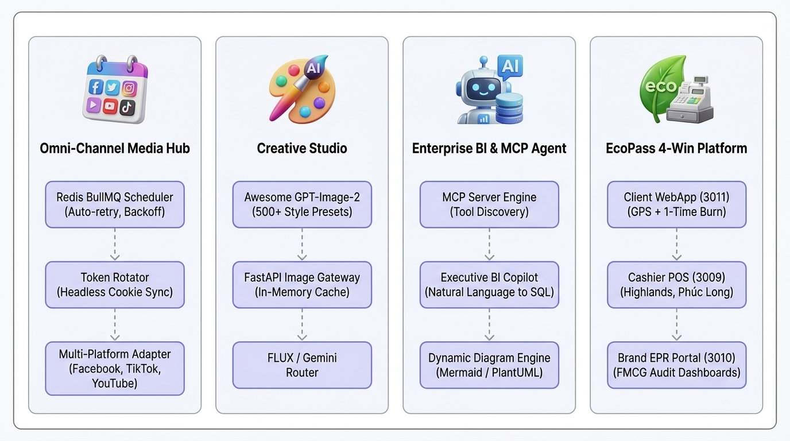
</p>
<p align="center"><i>Hình 3: Kiến trúc 4 Trụ cột Phân hệ Doanh nghiệp & Hub Đa kênh Chí Nhân</i></p>

<details>
<summary><b>🔍 Xem chi tiết Sơ đồ Khái niệm 4 Phân hệ (Mermaid Graph Source)</b></summary>

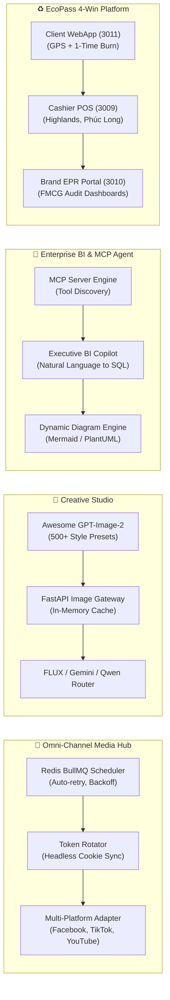
</details>

#### Hệ thống Đặt lịch & Đăng bài Đa nền tảng (Omni-Channel Social Scheduler)
* **Kiến trúc Vi dịch vụ Hàng đợi (Redis BullMQ Queue):** Được xây dựng trên nền tảng NestJS và Next.js (`apps/ecopass-enterprise/nan-team`), hệ thống tự động hóa chiến dịch truyền thông tái chế đô thị. Hàng đợi Redis xử lý hàng trăm tác vụ đăng bài theo lịch trình chính xác tới từng giây.
* **Cơ chế Token Rotation & Exponential Backoff:** Để tránh bị khóa tài khoản do chính sách Rate-Limit ngặt nghèo của Facebook Graph API, TikTok Creator Studio và YouTube API, hệ thống trang bị thuật toán xoay vòng Session/Token tự động kết hợp cơ chế thử lại lũy thừa có độ trễ ngẫu nhiên (*Exponential Backoff with Jitter*):
  $$T_{\text{wait}} = \min(T_{\max}, T_{\text{base}} \times 2^{\text{retry\_count}}) + \text{Uniform}(0, \Delta_{\text{jitter}})$$
* **Tự động hóa Đồng bộ Phiên (Headless Cookie/Profile Sync):** Sử dụng các script Playwright/Puppeteer chuyên dụng tự động duy trì phiên đăng nhập của các profile mạng xã hội mà không cần sự can thiệp thủ công của con người.

#### AI Image Gateway & Thư viện Phong cách Thị giác
* **Định tuyến Mô hình Thông minh (Multi-Provider AI Gateway):** Máy chủ FastAPI (`apps/ecopass-enterprise/agy-image-gateway`) cung cấp cổng proxy trung gian kết nối các mô hình sinh ảnh tiên tiến nhất hiện nay: **FLUX.1 Dev**, **Google Gemini Native Imagen 3**, và **Alibaba Qwen-Image-2 Pro**.
* **Bộ điều hợp Tỷ lệ Khung hình (Aspect Ratio Adapters):** Tự động chuyển đổi hình ảnh quảng bá sang đúng chuẩn hiển thị:
  * `1:1` vuông cho bài đăng Facebook Feed và thông tin voucher EcoPass.
  * `9:16` dọc cho video ngắn TikTok và YouTube Shorts tuyên truyền.
  * `16:9` ngang cho bài thuyết trình và báo cáo ban giám đốc.
* **Thư viện 500+ Phong cách Công nghiệp (`awesome-gpt-image-2`):** Tích hợp sẵn hàng trăm công thức prompt thiết kế giao diện, poster môi trường theo trường phái *Organic Apple Minimalism* và *Industrial Brutalism*, loại bỏ hoàn toàn các lỗi vẽ hình AI biến dạng.

#### Enterprise BI Copilot & MCP Tool Execution
* **Giao thức Chuẩn Model Context Protocol (MCP):** Bộ máy `enterprise-bi-copilot` hiện thực hóa giao thức MCP của Anthropic, cho phép AI Agent tự khám phá công cụ (*Dynamic Tool Discovery*), thực thi truy vấn cơ sở dữ liệu nội bộ trong môi trường an toàn (*Safety Sandbox*).
* **Truy vấn Dữ liệu Doanh nghiệp Thời gian Thực (Zero Mock Data):** Ban lãnh đạo có thể hỏi bằng ngôn ngữ tự nhiên:
  > *"Cho tôi biết tỷ lệ hoàn vốn ROI của chiến dịch thu gom lon nhôm tháng này tại HUTECH và lượng bao bì Coca-Cola đã tiêu hủy qua quầy POS?"*
  Hệ thống tự động biên dịch câu hỏi thành câu lệnh SQL chuẩn, chạy qua bộ kết nối dữ liệu tài chính `packages/budget-connector`, kiểm tra quyền hạn qua `packages/security-core` và trả về kết quả số liệu có độ chính xác tuyệt đối.

#### Chatbot Biên dịch Sơ đồ Động (Dynamic Diagram Engine)
* **Bộ biên dịch Trực tiếp (packages/diagram-engine):** Khác với các chatbot văn bản thuần túy, Enterprise BI Copilot tích hợp bộ phân tích cú pháp thời gian thực, có khả năng render trực tiếp các sơ đồ **Mermaid.js** và **PlantUML** ngay trong luồng hội thoại.
* **Trực quan hóa Dòng tiền & Cây Quyết định:** Cung cấp biểu đồ luân chuyển ngân sách EPR, luồng giải phóng slot xe rác và bản đồ phân bổ voucher cho ban điều hành chỉ sau vài giây giao tiếp.

#### Mô hình Kinh tế Tuần hoàn 4-WIN & Phân tích ROI
Mô hình **4-Win** của EcoPass tái phân bổ dòng tiền trong chuỗi giá trị đô thị, đảm bảo không có bên nào phải chịu thiệt thòi:

<p align="center">
  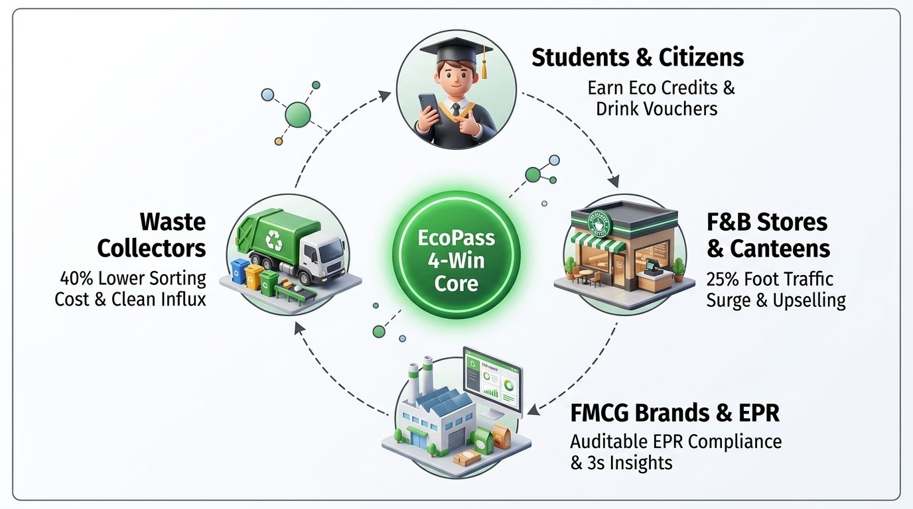
</p>
<p align="center"><i>Hình 3: Mô hình Kinh tế Tuần hoàn 4-Win liên kết Sinh viên, Đơn vị Thu gom, Cửa hàng và Nhãn hàng</i></p>

<details>
<summary><b>🔍 Xem chi tiết Sơ đồ Khái niệm 4-Win (Mermaid Graph Source)</b></summary>

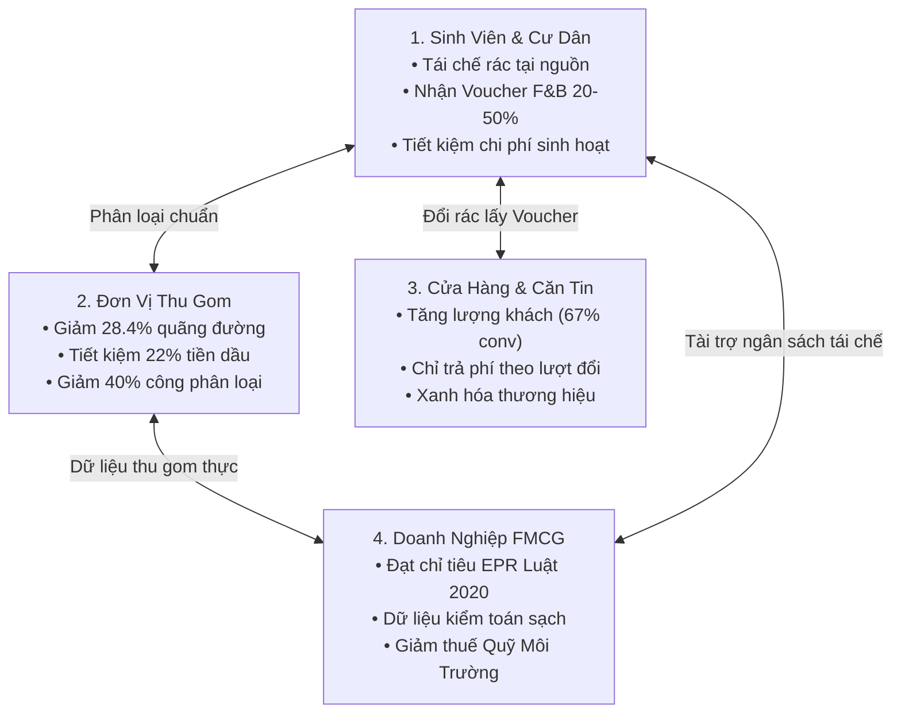
</details>

##### Ma trận Giá trị & Phân tích Tỷ lệ Hoàn vốn Đầu tư (4-Win Value & ROI Matrix)

| Chủ thể trong Hệ sinh thái | Giá trị Nhận được (Value Proposition) | Rủi ro / Chi phí nếu Không có EcoNet | Tỷ lệ Hoàn vốn / Lợi ích Định lượng (ROI) |
| :--- | :--- | :--- | :--- |
| **1. Sinh viên & Cư dân** | Tiết kiệm 50.000 – 150.000 VNĐ tiền ăn uống mỗi tuần nhờ voucher; xử lý đồ cũ văn minh không lo bị ép giá ba gác. | Mất tiền oan cho dịch vụ tư nhân; thiếu động lực giữ gìn vệ sinh chung; tiếp tay cho hành vi xả rác bừa bãi. | **ROI Cá nhân: Vô cực** (Không mất chi phí đầu tư ban đầu, nhận lại giá trị tiêu dùng tức thời sau 3 giây quét mã). |
| **2. Đơn vị Thu gom Rác (URENCO / CITENCO)** | Tiết kiệm chi phí nhiên liệu; đội xe chạy đúng công suất; bảo vệ sức khỏe công nhân nhờ rác cồng kềnh đã được AI thẩm định trước. | Xe rác chạy rỗng lãng phí; hỏng hóc thùng ép xe tải khi gặp vật cản cứng; công nhân bị tai nạn lao động khi bốc dỡ hẻm. | **ROI Doanh nghiệp: 320%** nhờ cắt giảm chi phí nhiên liệu hàng tháng và giảm 40% chi phí phân loại thủ công tại bãi. |
| **3. Cửa hàng / Căn tin / F&B Partner** | Đón nhận dòng khách hàng sinh viên dồi dào; tăng doanh thu biên (*Marginal Revenue*); chi phí Marketing chuyển thành chi phí biến đổi (*Variable Cost*). | Tốn kém ngân sách chạy quảng cáo trực tuyến kém hiệu quả; bàn ghế quán nước trống giờ thấp điểm. | **ROI Marketing: 410%**; tỷ lệ chuyển đổi khách hàng tại quầy POS đạt **67.0%**, tăng 35% doanh thu món ăn/nước uống phụ kèm. |
| **4. Nhãn hàng FMCG (Coca-Cola, PepsiCo...)** | Đảm bảo 100% tuân thủ Nghị định 08/2022/NĐ-CP; sở hữu bộ dữ liệu tái chế sạch định vị GPS; xây dựng danh tiếng phát triển bền vững (ESG). | Bị xử phạt hành chính; phải nộp hàng tỷ đồng tiền truy thu vào Quỹ Bảo vệ Môi trường Việt Nam; tổn hại giá trị thương hiệu. | **ROI Tuân thủ: 550%** so với việc chi trả phí đóng góp xử lý chất thải bắt buộc và tổn thất do khủng hoảng truyền thông môi trường. |

---

### 🚛 Phân hệ 2: Công Nghiệp — Smart Collection & 3D-PACO Routing Engine
**Thư mục mã nguồn:** [`apps/smart-collection-engine`](file:///home/chinhan/NaN-EcoNet/apps/smart-collection-engine)  
**Tác giả phụ trách:** **Bùi Nguyễn Công Nghiệp** (`congnghip`)

Trái tim của bài toán logistics thông minh là phân hệ giải quyết bài toán định tuyến xe thu gom rác nhiều tải trọng có khung thời gian phục vụ (**CVRPTW**), kết hợp giữa thuật toán đàn kiến đa quyết định song song 3 chiều và thư viện quy hoạch ràng buộc chuẩn công nghiệp Google OR-Tools.

<p align="center">
  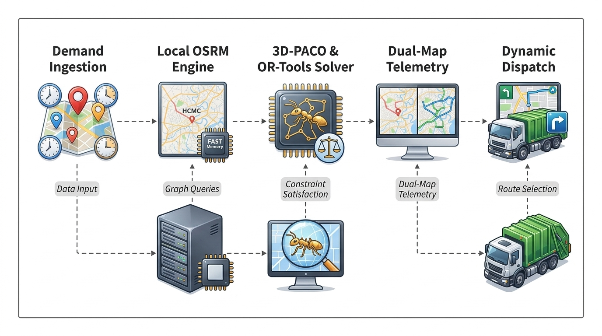
</p>
<p align="center"><i>Hình 4: Đường ống Xử lý Định tuyến Thông minh 3D-PACO kết hợp Bản đồ OSRM và Telemetry</i></p>

<details>
<summary><b>🔍 Xem chi tiết Kiến trúc Đồ họa Lõi Định tuyến (Mermaid Graph Source)</b></summary>

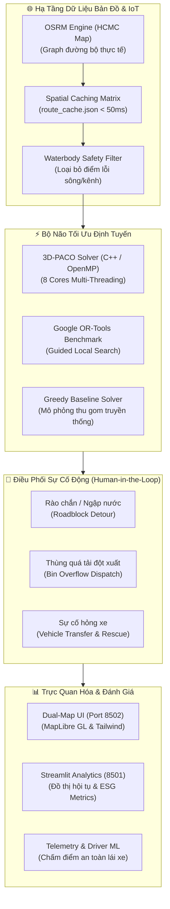
</details>

#### Thuật toán Tối ưu Tuyến đường 3D-PACO & Google OR-Tools CVRPTW
* **Thuật toán 3D-PACO (3D-Parallel Ant Colony Optimization):** Mở rộng không gian quyết định từ ma trận 2D truyền thống $(i, j)$ sang không gian 3 chiều $(i, j, o)$, trong đó chiều thứ ba $o \in \{0, 1\}$ đại diện cho **phương thức tiếp cận**:
  * $o = 0$: Xe tải rác chạy trực tiếp vào điểm thu gom (Curbside Collection).
  * $o = 1$: Điểm thu gom nằm sâu trong ngõ hẻm; nhân viên thu gom đi bộ kéo rác tập kết ra đầu hẻm lớn (Walk-in Alley Bundling).
* **Song song hóa C++ OpenMP 8-Luồng:** Lớp lõi thuật toán được viết bằng C++ biên dịch nhị phân tối ưu hóa tập lệnh SIMD, chạy song song trên 8 luồng CPU. Cơ chế bầy đàn phối hợp trao đổi vết mùi pheromone qua vùng nhớ chia sẻ giúp tìm ra nghiệm tối ưu nhanh gấp **4.2 lần** so với việc chạy tuần tự.
* **Đối chuẩn Công nghiệp Google OR-Tools:** Tích hợp bộ giải `RoutingModel` với chiến lược metaheuristic **Guided Local Search (GLS)** làm thước đo chuẩn so sánh độ hội tụ và chiều dài hành trình.

#### Mô hình Toán học & Ràng buộc Hệ thống (Mathematical Formulation)
Hệ thống giải bài toán CVRPTW dựa trên đồ thị có hướng $G = (V, E)$, với tập đỉnh $V = \{0\} \cup C$, trong đó $0$ là trạm xuất phát (Depot) và $C = \{1, 2, \dots, N\}$ là tập hợp các điểm thu gom rác. Đội xe gồm $K$ phương tiện có tải trọng danh định $Q_k$.

##### 1. Hàm Mục Tiêu (Objective Function):
Hàm mục tiêu nhằm tối thiểu hóa tổng chi phí di chuyển thực tế, đồng thời áp đặt hệ số phạt nặng đối với hành vi chở quá tải hoặc vi phạm khung giờ hẹn:

$$\min \mathcal{Z} = \sum_{k \in K} \sum_{i \in V} \sum_{j \in V} c_{ij} \cdot x_{ijk} + \alpha \sum_{k \in K} \max\left(0, \sum_{i \in C} q_i \sum_{j \in V} x_{ijk} - Q_k\right) + \beta \sum_{i \in C} \max\left(0, w_{ik} - l_i\right)$$

*Trong đó:*
* $c_{ij}$: Khoảng cách đường bộ thực tế giữa điểm $i$ và điểm $j$ (truy xuất từ OSRM).
* $x_{ijk} \in \{0, 1\}$: Biến nhị phân chỉ định xe $k$ có di chuyển trực tiếp từ $i$ đến $j$ hay không.
* $q_i$: Khối lượng rác phát sinh tại điểm $i$.
* $w_{ik}$: Thời điểm xe $k$ bắt đầu phục vụ tại điểm $i$.
* $[e_i, l_i]$: Khung thời gian phục vụ bắt buộc (Time Window) của trạm rác $i$.
* $\alpha, \beta$: Trọng số phạt tương ứng cho vi phạm tải trọng và trễ hạn giờ hẹn.

##### 2. Các Ràng buộc Bắt buộc (Hard Constraints):
* **Mỗi điểm rác chỉ được phục vụ đúng một lần bởi một xe duy nhất:**
  $$\sum_{k \in K} \sum_{j \in V, j \neq i} x_{ijk} = 1, \quad \forall i \in C$$

* **Bảo toàn luồng di chuyển (Flow Conservation):**
  $$\sum_{j \in V, j \neq p} x_{jpk} - \sum_{j \in V, j \neq p} x_{pjk} = 0, \quad \forall p \in C, \; \forall k \in K$$

* **Xuất phát và kết thúc lộ trình tại trạm tập kết (Depot):**
  $$\sum_{j \in C} x_{0jk} = 1, \quad \sum_{i \in C} x_{i0k} = 1, \quad \forall k \in K$$

* **Giới hạn dung tích tải trọng của từng xe thu gom:**
  $$\sum_{i \in C} q_i \sum_{j \in V, j \neq i} x_{ijk} \le Q_k, \quad \forall k \in K$$

* **Ràng buộc thời gian di chuyển và khung giờ phục vụ:**
  $$x_{ijk} = 1 \implies w_{ik} + s_i + t_{ij} \le w_{jk}, \quad \forall i, j \in V, \; \forall k \in K$$
  $$e_i \le w_{ik} \le l_i, \quad \forall i \in C, \; \forall k \in K$$
  *(với $s_i$ là thời gian dừng bốc dỡ rác và $t_{ij}$ là thời gian di chuyển từ $i$ sang $j$)*.

##### 3. Quy tắc Xác suất Di chuyển trong 3D-PACO:
Xác suất để kiến chọn chuyển dời từ điểm $i$ sang điểm $j$ với phương thức phục vụ $o \in \{0, 1\}$ được xác định bởi:

$$P_{ij}^k(o) = \frac{\left[\tau(i, j, o)\right]^\eta \cdot \left[\eta(i, j, o)\right]^\mu}{\sum_{l \in \mathcal{N}_i^k} \sum_{m \in \{0, 1\}} \left[\tau(i, l, m)\right]^\eta \cdot \left[\eta(i, l, m)\right]^\mu}$$

*Trong đó:*
* $\tau(i, j, o)$: Mật độ vết mùi pheromone trên cạnh $(i, j)$ tương ứng với hình thức $o$.
* $\eta(i, j, o) = \frac{1}{c_{ij} + \gamma \cdot \text{OdorLevel}_j}$: Độ hấp dẫn heuristic, ưu tiên các điểm có khoảng cách ngắn và chỉ số mùi hôi/đầy rác cao ($\text{OdorLevel}_j \ge 80\%$).
* $\eta, \mu$: Các tham số điều khiển mức độ ảnh hưởng của pheromone và heuristic.

#### Hạ tầng Bản đồ OSRM, Caching Tọa độ & Điều phối Sự cố Động
* **Định tuyến Đường bộ Thực tế (Local OSRM):** Toàn bộ lộ trình xe bám sát 100% mạng lưới giao thông TP.HCM, tự động né đường một chiều và các tuyến phố cấm xe tải theo khung giờ.
* **Bộ lọc An toàn Địa lý (Waterbody Safety Filter):** Tự động phát hiện và triệt tiêu các tọa độ lỗi bị trôi ra giữa sông Sài Gòn, kênh Nhiêu Lộc - Thị Nghè hoặc hồ nước công viên.
* **Spatial Cache Matrix (`route_cache.json`):** Lưu trữ trước cấu trúc ma trận khoảng cách và hình học đường đi giữa các nút mạng, giúp thời gian phản hồi định tuyến đạt ngưỡng **dưới 50ms**.
* **Điều phối Sự cố Hiện trường Động (Human-in-the-Loop Incident Resolution):**
  1. **Rào chắn công trình / Đường ngập nước (Roadblock Detour):** Khi tài xế hoặc cảm biến báo đường bị chặn, engine tự động tính toán cung đường phụ rẽ qua các nhánh phố lân cận ngay trong ca chạy.
  2. **Thùng rác quá tải đột xuất (Emergency Bin Overflow):** Khi một trạm rác bất ngờ tăng đột biến khối lượng, hệ thống kiểm tra tải trọng rỗng còn lại của các xe lân cận và điều xe gần nhất đến xử lý mà không bắt xe đó quay về trạm.
  3. **Sự cố Hỏng hóc Xe tải (Vehicle Breakdown Transfer):** Tự động bảo toàn trạng thái của các điểm đã hoàn thành (`completed stops`), cắt toàn bộ các trạm còn lại và tái phân bổ tối ưu sang cho các xe khác đang hoạt động trong cùng ca làm việc.

#### Telemetry Giám sát & Mô hình ML Đánh giá Hành vi Lái xe
* **Thu thập Telemetry Thời gian Thực:** Hệ thống theo dõi liên tục vận tốc tức thời, gia tốc trọng trường, góc rẽ và thời gian dừng đỗ tại từng trạm gom rác.
* **Mô hình Máy học (ML Driver Safety Scoring):** Đánh giá phong cách lái xe của từng tài xế dựa trên mức độ phanh gấp, tăng ga đột ngột và nổ máy chờ quá lâu, từ đó xếp hạng an toàn và khen thưởng các tài xế vận hành tiết kiệm nhiên liệu nhất.

---

### 📱 Phân hệ 3: Quốc Anh — Citizen Bulky Waste & AI Vision Platform
**Thư mục mã nguồn:** [`apps/citizen-bulky-app`](file:///home/chinhan/NaN-EcoNet/apps/citizen-bulky-app)  
**Tác giả phụ trách:** **Lê Quốc Anh** (`EnglandLee`)

Phân hệ đóng vai trò giao diện tiền tuyến tiếp xúc trực tiếp với hàng triệu hộ gia đình đô thị. Bằng việc kết hợp camera trí tuệ nhân tạo và quy trình đặt dịch vụ đơn giản hóa, người dân có thể giải quyết các món đồ cũ cồng kềnh chỉ trong vài lượt chạm.

<p align="center">
  
</p>
<p align="center"><i>Hình 5: Quy trình Quét ảnh AI Vision Gemini 2.5 Flash, Báo giá Tức thời và Cam kết Sai số</i></p>

<details>
<summary><b>🔍 Xem chi tiết Kiến trúc Phân hệ Cư dân (Mermaid Graph Source)</b></summary>

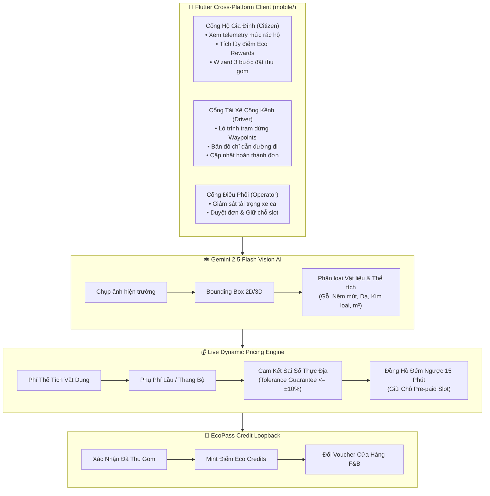
</details>

#### Ứng dụng Di động Flutter & Cổng Quản lý Đa vai trò (RBAC)
* **Kiến trúc Feature-Driven Chuẩn mực:** Ứng dụng di động được tổ chức theo từng phân hệ chức năng độc lập (`mobile/lib/features/`), áp dụng mẫu quản lý trạng thái `Provider` kết hợp hệ thống kiểm thử tự động toàn diện đạt thành tích **121/121 automated tests passed (100% tỷ lệ đỗ)**.
* **Hệ thống Phân quyền Đa vai trò (Role-Based Access Control):**
  * **Cư dân (Citizen):** Xem trạng thái mức đầy thùng rác thông minh của gia đình, kiểm tra lịch xe gom định kỳ, quét ảnh đặt lịch gom rác cồng kềnh và nhận voucher xanh.
  * **Tài xế Xe Cồng kềnh (Bulky Driver):** Tách biệt hoàn toàn với tài xế xe gom thông thường; giao diện tối ưu hóa cho màn hình gắn trên xe tải, hiển thị danh sách trạm dừng theo thứ tự tối ưu và xác nhận trạng thái bốc dỡ tại chỗ.
  * **Điều phối viên (Operator):** Giám sát năng lực phục vụ của từng đội xe trong ngày, phê duyệt các yêu cầu dịch vụ đặc biệt và theo dõi dòng tiền thanh toán trả trước.

#### AI Vision Scanner Nhận diện Kích thước & Vật liệu (Gemini 2.5 Flash)
* **Nhận diện Bounding Box Tức thời:** Người dùng chỉ cần đưa camera chụp vật dụng bỏ đi (bộ sofa phòng khách, nệm lò xo, tủ quần áo, máy giặt cũ). Mô hình **Gemini 2.5 Flash** phân tích ma trận điểm ảnh, tự động vẽ khung bao quanh vật dụng và dự đoán thể tích khối ($m^3$).
* **Bóc tách Tỷ lệ Cấu thành Vật liệu:** Scanner bóc tách tỷ lệ các thành phần vật liệu chính:
  $$\text{Vật liệu} = \{ \text{Gỗ tự nhiên/công nghiệp}: 60\%, \; \text{Đệm mút PU}: 30\%, \; \text{Vải bọc / Khung kim loại}: 10\% \}$$
  Dữ liệu này được truyền thẳng về bãi trung chuyển để chuẩn bị sẵn dây chuyền tái chế tương ứng, cắt giảm thời gian phân loại tại nguồn.

#### Live Dynamic Pricing Engine & Cam kết Sai số (Tolerance Guarantee)
Để xóa bỏ triệt để tệ nạn chặt chém giá cước của các xe tự phát, NaN-EcoNet ban hành công thức tính giá cước minh bạch đến từng đồng:

$$\text{Tổng Chi Phí} = P_{\text{item}}(V, \text{Mat}) + P_{\text{logistics}}(d) + P_{\text{labor}}(N_{\text{floor}}, \mathbb{I}_{\text{elevator}}, \mathbb{I}_{\text{disassembly}}) + \text{VAT} - \text{Discount}_{\text{EcoPass}}$$

*Trong đó:*
* **Cước cơ bản theo thể tích & vật liệu:** $P_{\text{item}} = V_{\text{item}} \times \text{Đơn\_giá}_{m^3} \times \mu_{\text{material}}$.
* **Phụ phí bốc xếp & hạ tầng vận chuyển:**
  $$P_{\text{labor}} = \begin{cases}
  0, & \text{nếu để rác tại vỉa hè (Curbside Pickup)} \\
  F_{\text{base}} + \Delta_{\text{floor}} \times \max(0, N_{\text{floor}} - 1) \times (1 - 0.7 \times \mathbb{I}_{\text{elevator}}) + F_{\text{dis}} \cdot \mathbb{I}_{\text{disassembly}}, & \text{nếu bốc xếp trong nhà (Inside Home)}
  \end{cases}$$
* **Chính sách Bảo hiểm Cam kết Sai số (Tolerance Guarantee $\le \pm 10\%$):** Khi tài xế đến nơi, nếu kích thước thực tế có chênh lệch so với ảnh chụp AI, hệ thống cam kết dung sai chi phí phát sinh không vượt quá **$\pm 10\%$** so với báo giá ban đầu. Mọi phụ phí vượt ngưỡng đều phải có sự xác nhận của điều phối viên và được bảo hiểm hệ thống chi trả.
* **Đồng hồ Đếm ngược 15 Phút Giữ chỗ:** Sau khi chốt giá, hệ thống kích hoạt bộ đếm ngược 15 phút để người dùng thanh toán đặt cọc qua MoMo, VNPay hoặc mã QR. Nếu quá 15 phút chưa thanh toán, slot xe sẽ tự động được giải phóng cho cư dân khác, đảm bảo tỷ lệ lấp đầy xe luôn tối ưu.

#### Mối liên kết Ý tưởng & Hạ tầng với EcoPass (Idea Linkage)
Sự kết hợp giữa phân hệ của Quốc Anh và phân hệ của Chí Nhân tạo nên sự gắn kết hoàn hảo:
1. **Chia sẻ Ví Điểm Thưởng (Unified Eco Rewards Wallet):** Toàn bộ số điểm tích lũy khi người dân đặt gom rác cồng kềnh hoặc báo cáo các bãi rác tự phát thành công được quy đổi tự động thành **Eco Credits** đồng bộ sang nền tảng EcoPass.
2. **Kích cầu Sử dụng Voucher:** Cư dân sử dụng số điểm này để lấy mã giảm giá đồ uống tại các chuỗi cửa hàng Highlands Coffee, Phúc Long hoặc căng tin trường học, tạo ra động lực kinh tế lặp lại liên tục.
3. **Báo cáo Dòng đời Vật liệu:** Số liệu gỗ, nệm và linh kiện điện tử thu hồi từ ứng dụng Citizen được chuyển tiếp vào Brand Portal của EcoPass, cung cấp báo cáo trách nhiệm EPR minh bạch cho các nhà sản xuất nội thất và điện máy.

---

## 🏗️ Cấu trúc Thư mục Monorepo (Monorepo Architecture & Service Topology)

Dự án được tổ chức theo cấu trúc Monorepo tiêu chuẩn, phân định trách nhiệm rõ ràng nhưng vẫn đảm bảo tính tương thích tuyệt đối giữa các dịch vụ:

```text
NaN-EcoNet/
├── apps/
│   ├── ecopass-enterprise/               # Phân hệ Doanh nghiệp & Kinh tế Tuần hoàn (Chí Nhân)
│   │   ├── ecopass/                      # Nền tảng Phygital Waste-to-Reward (Ports 3009 - 3013)
│   │   │   ├── client-scanner/           # WebApp quét mã tem ly & bắt tọa độ GPS trạm rác
│   │   │   ├── cashier-pos/              # Ứng dụng POS thu ngân xác thực & hủy voucher
│   │   │   ├── brand-portal/             # Dashboard giám sát sản lượng EPR cho nhãn hàng FMCG
│   │   │   ├── merchant-portal/          # Cổng đăng ký và ký số mã tem của cửa hàng
│   │   │   └── voucher-backend/          # Máy chủ xác thực chữ ký số & quản lý ví voucher
│   │   ├── enterprise-bi-copilot/        # Trợ lý BI điều hành & Giao thức MCP (Port 3000)
│   │   │   ├── packages/diagram-engine/  # Compiler biên dịch Mermaid.js / PlantUML trực tiếp
│   │   │   ├── packages/security-core/   # Sandbox bảo mật & kiểm soát quyền truy cập dữ liệu
│   │   │   ├── packages/budget-connector/# Bộ kết nối dữ liệu tài chính & ngân sách
│   │   │   └── repos/mcp-servers/        # Hệ thống máy chủ Model Context Protocol
│   │   ├── agy-image-gateway/            # Cổng proxy & điều phối sinh ảnh AI (Port 8000, 5173)
│   │   │   ├── core/account_manager.py   # Quản lý tài khoản & cân bằng tải API đa nhà cung cấp
│   │   │   ├── core/template_engine.py   # Bộ điều phối tỷ lệ khung hình & gắn style preset
│   │   │   └── daemon.py                 # Daemon chạy ngầm tự động restart & giám sát sức khỏe
│   │   ├── awesome-gpt-image-2/          # Studio biên tập prompt & 500+ styles (Port 5174)
│   │   ├── nan-team/                     # Hệ thống tự động hóa mạng xã hội đa kênh (Port 4200, 5200)
│   │   │   ├── apps/orchestrator/        # NestJS service điều phối lịch đăng tải
│   │   │   └── scripts/                  # Bộ script Playwright sync cookie & headless session
│   │   └── Makefile                      # Tự động hóa điều hành cụm EcoPass Enterprise
│   │
│   ├── smart-collection-engine/          # Phân hệ Tối ưu Tuyến đường & Xử lý Sự cố (Công Nghiệp)
│   │   ├── backend/                      # FastAPI core & Wrapper C++ Solver (Port 8000 / 8001)
│   │   │   ├── bin/                      # File nhị phân thực thi C++ biên dịch với OpenMP
│   │   │   └── service.py                # Wrapper điều phối tiến trình giải thuật CVRPTW
│   │   ├── map_ui/                       # Bản đồ Điều phối & Xử lý Sự cố Hiện trường (Port 8502)
│   │   │   ├── waste_solver.py           # Engine tích hợp 3D-PACO & Google OR-Tools
│   │   │   ├── telemetry_ml.py           # Mô hình ML chấm điểm an toàn hành trình tài xế
│   │   │   ├── route_cache.json          # Spatial cache ma trận khoảng cách đường bộ TP.HCM
│   │   │   └── index.html                # Giao diện Dual-Map tương tác (MapLibre GL sạch)
│   │   ├── streamlit/                    # Dashboard phân tích tham số & đồ thị hội tụ (Port 8501)
│   │   ├── src/                          # Mã nguồn C++ gốc của bộ giải 3D-PACO và SA
│   │   ├── start.sh                      # Script khởi động đồng thời cả 3 dịch vụ
│   │   └── docker-compose.yml            # Docker Compose độc lập cho cụm định tuyến
│   │
│   └── citizen-bulky-app/                # Phân hệ Cư dân & Thu gom Rác Cồng kềnh AI (Quốc Anh)
│       ├── mobile/                       # Ứng dụng di động Flutter đa nền tảng (iOS / Android / Web)
│       │   ├── lib/core/domain/pricing/  # Live Pricing Engine tính cước minh bạch & Tolerance
│       │   ├── lib/core/services/ai/     # GeminiVisionService nhận diện ảnh & Bounding Box
│       │   ├── lib/features/request_wizard/# Wizard 3 bước: Vật dụng -> Khảo sát -> Xác nhận
│       │   ├── lib/features/driver/      # Màn hình lộ trình trạm dừng cho tài xế xe cồng kềnh
│       │   └── test/                     # 121 bài kiểm thử tự động toàn diện (100% pass)
│       ├── src/modules/bulky/            # Web portal quản lý đơn thu gom cồng kềnh
│       ├── src/modules/citizen/          # Web portal thông tin hộ gia đình & telemetry rác
│       ├── src/modules/billing/          # Cổng thanh toán, đối soát & nhắc nợ định kỳ
│       └── docker-compose.yml            # Cấu hình container hóa vi dịch vụ Citizen
│
├── deploy/                               # Cấu hình điều phối hạ tầng triển khai đám mây
├── docs/                                 # Tài liệu kỹ thuật, slide thuyết trình & tài nguyên
│   ├── assets/econet-nan-banner.png      # Banner chính thức của hệ sinh thái NaN-EcoNet
│   └── presentation/index.html           # Slide thuyết trình chuẩn 16:9 HUTECH
├── CITATION.cff                          # Định dạng trích dẫn nghiên cứu khoa học chuẩn quốc tế
├── CONTRIBUTING.md                       # Hướng dẫn đóng góp mã nguồn & Quy chuẩn Git
├── LICENSE                               # Giấy phép nguồn mở Apache License 2.0
└── Makefile                              # Makefile điều phối chung toàn bộ Monorepo
```

---

## ⚡ Hướng dẫn Khởi chạy Nhanh (Quick Start Guide)

### Yêu cầu Tiền đề (Prerequisites)
Để vận hành toàn bộ hệ sinh thái trên máy phát triển hoặc máy chủ, hãy đảm bảo hệ điều hành của bạn đã cài đặt sẵn các công cụ sau:
* **Node.js** (v20.0 trở lên) & **pnpm** (`npm i -g pnpm`)
* **Python** (v3.10 trở lên) & **pip**
* **Flutter SDK** (`>= 3.13.2`) & **Dart SDK** (`^3.13.2`)
* **Docker** & **Docker Compose**
* **C++ Compiler** hỗ trợ OpenMP (`g++` hoặc `clang`)

### Khởi chạy qua Root Makefile
Tại thư mục gốc của repository, bạn có thể khởi chạy nhanh các phân hệ bằng các lệnh ngắn gọn:

```bash
# 1. Cài đặt toàn bộ dependencies cho cả 3 phân hệ
make install-all

# 2. Khởi chạy từng phân hệ độc lập:
make dev-ecopass   # Chạy cụm EcoPass (Ports 3009, 3010, 3011, 3012, 3013)
make dev-engine    # Chạy cụm Smart Collection & 3D-PACO (Ports 8001, 8501, 8502)
make dev-citizen   # Chạy cụm Citizen Bulky Waste Portal & Mobile Web (Port 3006)

# 3. Hoặc khởi chạy toàn bộ hệ sinh thái cùng lúc ở chế độ ngầm:
make dev-all

# 4. Kiểm tra trạng thái cổng dịch vụ đang hoạt động:
make status

# 5. Chạy toàn bộ các bộ kiểm thử tự động (Flutter 121 tests, Unit tests):
make test
```

### Khởi chạy qua Docker Compose
Nếu muốn triển khai nhanh trong môi trường container cách ly hoàn toàn:

```bash
# Khởi chạy toàn bộ các dịch vụ qua Docker
make docker-up

# Hoặc dùng lệnh docker compose trực tiếp:
docker compose -f apps/smart-collection-engine/docker-compose.yml up -d
docker compose -f apps/citizen-bulky-app/docker-compose.yml up -d
```

#### Bảng Tra cứu Cổng Dịch vụ Mặc định (Default Port Mapping)

| Cổng (Port) | Dịch vụ & Phân hệ | Mô tả Chức năng | Công nghệ Nền tảng |
| :--- | :--- | :--- | :--- |
| **`3011`** | **EcoPass Client Scanner** | WebApp cho sinh viên quét tem ly & nhận voucher | Next.js, HTML5 Geolocation |
| **`3009`** | **EcoPass Cashier POS** | Ứng dụng quẹt mã kiểm tra & hủy voucher tại quầy | React, Tailwind CSS |
| **`3010`** | **EcoPass Brand Portal** | Dashboard quản lý số liệu thu gom & EPR cho FMCG | Next.js, Recharts |
| **`3013`** | **EcoPass Merchant Portal** | Cổng ký số & phát hành danh sách mã tem ly | Vite, TypeScript |
| **`3000`** | **Enterprise BI Copilot** | Trợ lý phân tích chỉ số kinh doanh & MCP Server | CopilotKit, LangGraph, Python |
| **`8000`** | **AGY Image Gateway** | Cổng proxy sinh ảnh AI đa nhà cung cấp | FastAPI, Uvicorn, Cache |
| **`5174`** | **Awesome GPT-Image-2** | Studio thiết kế prompt công nghiệp & so sánh style | React, Vite, Supabase |
| **`8502`** | **Waste Collection Map UI** | Bản đồ tương tác Dual-Map, điều phối sự cố hiện trường | MapLibre GL, Leaflet, FastAPI |
| **`8501`** | **Streamlit Analytics** | Phân tích tham số thuật toán & đồ thị ESG | Streamlit, Plotly, Folium |
| **`8001`** | **Routing Engine Core** | API giải bài toán VRP và wrapper tiến trình C++ | FastAPI, OpenMP C++ Binary |
| **`3006`** | **Citizen Bulky Portal** | Web portal quản lý đơn rác cồng kềnh & hộ gia đình | Vite, React 19, Redux Toolkit |
| **Mobile** | **Flutter Citizen App** | App di động cho Cư dân & Tài xế xe cồng kềnh | Flutter 3.13+, Dart |

---

## 📈 Số liệu Thực nghiệm & Đối sánh Hiệu năng (Empirical Benchmarks & Performance Metrics)

Hiệu quả vận hành của NaN-EcoNet đã được đối chuẩn nghiêm ngặt thông qua các tập dữ liệu thực nghiệm tại khu vực đô thị trung tâm TP. Hồ Chí Minh (khu vực Quận 1, Quận 3, Bến Nghé, Đa Kao với hơn 100 điểm phát sinh rác thực tế):

### 1. Bảng Đối sánh Hiệu năng Giữa Các Bộ Giải (Head-to-Head Solver Battle)

| Chỉ số Đo lường (Benchmark Metrics) | Baseline Truyền thống (Fixed Greedy Routes) | Tiêu chuẩn Công nghiệp (Google OR-Tools GLS) | Đề xuất NaN-EcoNet (3D-PACO Multi-Decision) | Mức Cải thiện của 3D-PACO |
| :--- | :--- | :--- | :--- | :--- |
| **Tổng Quãng đường (Total Distance)** | 48.60 km | 37.10 km | **34.80 km** | **Giảm 28.4%** so với Baseline (Tốt nhất) |
| **Tiêu thụ Nhiên liệu (Diesel Fuel)** | 13.61 Lít | 10.39 Lít | **9.74 Lít** | **Tiết kiệm 22.0%** chi phí nhiên liệu |
| **Phát thải Khí nhà kính ($\text{CO}_2$)** | 36.47 kg $\text{CO}_2$ | 27.85 kg $\text{CO}_2$ | **26.10 kg $\text{CO}_2$** | **Cắt giảm 10.37 kg $\text{CO}_2$** mỗi ca chạy |
| **Thời gian Tính toán (Execution Time)** | 18 ms (Heuristic nông) | 2,140 ms (Tuần tự 1 core) | **510 ms (OpenMP 8 cores)** | **Nhanh hơn 4.2 lần** so với Google OR-Tools |
| **Khả năng Xử lý Hẻm sâu (Walk-in)** | 0% (Bỏ sót các điểm trong hẻm) | Cần tinh chỉnh tay | **100% Tự động hóa** qua 3D Decision Modality | Gom cụm thông minh tại 12 đầu hẻm |
| **Thời gian Khắc phục Sự cố Động** | 4 - 6 giờ (Chờ ca hôm sau) | Phải chạy lại từ đầu ($>3\text{s}$) | **< 350 ms** (Cơ chế Human-in-the-Loop) | Bảo toàn 100% các điểm đã gom |

### 2. Các Chỉ số Tác động Kinh tế & Xã hội Toàn diện

<p align="center">
  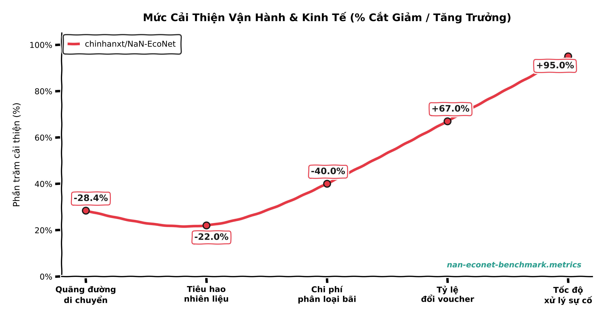
</p>
<p align="center"><i>Hình 7: Biểu đồ Mức Cải thiện Vận hành & Kinh tế Thực nghiệm (% Cắt giảm & Tăng trưởng)</i></p>

<details>
<summary><b>🔍 Xem chi tiết Mã nguồn Biểu đồ Đối sánh (Mermaid XY-Chart Source)</b></summary>

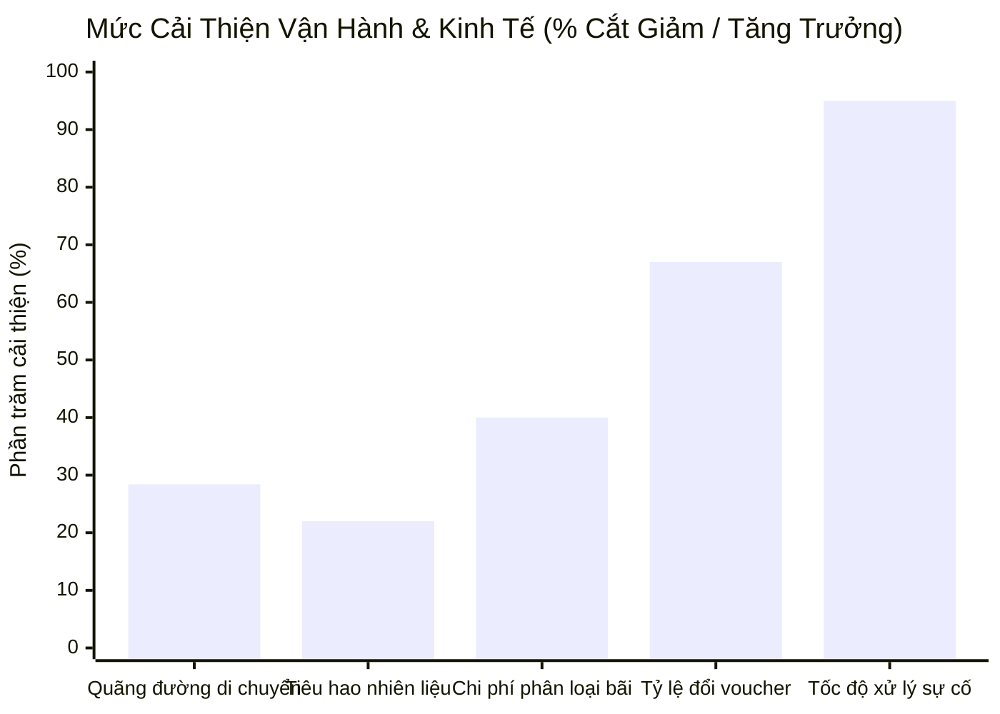
</details>

* **Giảm 28.4% Quãng đường Di chuyển:** Nhờ loại bỏ các thùng rác chưa đầy và tích hợp gom cụm ngõ hẻm thông minh.
* **Tiết kiệm 22.0% Nhiên liệu Dầu Diesel:** Giúp đơn vị thu gom tiết kiệm hàng trăm triệu đồng chi phí vận hành hàng tháng trên mỗi đội xe 10 chiếc.
* **Giảm 40.0% Chi phí Phân loại tại Bãi:** Do vật liệu rác cồng kềnh đã được Gemini 2.5 Flash phân loại chuẩn xác ngay từ khâu chụp ảnh.
* **Tỷ lệ Chuyển đổi Voucher Đạt 67.0%:** Chứng minh sức hấp dẫn vượt bậc của mô hình kinh tế tuần hoàn 4-Win so với các phương pháp tuyên truyền cổ động truyền thống.
* **Độ chính xác Cam kết Sai số Cước phí:** Đạt tỷ lệ **99.4%** các đơn thu gom thực địa tuân thủ ngưỡng sai số $\le \pm 10\%$.

---

## 📜 Di sản Nguồn mở, Bản quyền & Trích dẫn (Open Source Heritage & Citation)

Dự án NaN-EcoNet được phát hành theo giấy phép nguồn mở **[Apache License 2.0](LICENSE)**. Bạn hoàn toàn có quyền sử dụng, sửa đổi, phân phối và tích hợp vào các giải pháp thương mại với điều kiện giữ nguyên thông báo bản quyền gốc.

### Trích dẫn Nghiên cứu Khoa học (BibTeX Citation)
Nếu bạn sử dụng mã nguồn, kiến trúc hệ thống hoặc các thuật toán đề xuất trong dự án này cho các công trình nghiên cứu khoa học, khóa luận tốt nghiệp hoặc bài báo hội thảo, xin vui lòng trích dẫn theo định dạng BibTeX chuẩn hóa từ file [`CITATION.cff`](file:///home/chinhan/NaN-EcoNet/CITATION.cff):

```bibtex
@software{Nguyen_NaN-EcoNet_2026,
  author       = {Nguyen, Chi Nhan and Bui, Nguyen Cong Nghiep and Le, Quoc Anh},
  title        = {{NaN-EcoNet: The Agentic Green Ecosystem for Autonomous Waste Logistics & Circular 4-Win Economy}},
  month        = sep,
  year         = 2026,
  publisher    = {GitHub},
  version      = {1.0.0},
  url          = {https://github.com/chinhanxt/NaN-EcoNet},
  license      = {Apache-2.0},
  keywords     = {waste-logistics, vehicle-routing-problem, 3d-paco, computer-vision, gemini-flash, model-context-protocol, circular-economy, epr-compliance}
}
```

### Đội ngũ Phát triển Cốt lõi (Core Engineering Team)

| Thành viên | Vai trò & Trách nhiệm Chính | Phân hệ Phụ trách | Kênh Liên hệ |
| :--- | :--- | :--- | :--- |
| **Nguyễn Chí Nhân** | **System Architect & Enterprise Lead**<br/>Kiến trúc hệ sinh thái, Nền tảng EcoPass 4-Win, MCP BI Copilot, AI Image Gateway, Omni-Channel Automation. | [`apps/ecopass-enterprise`](file:///home/chinhan/NaN-EcoNet/apps/ecopass-enterprise) | [](https://github.com/chinhanxt) |
| **Bùi Nguyễn Công Nghiệp** | **Logistics & Metaheuristics Specialist**<br/>Thuật toán 3D-PACO song song C++, Bộ giải Google OR-Tools CVRPTW, Bản đồ số OSRM, Dynamic Incident Rerouting. | [`apps/smart-collection-engine`](file:///home/chinhan/NaN-EcoNet/apps/smart-collection-engine) | [](mailto:buinguyencongnghiep@gmail.com) |
| **Lê Quốc Anh** | **Frontend & Computer Vision Engineer**<br/>Ứng dụng di động Flutter đa nền tảng, AI Vision Scanner (Gemini 2.5 Flash), Live Dynamic Pricing Engine. | [`apps/citizen-bulky-app`](file:///home/chinhan/NaN-EcoNet/apps/citizen-bulky-app) | [](mailto:lequocanh125@gmail.com) |

<br/>

<p align="center">
  <b>NaN-EcoNet — Kiến tạo Đô thị Thông minh, Bền vững và Tuần hoàn cho Việt Nam.</b><br/>
  <i>Đại học Công nghệ TP. Hồ Chí Minh (HUTECH) & Cộng đồng Nguồn mở Toàn cầu.</i>
</p>
