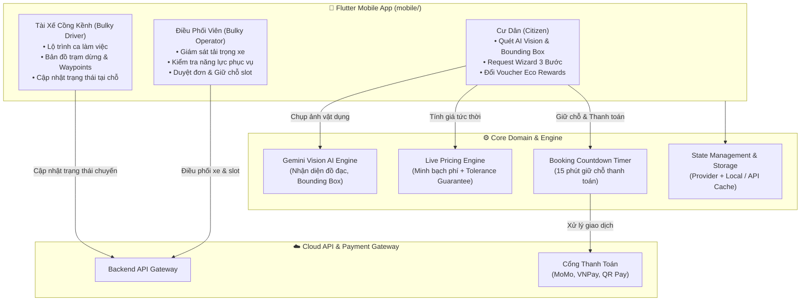

# 📱 Smartbin EcoNet - Ứng Dụng Di Động Cư Dân & Thu Gom Rác Cồng Kềnh AI

Hệ sinh thái ứng dụng di động thông minh đa vai trò (**Flutter**) phục vụ **Cổng Hộ Gia Đình (Citizen Portal)**, **Dịch vụ Thu Gom Rác Cồng Kềnh với Trí Tuệ Nhân Tạo (Bulky Waste Service)** và **Hệ thống Điểm Thưởng Xanh (Eco Rewards)**.

Phát triển và phụ trách bởi: **Quốc Anh (EnglandLee)** - Developer 3.

---

## 🌟 Tính Năng Nổi Bật

### 1. 👥 Tổng Quan Đa Vai Trò (RBAC)
- **Cư dân (Citizen):** Cổng thông tin gia đình, tích điểm đổi voucher quà tặng, đặt lịch thu gom rác cồng kềnh bằng camera AI, tra cứu hóa đơn & thanh toán trực tuyến.
- **Tài xế xe rác cồng kềnh (Bulky Driver):** Tách biệt hoàn toàn với đội xe rác thông thường. Theo dõi lộ trình ca làm việc, danh sách các điểm thu gom cồng kềnh được phân công, định vị bản đồ và cập nhật trạng thái thu gom tại chỗ.
- **Điều phối viên (Operator):** Giám sát tải trọng xe, kiểm tra năng lực phục vụ theo ngày, duyệt đơn và điều phối chuyến xe thu gom cồng kềnh.

### 2. 📷 AI Vision Scanner Nhận Diện Vật Dụng
- Chụp ảnh phế thải / đồ nội thất cồng kềnh (sofa, nệm, bàn, tủ, ghế, đồ gia dụng...).
- Tự động vẽ khung **Bounding Box** nhận diện với mô hình Gemini Vision.
- Tự động ước lượng kích thước (Dài x Rộng x Cao) và gợi ý phân loại vật liệu (gỗ, da, kim loại, nỉ...).

### 3. 📋 Quy Trình Request Wizard 3 Bước
- **Bước 1 - Danh mục vật dụng:** Chọn nhanh từ danh mục mẫu hoặc nhận diện từ AI Scanner; tùy chỉnh số lượng và kích thước.
- **Bước 2 - Khảo sát hiện trường & Hậu cần:** Khảo sát tầng lầu, có thang máy hay thang bộ; chọn vị trí lấy rác tại vỉa hè (*Curbside*) hoặc bốc dỡ trong nhà (*Inside Home*); tùy chọn yêu cầu tháo dỡ nội thất.
- **Bước 3 - Xem xét & Xác nhận:** Tóm tắt chi tiết toàn bộ đơn hàng, phụ phí và thời gian dự kiến thu gom.

### 4. 💰 Live Pricing Engine & Cam Kết Sai Số (Tolerance Guarantee)
- Công thức tính phí minh bạch theo chuẩn nghiệp vụ:
  $$\text{Tổng phí} = \text{Phí vật dụng} + \text{Phí xe / khu vực} + \text{Phí bốc xếp / tầng lầu / tháo dỡ} + \text{Thuế VAT} - \text{Ưu đãi}$$
- Chính sách **Bảo hiểm cam kết sai số (Tolerance Guarantee)**: Cam kết chênh lệch phụ phí thực tế khi tài xế đến nơi không vượt quá ngưỡng cho phép ($\le \pm 10\%$).

### 5. 🎁 Eco Rewards - Đổi Điểm Xanh Lấy Voucher Thương Hiệu Việt
- Cư dân tích lũy điểm xanh (Eco Points) khi thực hiện phân loại rác và đặt thu gom đúng quy chuẩn.
- Quy đổi điểm thưởng trực tiếp lấy voucher giải khát từ các thương hiệu phổ biến tại Việt Nam: **Highlands Coffee**, **Phúc Long Coffee & Tea**, **Katinat Saigon Kafe**.

### 6. ⏳ Thanh Toán Giữ Chỗ Có Thời Hạn (Countdown Timer)
- Sau khi chốt đơn, hệ thống kích hoạt **đồng hồ đếm ngược 15 phút** để giữ slot xe cồng kềnh (*Prepaid Booking Slot*).
- Tích hợp đa dạng phương thức thanh toán: mã QR, MoMo, VNPay hoặc chuyển khoản định danh. Tự động giải phóng slot nếu quá hạn chưa hoàn tất trả trước.

### 7. 🚛 Lộ Trình Ca Làm Việc Cho Tài Xế Cồng Kềnh
- Hệ thống phân tách rành mạch lộ trình xe cồng kềnh với xe rác thông thường.
- Hiển thị bản đồ trạm dừng (*Waypoints*), thông tin liên hệ hộ gia đình, chỉ dẫn đường đi và cập nhật trạng thái đơn (*Đã tiếp nhận*, *Đang đến*, *Đã thu gom*).

---

## 🏗️ Kiến Trúc Hệ Thống



---

## 📂 Cấu Trúc Thư Mục Feature-Driven

Mã nguồn ứng dụng di động được tổ chức theo kiến trúc **Feature-Driven Architecture** chuẩn mực tại `mobile/`:

```text
mobile/
├── lib/
│   ├── core/                           # Thành phần dùng chung toàn hệ thống
│   │   ├── constants/                  # Hằng số hệ thống, danh mục rác cồng kềnh
│   │   ├── domain/
│   │   │   ├── models/                 # BulkyOrder, BulkyItem, BulkyQuote, BoundingBox
│   │   │   └── pricing/                # PricingEngine tính chi phí & phụ phí lầu/thang máy
│   │   ├── services/
│   │   │   ├── ai/                     # GeminiVisionService, AiRecognitionResult
│   │   │   └── storage/                # MockBulkyStorage, lưu trữ session & cache
│   │   ├── theme/                      # BulkyTheme, BulkyColors (Chuẩn UX/UI)
│   │   └── widgets/                    # BottomNavBar, Tolerance Banner, Countdown Timer
│   ├── features/                       # Các phân hệ chức năng độc lập
│   │   ├── auth/                       # Quản lý tài khoản, CitizenUser, chuyển đổi Role RBAC
│   │   ├── citizen_home/               # Màn hình chính cư dân, Eco Rewards, voucher đồ uống
│   │   ├── scan/                       # Chụp ảnh, quét AI, vẽ Bounding Box trực quan
│   │   ├── request_wizard/             # Wizard 3 bước: Items -> Logistics -> Summary
│   │   ├── quote/                      # Chi tiết báo giá, phân rã chi phí minh bạch
│   │   ├── payment/                    # Thanh toán QR/MoMo/VNPay, đếm ngược giữ slot 15p
│   │   ├── orders/                     # Danh sách đơn, chi tiết đơn hàng & timeline xử lý
│   │   ├── driver/                     # Giao diện tài xế, bản đồ lộ trình ca trực, trạm dừng
│   │   └── operator/                   # Giao diện điều phối viên, kiểm tra năng lực ca xe
│   └── main.dart                       # Khởi tạo App, MultiProvider & khai báo Navigation
└── test/                               # Bộ kiểm thử tự động toàn diện (121 tests)
    ├── core/                           # Test logic PricingEngine, Storage
    ├── features/                       # Test tích hợp UI, Wizard, Auth, Đơn hàng, RBAC
    └── widget_test.dart                # Smoke test điều hướng Bottom Navigation
```

---

## 🚀 Hướng Dẫn Cài Đặt & Khởi Chạy

### Yêu Cầu Môi Trường
- **Flutter SDK**: `>= 3.13.2`
- **Dart SDK**: `^3.13.2`

### 1. Cài đặt thư viện dependencies
```bash
cd mobile
flutter pub get
```

### 2. Chạy kiểm thử tự động (Automated Tests)
```bash
flutter test
```
> **Kết quả kiểm thử:** Toàn bộ **121/121 tests** đều vượt qua thành công (`All tests passed!`), đảm bảo 100% độ tin cậy của các luồng nghiệp vụ.

### 3. Khởi chạy ứng dụng
```bash
# Chạy trên thiết bị mặc định (Emulator / Điện thoại thật)
flutter run

# Hoặc chạy trực tiếp trên trình duyệt Chrome (Web mode)
flutter run -d chrome
```

---

## 👥 Tác Giả & Bản Quyền
Phát triển bởi **Quốc Anh (EnglandLee)** - Developer 3, Phân hệ Mobile Cư Dân & Rác Cồng Kềnh AI.  
Dự án thuộc hệ sinh thái **NaN-EcoNet**. Giấy phép nguồn mở Apache License 2.0.
