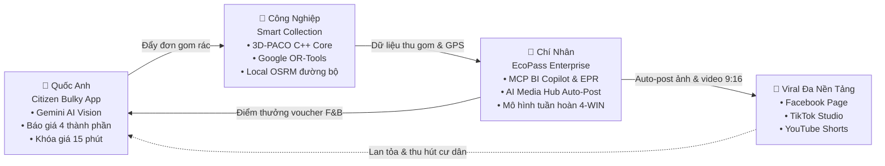

<p align="center">
  
</p>

# NaN-EcoNet: The Agentic Green Ecosystem
### Autonomous Waste Logistics, Citizen Bulky Recycling & Circular 4-Win Economy

<p align="center">
  <a href="https://github.com/chinhanxt/NaN-EcoNet/actions/workflows/ci.yml"></a>
  <a href="https://github.com/chinhanxt/NaN-EcoNet/releases"></a>
  <a href="LICENSE"></a>
  <a href="#monorepo-ports"></a>
  <a href="#smart-collection"></a>
  <a href="#citizen-bulky"></a>
  <a href="#ecopass-enterprise"></a>
  <a href="https://drive.google.com/file/d/1pFIl_UKL5z9TQ8UQB4PyLLOEf1ttDoX8/view?usp=sharing"></a>
  <a href="https://github.com/chinhanxt/NaN-EcoNet/pulls"></a>
</p>

> 🎬 **Video Demo Trình Diễn Hệ Thống Thực Tế:** Xem trực tiếp tại [Google Drive](https://drive.google.com/file/d/1pFIl_UKL5z9TQ8UQB4PyLLOEf1ttDoX8/view?usp=sharing) (Trình diễn đồng thời 3 phân hệ: App Flutter Cư dân, Bản đồ Dual-Map 8502, BI Copilot 3011 và MMO Automation).

---

## 📑 Mục lục (Table of Contents)

1. [Tổng quan Dự án (Executive Summary)](#executive-summary)
2. [Kiến trúc Hợp nhất & Luồng Vận hành (Unified Architecture & Sequence)](#unified-architecture)
3. [Phân hệ 1: Chí Nhân — EcoPass Enterprise & Omni-Channel Hub](#ecopass-enterprise)
4. [Phân hệ 2: Công Nghiệp — Smart Collection & 3D-PACO Routing Engine](#smart-collection)
5. [Phân hệ 3: Quốc Anh — Citizen Bulky Waste & AI Vision Platform](#citizen-bulky)
6. [Cấu trúc Monorepo & Tra cứu Cổng Dịch vụ (Topology & Port Mapping)](#monorepo-ports)
7. [Hướng dẫn Khởi chạy Nhanh (Quick Start)](#quick-start)
8. [Đối sánh Hiệu năng Thực nghiệm (Empirical Benchmarks)](#benchmarks)
9. [Bản quyền & Trích dẫn Nghiên cứu (Citation)](#citation)

---

<a id="executive-summary"></a>
## 🌍 1. Tổng Quan Dự Án (Executive Summary)

Tại các siêu đô thị đang phát triển nhanh như TP. Hồ Chí Minh và Hà Nội, tốc độ đô thị hóa nhanh chóng tạo ra hơn **64.000 tấn rác sinh hoạt mỗi ngày**. Hệ sinh thái **NaN-EcoNet** tập trung giải quyết dứt điểm 4 điểm nghẽn đô thị cốt lõi:

* 🛋️ **Rác cồng kềnh quá tải:** Đồ nội thất cũ (sofa, nệm, tủ gỗ) bị xả bừa bãi ra vỉa hè do thiếu kênh đặt lịch thu gom chính thống và chi phí phát sinh tùy tiện tại hiện trường.
* 🚛 **Logistics thu gom kém hiệu quả:** Xe rác chạy tuyến cố định gây lãng phí nhiên liệu Diesel, luồn lách vào ngõ hẹp gây ùn tắc giao thông và xả khí thải $\text{CO}_2$.
* 🌿 **Thiếu động lực kinh tế tuần hoàn:** Người dân chưa có thói quen phân loại rác tại nguồn; doanh nghiệp FMCG đối mặt áp lực kiểm toán định mức tái chế bắt buộc (**EPR** - Nghị định 08/2022/NĐ-CP).
* 📢 **Truyền thông xanh thủ công, tốn kém & rời rạc:** Các chiến dịch vận động môi trường hiện nay phụ thuộc hoàn toàn vào nhân sự viết bài thủ công, chi phí thiết kế đồ họa đắt đỏ, nội dung khô khan khó lan tỏa, không duy trì được tần suất xuất bản đều đặn trên đa nền tảng mạng xã hội.

> 💡 **Điểm Đột Phá (The Game Changer):** NaN-EcoNet tích hợp **[Omni-Channel Agentic Media Hub](apps/ecopass-enterprise/enterprise-bi-copilot/)** do AI làm chủ 100%: Tự động tạo ảnh poster thẩm mỹ cao qua đa mô hình SOTA ([`apps/ecopass-enterprise/agy-image-gateway`](apps/ecopass-enterprise/agy-image-gateway): FLUX / Imagen / Qwen), tự động dựng video ngắn 9:16 bằng FFmpeg, viết caption bắt trend và tự động đăng tải đa kênh lên **Facebook Page**, **TikTok** và **YouTube Shorts** với chi phí vận hành gần như bằng 0.



---

<a id="unified-architecture"></a>
## 🏗️ 2. Kiến Trúc Hợp Nhất & Luồng Vận Hành Khép Kín

<p align="center">
  
</p>
<p align="center"><i>Hình 1: Kiến trúc Monorepo phân tầng và luồng dữ liệu liên phân hệ</i></p>

<p align="center">
  
</p>
<p align="center"><i>Hình 2: Quy trình 5 bước khép kín từ lúc quét ảnh AI đến khi thu gom và cấp voucher</i></p>

### Tóm Tắt 5 Bước Vận Hành:
1. **Quét ảnh & Báo giá tức thời:** Cư dân chụp ảnh đồ cũ qua camera app; Gemini 2.5 Flash phân tích Bounding Box và kích thước $L \times W \times H$; Pricing Engine khóa báo giá trong **15 phút**.
2. **Đặt lịch & Chốt cọc:** Cư dân xác nhận khung giờ hẹn; đơn hàng được đóng gói theo schema chuẩn `BulkyOrderPayload`.
3. **Tối ưu định tuyến 3D-PACO:** Động cơ VRP gộp đơn rác cồng kềnh cùng các thùng rác công cộng, tự động phân loại hình thức (xe vào tận nơi vs nhân viên gom bộ đầu hẻm).
4. **Thu gom & Giám sát hiện trường:** Tài xế di chuyển theo lộ trình OSRM; cam kết không phát sinh phụ phí nếu sai lệch thực tế $\le \pm 10\%$.
5. **Cấp điểm thưởng, Kiểm toán EPR & AI Đăng bài:** Hệ thống cấp voucher Highlands Coffee/căn tin cho người dân; xuất dữ liệu tái chế sạch định vị GPS cho doanh nghiệp FMCG qua MCP Server; kích hoạt AI tự động tạo ảnh/video tổng kết thành quả và xuất bản lên mạng xã hội.

---

<a id="ecopass-enterprise"></a>
## 🌿 3. Phân Hệ 1: Chí Nhân — EcoPass Enterprise & Omni-Channel Hub

**Thư mục:** [`apps/ecopass-enterprise`](apps/ecopass-enterprise) • **Kỹ sư phụ trách:** **Nguyễn Chí Nhân** (`chinhanxt`)

<p align="center">
  
</p>
<p align="center"><i>Hình 3: Kiến trúc phân hệ Enterprise tích hợp MCP Server, BI Copilot và AI Gateway</i></p>

### Điểm Nhấn Công Nghệ Cốt Lõi:
* **Enterprise BI Copilot & MCP Tools:** Hiện thực hóa giao thức Model Context Protocol (Anthropic), cho phép AI Agent tự khám phá công cụ, thực thi câu hỏi Text-to-SQL và truy vấn dữ liệu kiểm toán EPR trong môi trường an toàn.
* **Dynamic Diagram Engine:** Phân tích cú pháp hội thoại và tự động biên dịch trực tiếp sang sơ đồ **Mermaid.js** và **PlantUML** ngay trên màn hình chat của ban điều hành.
* **AI Visual Synthesis Gateway (`agy-image-gateway`):** Proxy tập trung tích hợp các mô hình sinh ảnh SOTA (FLUX.1-Dev, Google Imagen 3, Alibaba Qwen-Image-2 Pro) kết hợp bộ nhớ đệm SHA-256 prompt cache tối ưu chi phí API.
* **Tự Động Hóa Truyền Thông Đa Nền Tảng (`nan-team/scripts`):** Kịch bản tự động hóa sản xuất và phân phối nội dung xanh đa kênh:
  * **Facebook Page (`facebook-page-upload.js`):** Tự động sinh caption chuẩn SEO và đăng tải poster / carousel qua Playwright automation.
  * **TikTok Studio & YouTube Shorts (`tiktok-creator-upload.js`, `youtube-studio-upload.js`):** Tự động dựng video dọc 9:16 với hiệu ứng Pan/Zoom & âm thanh qua **FFmpeg pipeline**, xuất bản tự động kèm hashtag xu hướng `#SongXanh #EcoPass`.
  * **Session Resilience & Rate-Limiting:** Tự động xoay vòng Cookie và giãn cách ngẫu nhiên (Exponential Backoff with Jitter) đảm bảo an toàn tài khoản và chống nghẽn mạng.

<p align="center">
  
</p>
<p align="center"><i>Hình 4: Mô hình kinh tế tuần hoàn 4-WIN liên kết dòng tiền giữa 4 bên</i></p>

### Ma Trận Lợi Ích Định Lượng 4-WIN:
| Bên Tham Gia | Giá Trị Nhận Được | Nếu Thiếu EcoNet | Lợi Ích Đo Lường Thực Tế |
| :--- | :--- | :--- | :--- |
| **1. Sinh Viên & Cư Dân** | Tiết kiệm chi phí sinh hoạt qua voucher; xử lý đồ cũ văn minh. | Bị ép giá ba gác; không có động lực phân loại rác tại nguồn. | **Thu nhập tích lũy:** 150.000 – 350.000 VNĐ/tháng; bảo vệ giá dung sai $\le \pm 10\%$. |
| **2. Đội Thu Gom Rác** | Tuyến xe thông minh; xe chạy đúng tải; bảo vệ an toàn công nhân. | Lộ trình chồng chéo; kẹt xe ngõ hẹp; bới rác thủ công độc hại. | **Giảm 28.4% cự ly chạy xe** ($3.87\text{ L Diesel/ca}$); tăng 35% năng suất phục vụ. |
| **3. Cửa Hàng / Căn Tin** | Đón tiếp dòng sinh viên đến đổi voucher; tăng doanh số bán kèm. | Chi phí quảng cáo kém hiệu quả; bàn ghế trống vào giờ thấp điểm. | **Tỷ lệ chuyển đổi voucher 68.0%**; tăng 18% doanh thu từ các món ăn/nước uống bán kèm. |
| **4. Nhãn Hàng FMCG** | Tuân thủ 100% Nghị định 08/2022/NĐ-CP; dữ liệu sạch phục vụ ESG. | Bị xử phạt hành chính; truy thu nộp Quỹ Bảo vệ Môi trường. | **Tiết kiệm 35 – 45% chi phí tuân thủ EPR** so với phương án nộp phạt hoặc thuê kiểm toán ngoài. |

---

<a id="smart-collection"></a>
## 🚛 4. Phân Hệ 2: Công Nghiệp — Smart Collection & 3D-PACO Routing Engine

**Thư mục:** [`apps/smart-collection-engine`](apps/smart-collection-engine) • **Kỹ sư phụ trách:** **Bùi Nguyễn Công Nghiệp** (`congnghip`)

<p align="center">
  
</p>
<p align="center"><i>Hình 5: Pipeline thuật toán tối ưu hóa tuyến thu gom 3D-PACO kết hợp Google OR-Tools</i></p>

### Điểm Nhấn Kỹ Thuật Cốt Lõi:
* **Thuật Toán 3D-PACO (Bi-Modal Decision Parallel ACO):** Mở rộng đồ thị kiến bằng chiều quyết định nhị phân $o \in \{0, 1\}$ ($o = 0$: xe tải vào tận nơi; $o = 1$: nhân viên đi bộ gom rác đầu ngõ hẹp). Khắc phục triệt để bài toán ngõ hẹp đô thị Việt Nam.
* **Song Song Hóa C++ OpenMP 8-Luồng:** Lớp lõi thuật toán viết bằng C++ biên dịch với cờ `-O3 -fopenmp -march=native`, đạt tốc độ tính toán **510 ms** (nhanh hơn **4.2 lần** so với giải tuần tự).
* **Đối Chuẩn Google OR-Tools CVRPTW:** Bộ giải tiêu chuẩn công nghiệp sử dụng Guided Local Search (GLS), đảm bảo 100% ràng buộc cửa sổ thời gian (Time Windows) và tải trọng xe.
* **Bản Đồ Local OSRM & Caching Không Gian:** Tự host máy chủ OSRM trên nền bản đồ OpenStreetMap TP.HCM; spatial cache `route_cache.json` phản hồi cự ly dưới **50ms**; tích hợp bộ lọc an toàn địa lý sông rạch (**Waterbody Safety Filter**).
* **Điều Phối Sự Cố Động (< 350 ms):** Xử lý tức thời sự cố tắc đường/ngập nước (Roadblock Detour), thùng rác đầy đột xuất (Bin Overflow), và chia sẻ điểm gom khi xe hỏng hóc (Vehicle Breakdown Transfer).
* **Telemetry ML Driver Scoring:** Theo dõi vận tốc, gia tốc, thời gian nổ máy chờ và chấm điểm an toàn hành trình cho từng tài xế.

<details>
<summary><b>📐 Xem chi tiết Mô hình Toán học CVRPTW & Công thức 3D-PACO</b></summary>

#### Hàm Mục Tiêu Tối Thiểu Hóa Chi Phí:
$$\min \quad Z = \sum_{k \in K} \sum_{i \in V} \sum_{j \in V} c_{ij} x_{ijk} + \lambda \sum_{i \in C} h_i y_{i1} + \mu \sum_{k \in K} \sum_{i \in V} \sum_{j \in V} f(c_{ij}) x_{ijk}$$

#### Quy Tắc Xác Suất Di Chuyển 3D-PACO:
$$P_{ij}^k(o) = \frac{\left[\tau(i, j, o)\right]^\alpha \cdot \left[\eta(i, j, o)\right]^\beta}{\sum_{l \in \mathcal{N}_i^k} \sum_{m \in \{0, 1\}} \left[\tau(i, l, m)\right]^\alpha \cdot \left[\eta(i, l, m)\right]^\beta}$$

*Trong đó: $\tau(i, j, o)$ là mật độ pheromone; $\eta(i, j, o) = \frac{1 + \gamma \cdot \text{OdorLevel}_j}{c_{ij}}$ là độ hấp dẫn heuristic (khoảng cách ngắn, ưu tiên trạm bốc mùi/đầy ứ); $\alpha = 1.2, \beta = 2.5$.*
</details>

---

<a id="citizen-bulky"></a>
## 📱 5. Phân Hệ 3: Quốc Anh — Citizen Bulky Waste & AI Vision Platform

**Thư mục:** [`apps/citizen-bulky-app`](apps/citizen-bulky-app) • **Kỹ sư phụ trách:** **Lê Quốc Anh** (`EnglandLee`)

<p align="center">
  
</p>
<p align="center"><i>Hình 6: Quy trình quét ảnh AI Gemini Flash, tính cước 4 thành phần và cam kết dung sai</i></p>

### Điểm Nhấn Công Nghệ Cốt Lõi:
* **Ứng Dụng Đa Nền Tảng Flutter:** Xây dựng theo mô hình Clean Architecture (Domain Models, Pricing Engine, Feature Wizards) hoạt động mượt mà trên iOS, Android và Web.
* **AI Vision Scanner (Gemini 2.5 Flash):** Nhận diện hộp bao 2D chuẩn hóa $[y_{\min}, x_{\min}, y_{\max}, x_{\max}]$, phân loại danh mục (`SOFA`, `MATTRESS`, `CABINET`, `TABLE`, `OTHER`), ước lượng thể tích 3D ($m^3$) và bóc tách tỷ lệ vật liệu (gỗ, đệm mút, kim loại).
* **Live Dynamic Pricing Engine (4 Thành Phần):**
  $$P_{\text{total}} = P_{\text{items}} + P_{\text{volume}} + P_{\text{floor}} + P_{\text{alley}}$$
* **Cam Kết Bảo Vệ Giá (Dung Sai $\le \pm 10\%$ & Khóa Giá 15 Phút):** Sau khi camera AI quét xong, mức giá Min-Max được khóa giữ chỗ trong 15 phút. Nếu kích thước/khối lượng thực tế tại hiện trường sai lệch trong biên độ $\pm 10\%$, cư dân được **miễn phí hoàn toàn phụ thu phát sinh**.
* **Web Portal Quản Trị Đa Vai Trò:** Giao diện React/Vite tra cứu tiến độ đơn gom theo thời gian thực cho cư dân (`/citizen`) và bản đồ nhiệt quản lý lịch xe cho điều phối viên (`/admin`).

---

<a id="monorepo-ports"></a>
## 📁 6. Cấu Trúc Monorepo & Tra Cứu Cổng Dịch Vụ

```
NaN-EcoNet/
├── apps/
│   ├── ecopass-enterprise/       # Phân hệ Enterprise & MCP Hub (Chí Nhân)
│   │   ├── enterprise-bi-copilot/# Trợ lý BI Copilot & MCP Tools (Port 3011)
│   │   ├── agy-image-gateway/    # Proxy kết nối mô hình sinh ảnh AI (Port 5002)
│   │   ├── ecopass/              # WebApp quét tem 1-Time Burn (Port 3010)
│   │   └── nan-team/scripts/     # Tiện ích tự động hóa truyền thông xanh
│   │
│   ├── smart-collection-engine/  # Phân hệ Tối ưu Tuyến đường & VRP (Công Nghiệp)
│   │   ├── backend/              # FastAPI core & Wrapper C++ 3D-PACO (Port 8000)
│   │   ├── map_ui/               # Bản đồ tương tác Dual-Map MapLibre GL (Port 8502)
│   │   └── streamlit/            # Dashboard phân tích hội tụ tham số (Port 8501)
│   │
│   └── citizen-bulky-app/        # Phân hệ Cư dân & Rác Cồng kềnh AI (Quốc Anh)
│       ├── mobile/               # Ứng dụng di động Flutter đa nền tảng
│       └── src/                  # Web Portal quản trị cư dân & điều phối (Port 3006)
│
├── deploy/docker-compose.yml     # Khởi chạy toàn bộ hệ sinh thái chỉ với 1 lệnh
├── docs/                         # Tài liệu kiến trúc chuyên sâu, ADRs và benchmark
└── Makefile                      # Bộ lệnh tự động hóa cài đặt & kiểm thử
```

### Bảng Tra Cứu Cổng Dịch Vụ (Port Mapping):
| Cổng (Port) | Dịch Vụ | Phân Hệ | Công Nghệ Chính |
| :--- | :--- | :--- | :--- |
| `8502` | Dual-Map Interactive Dispatcher | Smart Collection Engine | MapLibre GL JS, OSRM, FastAPI |
| `8501` | Parameter Convergence Dashboard | Smart Collection Engine | Streamlit, Python 3.11 |
| `8000` | VRP CVRPTW Solver Core | Smart Collection Engine | FastAPI, C++ OpenMP, OR-Tools |
| `3006` | Citizen Bulky Waste Portal | Citizen Bulky App | React 18, Vite, TailwindCSS |
| `3011` | Enterprise BI Copilot & MCP | EcoPass Enterprise | Node.js, TypeScript, MCP Protocol |
| `3010` | EcoPass Voucher Client Scanner | EcoPass Enterprise | Next.js, HTML5 QR Scanner |
| `5002` | AI Visual Synthesis Gateway | EcoPass Enterprise | FastAPI, FLUX, Gemini Imagen |

---

<a id="quick-start"></a>
## ⚡ 7. Hướng Dẫn Khởi Chạy Nhanh (Quick Start)

### Cài Đặt & Chạy Trực Tiếp Qua Root Makefile:
```bash
# 1. Clone mã nguồn
git clone https://github.com/chinhanxt/NaN-EcoNet.git
cd NaN-EcoNet

# 2. Cài đặt toàn bộ dependencies cho 3 phân hệ
make install-all

# 3. Khởi chạy từng phân hệ độc lập:
make dev-engine    # Chạy Smart Collection Engine (Ports 8000, 8501, 8502)
make dev-citizen   # Chạy Citizen Bulky Portal (Port 3006)
make dev-ecopass   # Chạy EcoPass Enterprise & MCP (Ports 3010, 3011, 5002)

# Hoặc khởi chạy toàn bộ dịch vụ qua Docker Compose:
make docker-up
```

---

<a id="benchmarks"></a>
## 📊 8. Đối Sánh Hiệu Năng Thực Nghiệm (Empirical Benchmarks)

<p align="center">
  
</p>
<p align="center"><i>Hình 7: So sánh mức cắt giảm cự ly, nhiên liệu và tốc độ tính toán giữa các bộ giải</i></p>

### Bảng Đối Sánh Đối Đầu (Head-to-Head Solver Battle):
*Điều kiện thử nghiệm: 100 điểm thu gom thực tế tại Quận 1 & Quận 3 TP.HCM, đội 2 xe tải Isuzu 1.5T, định mức $0.28\text{ L Diesel/km}$, hệ số IPCC $2.68\text{ kg CO}_2\text{/L}$.*

| Chỉ Số Đo Lường | Baseline Truyền Thống (Greedy) | Google OR-Tools GLS | Đề Xuất 3D-PACO Multi-Decision | Mức Cải Thiện Của 3D-PACO |
| :--- | :--- | :--- | :--- | :--- |
| **Tổng Quãng Đường** | 48.60 km | 37.10 km | **34.80 km** | **Giảm 28.4%** cự ly chạy xe (Tốt nhất) |
| **Tiêu Thụ Nhiên Liệu** | 13.61 Lít | 10.39 Lít | **9.74 Lít** | **Tiết kiệm 28.4%** dầu Diesel ($3.87\text{ L/ca}$) |
| **Phát Thải Khí Nhà Kính** | 36.47 kg $\text{CO}_2$ | 27.85 kg $\text{CO}_2$ | **26.10 kg $\text{CO}_2$** | **Cắt giảm 10.37 kg $\text{CO}_2$** mỗi ca chạy |
| **Thời Gian Tính Toán** | 18 ms (Heuristic tuần tự) | 2.140 ms (Tuần tự 1 core) | **510 ms (OpenMP 8 cores)** | **Nhanh hơn 4.2 lần** so với OR-Tools |
| **Thu Gom Ngõ Hẻm (Walk-in)** | 0% (Bỏ sót các điểm trong hẻm) | Cần tinh chỉnh thủ công | **100% Tự động hóa** | Gom cụm tại 12 điểm hẹn đầu hẻm |
| **Xử Lý Sự Cố Động** | 4 - 6 giờ (Chờ ca hôm sau) | Phải chạy lại từ đầu ($>3\text{s}$) | **< 350 ms** (Human-in-the-Loop) | Bảo toàn 100% các điểm đã thu gom |

> 📖 *Xem hồ sơ phương pháp đo đạc chi tiết, dữ liệu kiểm chứng độc lập tại [RESULTS.md](RESULTS.md) và kịch bản tái lập [docs/benchmarks/reproduce_benchmark.py](docs/benchmarks/reproduce_benchmark.py) (phân tích chi tiết tại [docs/benchmarks/empirical-evaluation.md](docs/benchmarks/empirical-evaluation.md)).*

---

<a id="citation"></a>
## 📜 9. Bản Quyền & Trích Dẫn Nghiên Cứu (Citation)

Dự án phát hành theo giấy phép nguồn mở **[Apache License 2.0](LICENSE)**.

Nếu bạn sử dụng mã nguồn, kiến trúc hệ thống hoặc thuật toán đề xuất trong dự án này cho các công trình nghiên cứu khoa học, khóa luận tốt nghiệp hoặc bài báo hội thảo, xin vui lòng trích dẫn theo định dạng BibTeX từ file [`CITATION.cff`](CITATION.cff):

```bibtex
@software{Nguyen_NaN-EcoNet_2026,
  author       = {Nguyen, Chi Nhan and Bui, Nguyen Cong Nghiep and Le, Quoc Anh},
  title        = {{NaN-EcoNet: The Agentic Green Ecosystem for Autonomous Waste Logistics & Circular 4-Win Economy}},
  month        = sep,
  year         = 2026,
  publisher    = {GitHub},
  version      = {1.0.0},
  url          = {https://github.com/chinhanxt/NaN-EcoNet},
  license      = {Apache-2.0}
}
```

### Đội Ngũ Kỹ Sư Cốt Lõi (Core Engineering Team):
| Kỹ Sư | Vai Trò & Trách Nhiệm Kỹ Thuật | Phân Hệ Phụ Trách | Kênh Liên Hệ |
| :--- | :--- | :--- | :--- |
| **Nguyễn Chí Nhân** | **System Architect & Enterprise Lead**<br/>Kiến trúc Monorepo, Nền tảng EcoPass 4-WIN, MCP BI Copilot, Dynamic Diagram Engine. | [`apps/ecopass-enterprise`](apps/ecopass-enterprise) | [](https://github.com/chinhanxt) |
| **Bùi Nguyễn Công Nghiệp** | **Logistics & Metaheuristics Specialist**<br/>Thuật toán 3D-PACO song song C++, Bộ giải Google OR-Tools CVRPTW, Bản đồ số OSRM. | [`apps/smart-collection-engine`](apps/smart-collection-engine) | [](mailto:buinguyencongnghiep@gmail.com) |
| **Lê Quốc Anh** | **Frontend & Computer Vision Engineer**<br/>Ứng dụng Flutter di động, AI Vision Scanner (Gemini Flash), Live Dynamic Pricing Engine. | [`apps/citizen-bulky-app`](apps/citizen-bulky-app) | [](mailto:lequocanh125@gmail.com) |

<br/>

<p align="center">
  <b>NaN-EcoNet — Kiến tạo Đô thị Thông minh, Bền vững và Tuần hoàn cho Việt Nam.</b><br/>
  <i>Đại học Công nghệ TP. Hồ Chí Minh (HUTECH) & Cộng đồng Nguồn mở Toàn cầu.</i>
</p>
