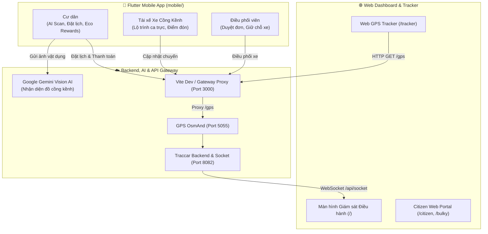

# 🚛 Smartbin - Hệ Thống Giám Sát & Định Vị Thu Gom Rác Thông Minh (Civic-Tech)

Hệ thống điều phối, quản lý và định vị phương tiện thu gom rác thải & điểm tập kết thông minh thời gian thực (Real-time GPS Tracking & Smart Waste Management System), phục vụ chương trình Chuyển đổi số địa phương và kinh tế tuần hoàn.


---

## 🌟 Tính Năng Nổi Bật

### 1. 📱 Ứng dụng Di động Cư Dân & Thu Gom Rác Cồng Kềnh AI (`mobile/`)
> Phân hệ ứng dụng Native đa nền tảng (**Flutter**) dành cho **Cư dân**, **Tài xế rác cồng kềnh** và **Điều phối viên** do **Dev 3 (EnglandLee)** phát triển. Xem chi tiết tại [mobile/README.md](mobile/README.md).

- **Camera Quét & Nhận diện AI (Gemini Vision)**: Chụp ảnh đồ đạc cồng kềnh (sofa, nệm, bàn tủ...), tự động vẽ khung *bounding box*, nhận diện chủng loại và phân loại vật liệu.
- **Request Wizard 3 Bước**: Quy trình đặt lịch nhanh chóng — từ chọn vật dụng, khảo sát lầu/thang máy/bốc dỡ vỉa hè đến xem xét báo giá.
- **Live Pricing Engine & Cam kết sai số (Tolerance Guarantee)**: Tính toán chi phí minh bạch theo công thức chuẩn; cam kết chênh lệch phụ phí thực tế không vượt quá ngưỡng cho phép (±10%).
- **Đổi Điểm Xanh (Eco Rewards)**: Tích điểm phân loại rác để đổi voucher đồ uống từ các thương hiệu phổ biến tại Việt Nam (**Highlands Coffee**, **Phúc Long**, **Katinat**).
- **Thanh toán giữ chỗ có thời hạn**: Đếm ngược 15 phút giữ slot xe cồng kềnh, thanh toán trực tiếp qua mã QR / MoMo / VNPay.
- **Bản đồ ca trực cho Tài xế xe cồng kềnh**: Phân tách rành mạch với xe rác thông thường; hiển thị danh sách điểm gom, lộ trình tối ưu và trạng thái hoàn thành.

### 2. 📡 Web Mobile Tracker (`/tracker`) dành cho Xe gom rác thông thường
- **Không cần cài đặt app Native**: Hoạt động trực tiếp trên trình duyệt mọi điện thoại (iOS Safari, Android Chrome, Zalo Browser).
- **Định vị GPS vệ tinh độ chính xác cao**: Tự động lấy toạ độ vệ tinh (sai số chỉ 5 - 15m), vận tốc km/h và hướng la bàn.
- **Nút Kết nối tức thì (< 50ms)**: Đồng bộ toạ độ về máy chủ ngay lập tức với bộ đệm thông minh.
- **Nút Báo động SOS khẩn cấp**: Phát chuỗi tín hiệu ưu tiên (`alarm=sos`) về phòng điều hành, kích hoạt còi hú và thông báo cảnh báo tức thì.
- **Giám sát pin thông minh (Hybrid Battery)**: Hỗ trợ đọc pin phần cứng hoặc pin mô phỏng IoT, liên tục báo cáo % pin và trạng thái sạc.

### 3. 🗺️ Trung tâm Giám sát Bản đồ (`/`)
- **Bản đồ thời gian thực (Live Map)**: Theo dõi lộ trình di chuyển của toàn bộ đội xe rác trên địa bàn xã/phường.
- **Cảnh báo SOS trung tâm**: Tự động phát âm thanh cảnh báo và hiển thị hộp thoại khẩn cấp khi xe gặp sự cố.
- **Báo cáo & Lịch sử**: Xem lại hành trình, dừng đỗ, quãng đường tiêu hao nhiên liệu.
- **Vùng địa lý (Geofencing)**: Thiết lập ranh giới điểm tập kết rác, bãi chôn lấp, trạm trung chuyển.

---

## 🏗️ Kiến Trúc Hệ Thống



---

## 🚀 Hướng Dẫn Cài Đặt & Phát Triển

### Yêu Cầu Tiên Quyết
- **Node.js**: `>= 18.x`
- **Flutter SDK**: `>= 3.13.2` (để phát triển App Mobile)
- **Docker**: Để chạy Traccar Backend Server (Port 8082 & Port 5055)

---

### A. Khởi Động Web Dashboard & GPS Server

#### 1. Khởi động Backend Traccar (Docker)
```bash
docker run -d --name traccar-server \
  -p 8082:8082 -p 5055:5055 \
  traccar/traccar:latest
```
* Tài khoản quản trị mặc định: `admin` / `admin`.

#### 2. Cài đặt Thư Viện & Chạy Web Frontend
```bash
npm install
npm start
```
- **Web App**: `http://localhost:3000`
- **Bộ phát GPS Web**: `http://localhost:3000/tracker`
- **Cổng Rác Cồng Kềnh Web**: `http://localhost:3000/bulky`

#### 3. Build Bản Triển Khai Web (Production)
```bash
npm run build
```

---

### B. Khởi Động Ứng Dụng Di Động Flutter (`mobile/`)

```bash
# 1. Chuyển vào thư mục mobile
cd mobile

# 2. Cài đặt các gói thư viện
flutter pub get

# 3. Chạy kiểm thử tự động (121 tests)
flutter test

# 4. Khởi chạy ứng dụng
flutter run
# Hoặc chạy thử nghiệm trên Chrome:
flutter run -d chrome
```

---

## 📂 Cấu Trúc Thư Mục Quan Trọng

```text
Smartbin/
├── mobile/                        # 🌟 Ứng dụng di động Flutter (Cư dân, Rác cồng kềnh AI, Tài xế)
│   ├── lib/
│   │   ├── core/                  # Domain models, PricingEngine, GeminiVisionService
│   │   ├── features/              # citizen_home, scan, request_wizard, quote, payment, orders, driver, operator
│   │   └── main.dart              # Khởi tạo App, MultiProvider & RBAC
│   ├── test/                      # 121 automated tests cho luồng Wizard, AI & Pricing
│   └── README.md                  # Tài liệu chi tiết kiến trúc App Mobile
├── public/                        # Tài nguyên tĩnh, logo.svg, manifest PWA
├── src/
│   ├── modules/
│   │   ├── citizen/               # Cổng thông tin cư dân, lịch thu gom, phản ánh
│   │   ├── billing/               # Bảng kê phí tháng, đối soát thanh toán MoMo/QR
│   │   └── bulky/                 # Dịch vụ thu gom cồng kềnh web, Vision AI, bảng giá
│   ├── other/
│   │   └── MobileTrackerPage.jsx  # Bộ phát GPS di động trên nền Web
│   ├── main/                      # Giao diện bản đồ giám sát trung tâm
│   │   ├── MainPage.jsx
│   │   ├── DeviceRow.jsx
│   │   └── EventsDrawer.jsx
│   ├── SocketController.jsx       # WebSocket realtime & còi báo động SOS
│   └── vite.config.js             # Cấu hình Proxy và Build Web
└── package.json
```

---

## 📡 Chuẩn Giao Thức Truyền Tin GPS (OsmAnd Protocol)

Bộ phát Mobile gửi dữ liệu toạ độ định kỳ bằng HTTP GET về endpoint `/gps`:
```http
GET /gps?id={deviceId}&lat={lat}&lon={lon}&timestamp={timestamp}&speed={speedKnots}&bearing={heading}&accuracy={acc}&batt={batteryLevel}&charge={isCharging}&alarm={alarmType}
```
| Tham số | Ý nghĩa | Ví dụ |
| :--- | :--- | :--- |
| `id` | Mã định danh xe / thùng rác | `81891318`, `BIN-001` |
| `timestamp` | Thời gian gửi (giây Epoch) | `1789580341` |
| `lat`, `lon` | Toạ độ vệ tinh WGS84 | `10.845671, 106.813482` |
| `speed` | Vận tốc chuyển đổi ra Knot | `15.5` |
| `bearing` | Góc la bàn di chuyển (0 - 360°) | `90.0` |
| `accuracy` | Độ chính xác bán kính mét | `12.5` |
| `batt` | Phần trăm pin thiết bị (0 - 100) | `95` |
| `charge` | Đang cắm sạc (`true`/`false`) | `true` |
| `alarm` | Báo động khẩn cấp | `sos` |

---

## 👥 Tác Giả & Bản Quyền
Dự án được phát triển và tối ưu cho nền tảng Chuyển đổi số Quản lý Rác thông minh Smartbin / NaN-EcoNet.  
Phát triển bởi **chinhanxt, EnglandLee (Quốc Anh) & Team**. Giấy phép nguồn mở Apache License 2.0.
