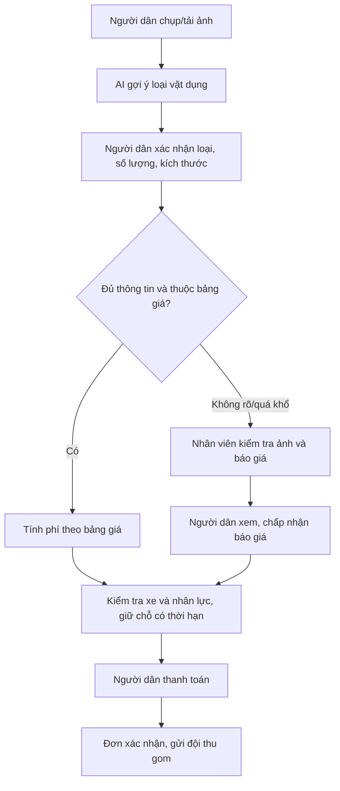

# Báo cáo quy trình đặt và thu gom rác cồng kềnh

## 1. Mục tiêu

Chức năng hỗ trợ người dân đặt lịch thu gom các vật dụng cồng kềnh như sofa, nệm, bàn, tủ. Hệ thống dùng AI để **gợi ý loại vật dụng từ ảnh**, sau đó báo giá dựa trên thông tin người dân xác nhận và điều kiện thu gom thực tế.

Mục tiêu là báo giá rõ ràng trước khi điều phối xe, đồng thời tránh tính tiền sai do AI suy đoán trọng lượng từ ảnh.

## 2. Vấn đề nghiệp vụ

Không thể xác định chính xác số kg chỉ từ một ảnh. Hai chiếc tủ có ngoại hình giống nhau có thể khác rất nhiều về trọng lượng do vật liệu, kết cấu hoặc đồ còn chứa bên trong. Vì vậy, lấy kg AI dự đoán để tính phí sẽ thiếu minh bạch và dễ phát sinh tranh chấp.

Giải pháp áp dụng là tính phí theo **loại vật dụng, số lượng, nhóm kích thước và điều kiện bốc xếp**, không tính kg từ ảnh.

## 3. Quy trình đề xuất

### Bước 1: Người dân gửi yêu cầu

Người dân tải ít nhất một ảnh, chọn địa chỉ và ngày mong muốn. AI nhận diện và gợi ý nhóm đồ: `SOFA`, `MATTRESS`, `CABINET`, `TABLE` hoặc `OTHER`.

AI chỉ là trợ lý gợi ý. Người dân vẫn là người xác nhận loại đồ, số lượng và nhóm kích thước.

### Bước 2: Xác nhận thông tin để tính giá

Mỗi món đồ cần có:

- Loại vật dụng.
- Số lượng.
- Nhóm kích thước, ví dụ sofa đơn, sofa 2 chỗ hoặc sofa 3 chỗ.
- Vị trí lấy đồ: mặt đường, tầng trệt hoặc tầng lầu.
- Số tầng, thông tin thang máy và yêu cầu tháo dỡ nếu có.

Nhóm kích thước được chọn bởi người dân, không lấy kích thước tuyệt đối do AI suy luận từ ảnh.

### Bước 3: Tính báo giá tự động

Với đơn đủ thông tin và thuộc danh mục hỗ trợ, hệ thống tính:

`Tổng phí = Phí vật dụng theo loại/kích thước × số lượng + phí khu vực/xe + phí thang bộ + phí tháo dỡ + thuế/phí − ưu đãi`

Phí thang bộ chỉ áp dụng khi đồ ở tầng lầu và không có thang máy đủ điều kiện vận chuyển. Không áp dụng phí này khi đồ đã ở mặt đường, tầng trệt hoặc có thang máy phù hợp.

Sau khi báo giá, hệ thống kiểm tra năng lực xe và nhân công. Chỉ khi còn chỗ mới tạo giữ chỗ có thời hạn. Người dân thanh toán thành công thì đơn mới được xác nhận và chuyển cho đội thu gom.

### Bước 4: Trường hợp cần nhân viên báo giá

Đơn được chuyển trạng thái `MANUAL_REVIEW` khi có một trong các tình huống:

- Ảnh mờ hoặc AI không nhận diện chắc chắn.
- Người dân chưa chọn được kích thước.
- Đồ quá khổ hoặc không nằm trong bảng giá chuẩn.
- Nhóm `OTHER` cần khảo sát thêm.
- Phát hiện rác nguy hại hoặc phế thải xây dựng.

Với đơn cần xem xét, hệ thống chưa tạo báo giá tự động, chưa giữ chỗ và chưa thu tiền. Nhân viên có quyền điều phối xem ảnh/thông tin, nhập mức phí trọn gói cùng nội dung báo giá. Người dân phải xem và chấp nhận báo giá trước khi đi đến bước giữ chỗ và thanh toán.

Rác nguy hại và phế thải xây dựng không được nhận chung trong dịch vụ này; nhân viên cần hướng dẫn người dân sang quy trình xử lý phù hợp.

## 4. Minh họa cách tính

Ví dụ: một sofa 3 chỗ, lấy tại tầng 3 không có thang máy, cần tháo dỡ, thuộc khu vực có phụ phí.

| Hạng mục | Ví dụ minh họa |
|---|---:|
| Sofa 3 chỗ | 250.000đ |
| Bốc xếp thang bộ 3 tầng | 60.000đ |
| Tháo dỡ | 30.000đ |
| Phụ phí khu vực | 25.000đ |
| Tổng phí trước thuế/ưu đãi | 365.000đ |

Các con số trên là ví dụ từ bảng giá mẫu trong bản demo. Đơn vị vận hành cần phê duyệt biểu phí chính thức trước khi áp dụng ngoài thực tế.

## 5. Nguyên tắc minh bạch và an toàn

- Không dùng AI để đoán kg tuyệt đối từ ảnh.
- Không tự động phụ thu theo một tỷ lệ cố định khi đến hiện trường.
- Nếu thông tin thực tế khác khai báo, nhân viên phải giải thích khoản phát sinh và nhận được sự đồng ý của khách trước khi thực hiện.
- Báo giá trọn gói do nhân viên tạo cũng không tự xác nhận lịch hoặc thanh toán; người dân vẫn phải chấp nhận, giữ chỗ và thanh toán.
- Phí rác cồng kềnh là khoản thu riêng, không cấn trừ vào phí vệ sinh định kỳ.

## 6. Kết quả đã triển khai trong bản demo

- Form đặt lịch yêu cầu người dân xác nhận nhóm kích thước thay vì hiển thị kg ước tính.
- Báo giá tự động theo loại đồ, kích thước, số lượng, tầng lầu, thang máy, tháo dỡ và khu vực.
- Luồng `MANUAL_REVIEW` và thông báo cho nhân viên khi đơn không đủ điều kiện báo giá tự động.
- Màn hình nhân viên nhập báo giá trọn gói; hệ thống lưu người báo giá và thời điểm báo giá.
- Người dân xem báo giá nhân viên, tạo giữ chỗ, rồi mới thanh toán.
- Có kiểm thử cho tính phí, quyền báo giá nhân viên, chặn thanh toán khi thiếu thông tin và luồng đầy đủ người dân–nhân viên–người dân.

## 7. Phạm vi và việc cần làm trước khi vận hành thật

Hiện phần này sử dụng dịch vụ mô phỏng và `localStorage`, bao gồm thanh toán mô phỏng. Trước khi đưa vào vận hành cần:

1. Chốt và phê duyệt bảng giá chính thức theo từng khu vực.
2. Kết nối backend, xác thực tài khoản và phân quyền nhân viên điều phối.
3. Tích hợp cổng thanh toán thực tế với webhook idempotent.
4. Kết nối dữ liệu đơn đã thanh toán sang đội điều phối/thu gom.
5. Xây dựng quy trình thực địa để nhân viên ghi nhận việc khách đồng ý nếu có thay đổi báo giá.

## 8. Nội dung trình bày ngắn

> Hệ thống không dùng AI để đoán số kg từ ảnh vì kết quả đó không đủ tin cậy để tính tiền. AI chỉ nhận diện loại đồ. Người dân xác nhận số lượng, kích thước và điều kiện bốc xếp; hệ thống tính giá theo bảng giá minh bạch. Với đồ quá khổ hoặc ảnh không rõ, đơn được chuyển nhân viên báo giá và chưa thu tiền. Khách chỉ thanh toán sau khi xem, chấp nhận báo giá và hệ thống giữ được lịch xe phù hợp.
