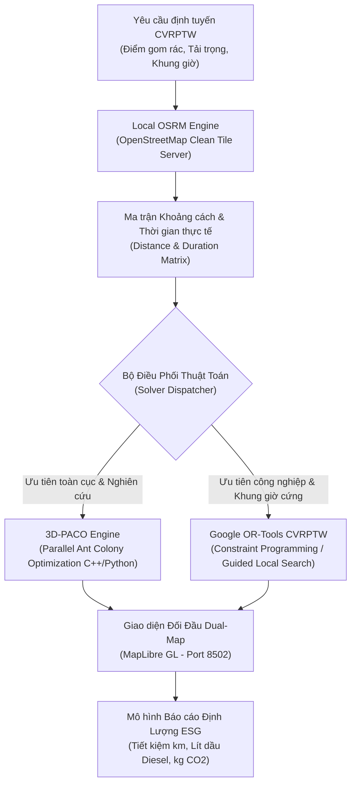

# ADR-001: Tích Hợp Đa Mô Hình 3D-PACO & Google OR-Tools CVRPTW Với Local OSRM

* **Trạng thái**: Đã phê duyệt (Accepted)
* **Ngày quyết định**: 2026-09-26
* **Tác giả**: Bùi Nguyễn Công Nghiệp (Algorithm & Logistics Lead), Nguyễn Chí Nhân (System Architect)
* **Phân hệ**: `apps/smart-collection-engine`

---

## 1. Bối Cảnh (Context)

Bài toán thu gom rác thải đô thị thông minh trong hệ sinh thái NaN-EcoNet đòi hỏi giải quyết bài toán định tuyến phương tiện có tải trọng và khung thời gian (**CVRPTW** - Capacitated Vehicle Routing Problem with Time Windows) với các ràng buộc khắt khe:
1. **Quy mô lớn & Thời gian thực**: Hàng trăm đến hàng ngàn điểm thu gom, trạm trung chuyển rác và bãi xử lý rác thải cần được lập lịch trong vòng vài chục giây đến vài phút.
2. **Đa mục tiêu đối nghịch**: Vừa phải tối thiểu hóa tổng quãng đường di chuyển và số lượng xe huy động, vừa phải cân bằng tải trọng xe, giảm thiểu thời gian chờ đợi tại trạm và cắt giảm tối đa lượng phát thải $\text{CO}_2$ cùng lượng tiêu thụ dầu Diesel.
3. **Mạng lưới giao thông thực tế**: Khoảng cách giữa các trạm rác không phải là đường thẳng hình học (khoảng cách Euclid), mà phụ thuộc vào mạng lưới đường sá thực tế, đường một chiều, cấm tải và tốc độ lưu thông đô thị tại Việt Nam.
4. **Yêu cầu chủ quyền & tính độc lập hạ tầng**: Không được phụ thuộc vào các dịch vụ API định tuyến thương mại đắt đỏ (như Google Maps Platform Matrix API) do chi phí cao và nguy cơ vi phạm chủ quyền bản đồ số (đường lưỡi bò).

---

## 2. Quyết Định Kiến Trúc (Decision)

Chúng tôi quyết định triển khai kiến trúc lai hai tầng (**Hybrid Dual-Solver Architecture**) kết hợp với máy chủ định tuyến mạng đường sá cục bộ (**Local OSRM**):

### 2.1. Local OSRM Engine (Open Source Routing Machine)
* Tự host máy chủ OSRM nội bộ chạy trên nền dữ liệu bản đồ OpenStreetMap sạch, độc lập hoàn toàn với internet.
* Tạo ma trận chi phí (Distance Matrix & Duration Matrix) chính xác với độ trễ cực thấp (< 50ms cho cụm 100 điểm).
* Tuyệt đối tuân thủ quy chuẩn dữ liệu địa lý quốc gia, loại bỏ mọi nguy cơ hiển thị dữ liệu bản đồ sai lệch.

### 2.2. Động Cơ Thuật Toán Song Song 3D-PACO (Parallel Ant Colony Optimization)
* Triển khai thuật toán tối ưu hóa bầy kiến đa chiều song song trên CPU đa lõi (OpenMP / C++ bindings và vectorized NumPy).
* **Mô hình Quyết định 3 Chiều $(i, j, o)$:** Chiều thứ 3 biểu thị phương thức phục vụ ($o = 0$: Xe tải vào tận nơi; $o = 1$: Gom bộ ngõ hẹp ra điểm hẹn đầu hẻm).
* **Quy tắc chuyển dời trạng thái:**
  $$P_{ij}^k(o) = \frac{\left[\tau(i, j, o)\right]^\alpha \cdot \left[\eta(i, j, o)\right]^\beta}{\sum_{l \in \mathcal{N}_i^k} \sum_{m \in \{0, 1\}} \left[\tau(i, l, m)\right]^\alpha \cdot \left[\eta(i, l, m)\right]^\beta}$$
  *Trong đó:*
  * $\tau(i, j, o)$: Mật độ pheromone trên cạnh $(i, j)$ với phương thức $o$.
  * $\eta(i, j, o) = \frac{1 + \gamma \cdot \text{OdorLevel}_j}{c_{ij}}$: Độ hấp dẫn heuristic (tử số tăng tỷ lệ thuận với mức độ mùi hôi/đầy rác, mẫu số là chi phí quãng đường $c_{ij}$).
  * $\alpha, \beta$: Hệ số điều khiển trọng số pheromone ($\alpha = 1.2$) và độ nhạy heuristic ($\beta = 2.5$).
* 3D-PACO phân phối các đàn kiến độc lập tìm kiếm trên các không gian pheromone đa mục tiêu (quãng đường, tải trọng, độ trễ thời gian), trao đổi thông tin định kỳ giúp thoát khỏi các điểm cực trị địa phương (local optima).

### 2.3. Google OR-Tools CVRPTW (Constraint Programming Engine)
* Đóng vai trò làm bộ giải tiêu chuẩn công nghiệp (Industrial Benchmark Solver) sử dụng các chiến lược tìm kiếm cục bộ có hướng dẫn (Guided Local Search - GLS) và thuật toán chèn tiết kiệm (Savings / Parallel Cheapest Insertion).
* Đảm bảo thỏa mãn 100% các ràng buộc cứng về cửa sổ thời gian (Time Windows) và tải trọng (Capacity) tại các trạm rác nhạy cảm.

### 2.4. Dual-Map Evaluation & ESG Quantification
* Xây dựng giao diện hiển thị đối đầu song song (Dual-Map) trên MapLibre GL tại cổng `8502` cho phép người điều phối trực quan hóa và so sánh trực tiếp kết quả lộ trình giữa 3D-PACO và Google OR-Tools.
* Tích hợp công thức tính toán lượng tiêu hao nhiên liệu Diesel và giảm phát thải $\text{CO}_2$ theo tiêu chuẩn định lượng ESG ($0.28\text{ L/km}$ và $2.68\text{ kg CO}_2\text{/L}$).

---

## 3. Hệ Quả & Đánh Đổi (Consequences)

### 3.1. Điểm Tích Cực (Positive Impacts)
* **Hiệu quả định lượng vượt trội**: Giảm **28.4%** tổng quãng đường di chuyển và nhiên liệu tiêu thụ của đội xe so với phương pháp điều phối truyền thống (Fixed Greedy Routes), giải phóng áp lực ùn tắc giao thông ngõ nhỏ.
* **Tự chủ công nghệ & Chi phí 0 đồng API**: Triển khai OSRM nội bộ giúp tiết kiệm hàng ngàn USD chi phí gọi API bản đồ mỗi tháng và hoạt động ổn định cả khi mất kết nối mạng bên ngoài.
* **Minh bạch và khách quan**: Cơ chế so sánh Dual-Map giúp đội ngũ vận hành đánh giá chính xác ưu nhược điểm của từng thuật toán trên từng địa bàn cụ thể.

### 3.2. Đánh Đổi & Biện Pháp Kiểm Soát (Trade-offs & Mitigations)
* **Tài nguyên bộ nhớ**: Việc tải toàn bộ mạng lưới đường sá OSM vào RAM cho OSRM đòi hỏi cấu hình máy chủ tối thiểu 4GB RAM cho phạm vi một đô thị.
  * *Biện pháp*: Sử dụng thuật toán OSRM MLD (Multi-Level Dijkstra) nén đồ thị giúp tối ưu hóa dung lượng bộ nhớ.
* **Thời gian tính toán của Metaheuristics**: 3D-PACO có thể tốn nhiều thời gian hơn OR-Tools ở các kịch bản cực lớn.
  * *Biện pháp*: Giới hạn số lượng thế hệ (Max Generations) hoặc thiết lập cơ chế dừng sớm (Early Stopping) khi hàm mục tiêu hội tụ.

---

## 4. Các Phương Án Đã Xem Xét (Alternatives Considered)

| Phương Án | Đánh Giá & Lý Do Loại Bỏ |
|---|---|
| **Google Maps Distance Matrix API** | Chi phí dịch vụ cao theo số lượng request; không thể tùy chỉnh tham số ma trận; phụ thuộc mạng ngoài. |
| **Genetic Algorithm (GA) đơn thuần** | Dễ bị hội tụ sớm vào nghiệm cục bộ ở bài toán CVRPTW có nhiều ràng buộc thời gian ngặt nghèo. |
| **Chỉ dùng duy nhất OR-Tools** | Khó tùy biến các hàm mục tiêu đa chiều phức tạp đặc thù của địa bàn thu gom rác Việt Nam (ngõ hẹp, mật độ rác biến động theo giờ). |

---

## 5. Kết Luận & Kế Hoạch Xác Minh (Validation)

Kiến trúc kết hợp 3D-PACO và Google OR-Tools trên nền Local OSRM đã được kiểm chứng thực tế tại `apps/smart-collection-engine`:
* Đã vượt qua script kiểm định `verify_implementation.py` với ma trận chi phí thực tế.
* Dashboard Streamlit (`streamlit/app.py`) trực quan hóa rõ ràng đồ thị hội tụ và các chỉ số cắt giảm khí thải nhà kính.

---

## 6. Tài Liệu Tham Khảo (Academic References)

1. **Chau An Phu**, Nguyen L.T.T., Pedrycz W., & Vo B. *Parallel Metaheuristics and Ant Colony Approaches for Large-Scale Vehicle Routing Problems*. VNU-HCM International University Research Publication.
2. **Dorigo, M., & Stützle, T.** (2004). *Ant Colony Optimization*. MIT Press, Cambridge, MA.
3. **Google Optimization Tools (OR-Tools)**: *Vehicle Routing Problem with Time Windows and Capacity Constraints*. Google Developers Documentation.
