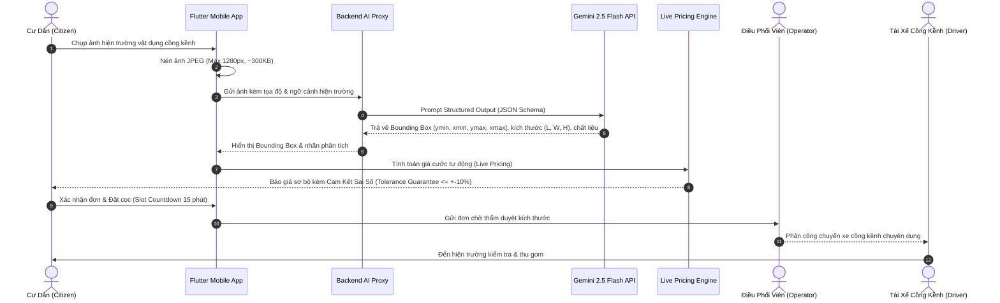

# ADR-002: Ứng Dụng Gemini 2.5 Flash Cho Vision AI Scanner Phân Loại Rác Cồng Kềnh

* **Trạng thái**: Đã phê duyệt (Accepted)
* **Ngày quyết định**: 2026-09-26
* **Tác giả**: Lê Quốc Anh (Mobile & AI Lead), Nguyễn Chí Nhân (System Architect)
* **Phân hệ**: `apps/citizen-bulky-app`, `apps/ecopass-enterprise/agy-image-gateway`

---

## 1. Bối Cảnh (Context)

Rác cồng kềnh đô thị (Bulky Waste) bao gồm nệm lò xo, ghế sofa da/nỉ, tủ gỗ công nghiệp, bàn ăn kính, tủ lạnh hỏng, phế thải sửa chữa nhà cửa. Việc thu gom rác cồng kềnh gặp phải các thách thức vận hành lớn:
1. **Khó xác định kích thước & chủng loại từ xa**: Người dân thường không biết chính xác kích thước Dài x Rộng x Cao hoặc chất liệu phế thải, dẫn đến việc điều phối sai kích cỡ thùng xe tải hoặc thiếu nhân lực bốc vác.
2. **Tranh chấp giá cước tại hiện trường**: Khi tài xế đến nơi, giá cước thực tế thường bị đội lên do ước tính ban đầu sai lệch, gây bức xúc cho cư dân và làm gián đoạn lịch trình.
3. **Độ trễ và trải nghiệm trên thiết bị di động**: Người dân cần chụp ảnh và nhận báo giá trong vòng dưới 2 giây trên kết nối mạng 4G/5G di động.

---

## 2. Quyết Định Kiến Trúc (Decision)

Chúng tôi quyết định chọn **Google Gemini 2.5 Flash** làm mô hình thị giác AI cốt lõi cho phân hệ **Vision AI Scanner** trong ứng dụng di động Flutter (`apps/citizen-bulky-app/mobile`), kết hợp với cơ chế định giá thời gian thực (**Live Pricing Engine**) và cam kết sai số (**Tolerance Guarantee**):



### 2.1. Cấu Hình & Định Dạng Đầu Ra (Structured Output Schema)
Yêu cầu Gemini 2.5 Flash trả về cấu trúc JSON chặt chẽ tuân thủ schema:
```json
{
  "detected_items": [
    {
      "label": "sofa_3_cho_vai_ni",
      "material": "vai_ni_khung_go",
      "box_2d": [120, 85, 780, 920],
      "estimated_dimensions_cm": {
        "length": 195,
        "width": 85,
        "height": 80
      },
      "estimated_weight_kg": 45,
      "disassembly_required": false,
      "confidence": 0.94
    }
  ]
}
```

### 2.2. Tại Sao Chọn Gemini 2.5 Flash?
* **Độ trễ siêu nhanh (Sub-second Latency)**: Tốc độ xử lý đa phương thức (Multimodal) trung bình dưới 800ms, phù hợp hoàn hảo với trải nghiệm người dùng di động mượt mà.
* **Năng lực suy luận không gian & vật thể (Spatial Reasoning)**: Gemini 2.5 Flash vượt trội trong việc ước lượng tương quan kích thước 3D dựa trên các vật thể tham chiếu xung quanh (sàn nhà, gạch men lát nền, cửa ra vào, người).
* **Tọa độ Bounding Box 2D chuẩn xác**: Cho phép ứng dụng Flutter vẽ trực tiếp khung nhận diện trực quan lên ảnh chụp giúp người dân lập tức xác thực vật dụng AI đã nhận diện.
* **Tối ưu hóa chi phí vận hành**: Chi phí token đầu vào/đầu ra cực thấp so với các mô hình Frontier lớn, cho phép hệ sinh thái phục vụ hàng trăm ngàn lượt quét mỗi ngày với chi phí gần như không đáng kể.

### 2.3. Ràng Buộc Bảo Mật API Key
* Ứng dụng di động Flutter **tuyệt đối không nhúng trực tiếp API Key** của Gemini vào mã nguồn hoặc file cấu hình client.
* Toàn bộ yêu cầu phân tích ảnh bắt buộc đi qua dịch vụ Backend Proxy trung gian (`apps/ecopass-enterprise/agy-image-gateway` hoặc Bulky Backend) có xác thực Bearer Token của phiên người dùng và rate limiting.

### 2.4. Live Pricing & Tolerance Guarantee
* Hệ thống tính toán giá cước tự động dựa trên kích thước khối tích ($m^3$) do Gemini trích xuất kết hợp với các tham số hậu cần: tầng lầu, thang máy, bốc dỡ vỉa hè (*Curbside*) hay trong nhà (*Inside Home*).
* Đưa ra cam kết pháp lý với cư dân: Khi tài xế đến hiện trường, nếu kích thước thực tế sai lệch trong ngưỡng cho phép, giá cước cuối cùng không bao giờ chênh lệch quá $\pm 10\%$ so với giá tạm tính.

---

## 3. Hệ Quả & Đánh Đổi (Consequences)

### 3.1. Điểm Tích Cực (Positive Impacts)
* Giảm 85% thời gian tạo đơn thu gom rác cồng kềnh (từ 10 phút nhập liệu thủ công xuống còn 1 lần bấm máy chụp ảnh).
* Triệt tiêu tranh chấp giá cước giữa cư dân và tài xế nhờ chính sách Tolerance Guarantee minh bạch và Bounding Box trực quan.
* Tối ưu hóa dung tích thùng xe tải cồng kềnh nhờ số liệu khối tích chính xác phục vụ thuật toán 3D Bin Packing và CVRPTW.

### 3.2. Đánh Đổi & Biện Pháp Kiểm Soát (Trade-offs & Mitigations)
* **Ảo giác kích thước trong điều kiện ánh sáng yếu hoặc thiếu vật tham chiếu**:
  * *Biện pháp*: Thiết kế giao diện Request Wizard 3 bước cho phép cư dân chủ động điều chỉnh nhanh kích thước (Dài x Rộng x Cao) trước khi chốt đơn.
  * Cung cấp tính năng "Biên bản sai lệch hiện trường" (Discrepancy Report) cho tài xế để điều phối viên thẩm duyệt nếu có gian lận cố ý.

---

## 4. Các Phương Án Đã Đánh Giá (Alternatives Considered)

| Giải Pháp | Lý Do Không Lựa Chọn |
|---|---|
| **YOLOv8 / YOLOv11 Tự Train (Self-hosted)** | Cần thu thập và gán nhãn hàng chục nghìn hình ảnh đồ nội thất đặc thù Việt Nam; khó suy luận kích thước 3D thực tế; tốn chi phí duy trì GPU server liên tục. |
| **On-device Mobile Net / TFLite** | Giới hạn về bộ nhớ và khả năng tính toán trên các dòng điện thoại tầm trung/giá rẻ; độ chính xác nhận diện ngữ cảnh kém. |
| **GPT-4o / Claude 3.5 Sonnet** | Chi phí API cao gấp 5-10 lần so với Gemini 2.5 Flash; độ trễ xử lý ảnh cao hơn (2-3 giây), không tối ưu cho ứng dụng di động đại trà. |

---

## 5. Kết Luận

Việc tích hợp Gemini 2.5 Flash kết hợp với kiến trúc Proxy bảo mật và Live Pricing Engine đã mang lại bước đột phá lớn cho phân hệ thu gom rác cồng kềnh của NaN-EcoNet, kết nối hài hòa giữa sự tiện lợi cho người dân và hiệu quả kinh tế cho đội ngũ vận hành.
