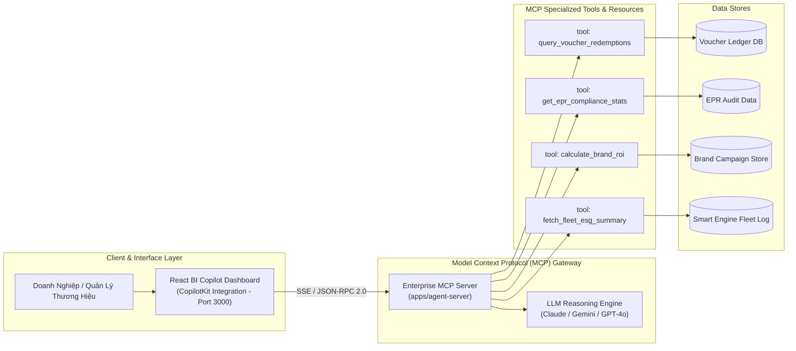
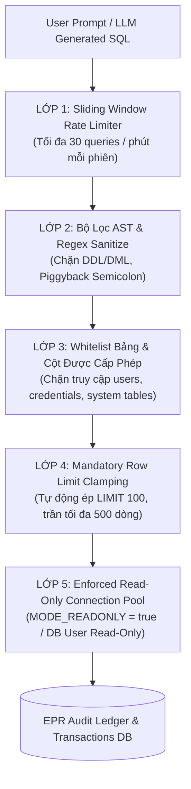

# ADR-003: Ứng Dụng Chuẩn Model Context Protocol (MCP) Cho Enterprise BI Copilot & Quản Trị Voucher Tuần Hoàn

* **Trạng thái**: Đã phê duyệt (Accepted)
* **Ngày quyết định**: 2026-09-26
* **Tác giả**: Nguyễn Chí Nhân (Lead & Enterprise Architect)
* **Phân hệ**: `apps/ecopass-enterprise/enterprise-bi-copilot`

---

## 1. Bối Cảnh (Context)

Nền tảng **EcoPass** trong hệ sinh thái NaN-EcoNet vận hành chuỗi giá trị tuần hoàn 4 bên (Citizen - Brand - Merchant - Recycler). Lượng dữ liệu phát sinh hàng ngày rất phong phú và phân mảnh:
1. **Dữ liệu giao dịch tuần hoàn thời gian thực**: Hàng trăm ngàn lượt quét tem QR 1-Time Burn từ vỏ lon bia, lon nước ngọt, ly nhựa dùng một lần.
2. **Quản trị ngân sách tài trợ & Báo cáo EPR (Extended Producer Responsibility)**: Các nhãn hàng đối tác (F&B, FMCG) cần theo dõi sát sao tiến độ giải ngân ngân sách CSR/ESG, lượng bao bì đã thu hồi theo hạn mức pháp lý, và tỷ lệ chuyển đổi khách hàng từ voucher xanh đến cửa hàng (*Redemption Conversion Rate*).
3. **Nhu cầu hỏi đáp tự nhiên từ ban lãnh đạo**: Giám đốc ESG, Quản lý Thương hiệu và Điều hành viên muốn đặt câu hỏi bằng ngôn ngữ tự nhiên (tiếng Việt hoặc tiếng Anh) như: *"Nhãn hàng Highlands Coffee đã giải ngân bao nhiêu % ngân sách tháng này và khu vực quận nào có tỷ lệ đổi quà cao nhất?"* thay vì phải tự viết câu truy vấn SQL hay chờ phòng dữ liệu kết xuất báo cáo tĩnh.

---

## 2. Quyết Định Kiến Trúc (Decision)

Chúng tôi quyết định áp dụng tiêu chuẩn mở **Model Context Protocol (MCP)** do Anthropic khởi xướng để xây dựng kiến trúc **Enterprise BI Copilot** tại thư mục `apps/ecopass-enterprise/enterprise-bi-copilot`:



### 2.1. Cấu Trúc MCP Server
* Đặt tại `apps/ecopass-enterprise/enterprise-bi-copilot/apps/agent-server`.
* Giao tiếp thông qua giao thức chuẩn **JSON-RPC 2.0** trên nền **Server-Sent Events (SSE)** hoặc Stdio.
* Phân tách rành mạch thành 2 khái niệm cốt lõi của MCP:
  * **Resources**: Cung cấp ngữ cảnh tĩnh/bán tĩnh (schema cơ sở dữ liệu, danh mục nhãn hàng, quy định định mức EPR quốc gia).
  * **Tools**: Cung cấp các hàm có khả năng thực thi tham số hóa để truy vấn và tính toán chỉ số tài chính, voucher.

### 2.2. Danh Mục MCP Tools Chuẩn Hóa
1. **`query_voucher_redemptions`**:
   * *Tham số*: `brand_id`, `time_range`, `location_zone`, `status` (`issued`, `redeemed`, `burned`, `expired`).
   * *Nghiệp vụ*: Truy vấn tốc độ lưu chuyển voucher và tỷ lệ đốt tem tại các điểm POS.
2. **`get_epr_compliance_stats`**:
   * *Tham số*: `enterprise_tax_id`, `fiscal_quarter`, `material_type` (`aluminum`, `pet_plastic`).
   * *Nghiệp vụ*: Tính toán khối lượng phế liệu thu gom thực tế đối chiếu với nghĩa vụ trách nhiệm mở rộng của nhà sản xuất theo Luật BVMT.
3. **`calculate_brand_roi`**:
   * *Tham số*: `campaign_id`, `spend_budget_vnd`.
   * *Nghiệp vụ*: Phân tích số lượng khách hàng mới ghé thăm cửa hàng thông qua chiến dịch voucher rác thưởng.
4. **`fetch_fleet_esg_summary`**:
   * *Tham số*: `fleet_id`, `date`.
   * *Nghiệp vụ*: Kết nối dữ liệu từ `smart-collection-engine` để xuất báo cáo phát thải $\text{CO}_2$ cắt giảm được.

### 2.3. Cơ Chế Cô Lập Đa Khách Hàng (Multi-Tenant Isolation) & Phân Quyền
* Toàn bộ truy vấn MCP đều chạy trong ngữ cảnh bảo mật của tài khoản người dùng (`brand_id`, `tenant_id`).
* Nhãn hàng A **tuyệt đối không thể truy vấn** số liệu kinh doanh, ngân sách hoặc khách hàng của nhãn hàng B.
* Các MCP Tools đều là **Read-Only (Chỉ đọc)** hoặc **Simulation (Mô phỏng dự báo)**; không cung cấp quyền đột biến ghi nợ hay chuyển tiền trực tiếp trong phiên chat để đảm bảo an toàn tuyệt đối.

---

## 3. Hệ Quả & Đánh Đổi (Consequences)

### 3.1. Điểm Tích Cực (Positive Impacts)
* **Không bị khóa chặt nhà cung cấp (Vendor-Agnostic)**: Giao thức MCP độc lập với mô hình LLM phía sau. Hệ thống có thể chuyển đổi linh hoạt giữa Claude 3.5 Sonnet, Gemini Flash, GPT-4o hoặc LLM cục bộ (Ollama/vLLM) mà không phải sửa đổi mã nguồn công cụ truy vấn dữ liệu.
* **Chuẩn hóa công cụ phân tích (Reusable Tooling)**: Các công cụ MCP có thể được tái sử dụng trực tiếp bởi Cursor, Claude Desktop, Antigravity, hoặc CopilotKit Frontend.
* **Tự động hóa báo cáo ESG**: Rút ngắn thời gian tạo báo cáo tuân thủ EPR từ 2 tuần xuống còn 30 giây với biểu đồ trực quan.

### 3.2. Hệ Quả Bảo Mật & Chốt Chặn Phòng Vệ Chuyên Sâu (Security Consequences & Guardrails)

Trong phân hệ Enterprise BI Copilot, các tác vụ Text-to-SQL và MCP Tool Calling trực tiếp tương tác với dữ liệu nhạy cảm của các tập đoàn đa quốc gia (FMCG, F&B như Unilever, Nestlé, Highlands Coffee). Do đó, mô hình bảo vệ dữ liệu được thiết kế theo nguyên lý **Phòng vệ Chuyên sâu (Defense-in-Depth)** qua 5 lớp chốt chặn bất khả xâm phạm, được cài đặt tại [`apps/ecopass-enterprise/enterprise-bi-copilot/src/security-guardrails.ts`](../../apps/ecopass-enterprise/enterprise-bi-copilot/src/security-guardrails.ts) và kiểm chứng bởi [`tests/security/test_mcp_guardrails.py`](../../tests/security/test_mcp_guardrails.py):



#### A. Mô Hình Bảo Vệ Cơ Sở Dữ Liệu Kiểm Toán EPR (EPR Audit Ledger Security)
* **Tầm quan trọng của dữ liệu EPR:** Sổ cái kiểm toán Trách nhiệm mở rộng của nhà sản xuất (EPR Audit Ledger) lưu trữ minh chứng pháp lý về khối lượng phế liệu thu gom, định mức tái chế, chi phí đóng góp tài chính vào Quỹ BVMT Việt Nam và mã xác thực đốt tem (One-Time Burn QR). Mọi hành vi sửa đổi trái phép (Tampering) hoặc rò rỉ dữ liệu (Exfiltration) sẽ dẫn đến trách nhiệm pháp lý và tổn thất hàng triệu USD cho doanh nghiệp đối tác.
* **Nguyên tắc Bất Biến (Immutability):** Dữ liệu giao dịch EPR và lịch sử đốt tem một khi đã ghi nhận thì chỉ được phép đọc (`SELECT`) hoặc kiểm toán (`VERIFY`). Bất kỳ thao tác `UPDATE`, `DELETE`, `DROP` nào đều bị coi là vi phạm an ninh nghiêm trọng.

#### B. Danh Sách Trắng Bảng Phân Tích (Strict Schema Whitelist)
Mọi câu truy vấn Text-to-SQL hoặc MCP tool gọi vào cơ sở dữ liệu phải được thẩm định qua danh sách trắng (Whitelist) nghiêm ngặt trước khi được phép chuyển xuống cơ sở dữ liệu:
* **Các bảng được cấp phép (Whitelisted Analytics Tables):**
  * `recycling_transactions`: Dữ liệu phân loại rác, khối lượng thu gom thực tế.
  * `epr_compliance_logs`: Báo cáo chỉ tiêu hoàn thành định mức tái chế theo quý.
  * `voucher_redemptions`: Tỷ lệ chuyển đổi voucher thưởng tại các điểm POS.
  * `collection_metrics`: Hiệu suất đội xe và định mức khí thải.
  * `carbon_offset_summary`: Báo cáo định lượng ESG và bù trừ $\text{CO}_2$.
* **Các bảng cấm tuyệt đối (Blacklisted / Restricted Tables):**
  * `users`, `user_credentials`, `passwords`, `api_keys`, `jwt_tokens`, `system_config`.
  * Siêu dữ liệu hệ quản trị: `sqlite_master`, `sqlite_schema`, `information_schema.*`, `pg_catalog.*`.
  * Bất kỳ câu truy vấn nào chứa tên bảng không thuộc Whitelist sẽ bị ngắt kết nối lập tức và ghi nhận cảnh báo an ninh mức độ cao (Security Alert Level 3).

#### C. Kết Nối Cơ Sở Dữ Liệu Chỉ Đọc Cưỡng Chế (Enforced Read-Only Connection Pool)
* Toàn bộ các kết nối từ MCP Server đến cơ sở dữ liệu phân tích đều sử dụng Connection Pool ở chế độ **Read-Only bắt buộc**:
  * Với SQLite: Thiết lập cứng cờ mở tệp `sqlite3.OPEN_READONLY` và chạy lệnh cưỡng chế `PRAGMA query_only = ON;`.
  * Với PostgreSQL: Kết nối thông qua tài khoản cơ sở dữ liệu chuyên dụng `mcp_readonly_worker` với phân quyền:
    ```sql
    REVOKE ALL ON ALL TABLES IN SCHEMA public FROM mcp_readonly_worker;
    GRANT SELECT ON TABLE recycling_transactions, epr_compliance_logs, voucher_redemptions TO mcp_readonly_worker;
    ```
* Ngay cả trong kịch bản xấu nhất khi kẻ tấn công đánh lừa được mô hình LLM sinh mã độc DDL/DML, tầng động cơ cơ sở dữ liệu vật lý (Database Engine Level) sẽ từ chối thực thi với mã lỗi `SQLITE_READONLY` hoặc `PG_INSUFFICIENT_PRIVILEGE`.

#### D. Ngăn Chặn SQL Injection Đa Tầng (Multi-Layer SQL Injection Defense)
1. **Lọc từ khóa nguy hiểm bằng Regular Expressions:**
   Chặn không khoan nhượng tất cả các từ khóa DDL/DML gây biến đổi trạng thái:
   `/(DROP|DELETE|UPDATE|INSERT|ALTER|TRUNCATE|CREATE|GRANT|REVOKE|EXEC|ATTACH|DETACH|VACUUM)/i`.
2. **Triệt tiêu tấn công gộp lệnh (Piggybacked Queries / Semicolon Injection):**
   Phát hiện và loại bỏ triệt để ký tự phân tách dấu chấm phẩy `;` trong câu lệnh SQL thô nhằm ngăn chặn kỹ thuật chèn thêm lệnh thứ hai (ví dụ: `SELECT * FROM epr_compliance_logs; DROP TABLE users; --`).
3. **Cưỡng chế giới hạn số dòng (Mandatory Row Limiting):**
   Tất cả câu lệnh SELECT đều bắt buộc có mệnh đề `LIMIT`. Hệ thống tự động thêm `LIMIT 100` nếu câu lệnh nguyên bản không có, hoặc hạ giới hạn xuống tối đa `500` nếu câu lệnh yêu cầu vượt quá, triệt tiêu nguy cơ tấn công từ chối dịch vụ (Denial of Service - OOM crash).
4. **Tham số hóa truy vấn (Parameterized Execution):**
   Mọi MCP tool cụ thể (`query_voucher_redemptions`, `get_epr_compliance_stats`) bắt buộc sử dụng Prepared Statements với các placeholder tham số (`$1, $2, ...`), cách ly hoàn toàn dữ liệu đầu vào của người dùng khỏi cú pháp thực thi SQL.

### 3.3. Các Đánh Đổi Khác & Biện Pháp Kiểm Soát
* **Độ trễ khi qua tầng trung gian MCP:** Giao thức SSE/JSON-RPC có thể thêm 50-100ms so với gọi REST trực tiếp.
  * *Biện pháp*: Sử dụng keep-alive connection và streaming response theo từng token (Token-by-token SSE streaming) giúp người dùng thấy câu trả lời xuất hiện ngay tức thì mà không phải chờ hoàn tất toàn bộ truy vấn.

---

## 4. Các Phương Án Đã Đánh Giá (Alternatives Considered)

| Phương Án | Lý Do Không Lựa Chọn |
|---|---|
| **Chatbot REST API tùy biến riêng (Custom Endpoints)** | Phải tự xây dựng lại toàn bộ giao thức gọi hàm (Tool Calling), quản lý phiên, streaming và schema định nghĩa; khó mở rộng khi bổ sung tính năng mới. |
| **LangChain Agents với Custom Tools** | Phụ thuộc nặng nề vào hệ sinh thái thư viện ngoài; cấu trúc tool không tương thích chuẩn công nghiệp với các IDE AI hiện đại (Cursor, Copilot, Claude Desktop). |
| **Bảng điều khiển BI tĩnh (Static Metabase / Superset)** | Không giải quyết được nhu cầu phân tích tùy biến theo thời gian thực và tương tác hội thoại tự nhiên của ban điều hành. |

---

## 5. Kết Luận

Áp dụng chuẩn Model Context Protocol (MCP) là một quyết định chiến lược đưa NaN-EcoNet trở thành nền tảng tiên phong về AI Agentic trong lĩnh vực kinh tế tuần hoàn tại Việt Nam, mang lại khả năng phân tích dữ liệu chuyên sâu, minh bạch và an toàn cho mọi đối tác doanh nghiệp.
