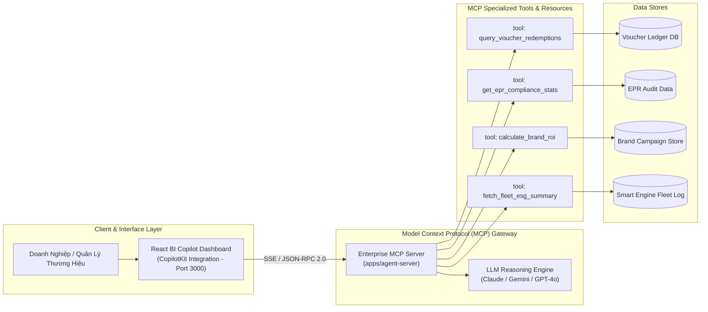

# ADR-003: Ứng Dụng Chuẩn Model Context Protocol (MCP) Cho Enterprise BI Copilot & Quản Trị Voucher Tuần Hoàn

* **Trạng thái**: Đã phê duyệt (Accepted)
* **Ngày quyết định**: 2026-09-26
* **Tác giả**: Nguyễn Chí Nhân (Lead & Enterprise Architect)
* **Phân hệ**: `apps/ecopass-enterprise/enterprise-bi-copilot`

---

## 1. Bối Cảnh (Context)

Nền tảng **EcoPass** trong hệ sinh thái NaN-EcoNet vận hành chuỗi giá trị tuần hoàn 4 bên (Citizen - Brand - Merchant - Recycler). Lượng dữ liệu phát sinh hàng ngày rất phong phú và phân mảnh:
1. **Dữ liệu giao dịch tuần hoàn thời gian thực**: Hàng trăm ngàn lượt quét tem QR 1-Time Burn từ vỏ lon bia, lon nước ngọt, ly nhựa dùng một lần.
2. **Quản trị ngân sách tài trợ & Báo cáo EPR (Extended Producer Responsibility)**: Các nhãn hàng đối tác (F&B, FMCG) cần theo dõi sát sao tiến độ giải ngân ngân sách CSR/ESG, lượng bao bì đã thu hồi theo hạn mức pháp lý, và tỷ lệ chuyển đổi khách hàng từ voucher xanh đến cửa hàng (*Redemption Conversion Rate*).
3. **Nhu cầu hỏi đáp tự nhiên từ ban lãnh đạo**: Giám đốc ESG, Quản lý Thương hiệu và Điều hành viên muốn đặt câu hỏi bằng ngôn ngữ tự nhiên (tiếng Việt hoặc tiếng Anh) như: *"Nhãn hàng Highlands Coffee đã giải ngân bao nhiêu % ngân sách tháng này và khu vực quận nào có tỷ lệ đổi quà cao nhất?"* thay vì phải tự viết câu truy vấn SQL hay chờ phòng dữ liệu kết xuất báo cáo tĩnh.

---

## 2. Quyết Định Kiến Trúc (Decision)

Chúng tôi quyết định áp dụng tiêu chuẩn mở **Model Context Protocol (MCP)** do Anthropic khởi xướng để xây dựng kiến trúc **Enterprise BI Copilot** tại thư mục `apps/ecopass-enterprise/enterprise-bi-copilot`:

### 2.1. Cấu Trúc MCP Server
* Đặt tại `apps/ecopass-enterprise/enterprise-bi-copilot/apps/agent-server`.
* Giao tiếp thông qua giao thức chuẩn **JSON-RPC 2.0** trên nền **Server-Sent Events (SSE)** hoặc Stdio.
* Phân tách rành mạch thành 2 khái niệm cốt lõi của MCP:
  * **Resources**: Cung cấp ngữ cảnh tĩnh/bán tĩnh (schema cơ sở dữ liệu, danh mục nhãn hàng, quy định định mức EPR quốc gia).
  * **Tools**: Cung cấp các hàm có khả năng thực thi tham số hóa để truy vấn và tính toán chỉ số tài chính, voucher.

### 2.2. Danh Mục MCP Tools Chuẩn Hóa
1. **`query_voucher_redemptions`**:
   * *Tham số*: `brand_id`, `time_range`, `location_zone`, `status` (`issued`, `redeemed`, `burned`, `expired`).
   * *Nghiệp vụ*: Truy vấn tốc độ lưu chuyển voucher và tỷ lệ đốt tem tại các điểm POS.
2. **`get_epr_compliance_stats`**:
   * *Tham số*: `enterprise_tax_id`, `fiscal_quarter`, `material_type` (`aluminum`, `pet_plastic`).
   * *Nghiệp vụ*: Tính toán khối lượng phế liệu thu gom thực tế đối chiếu với nghĩa vụ trách nhiệm mở rộng của nhà sản xuất theo Luật BVMT.
3. **`calculate_brand_roi`**:
   * *Tham số*: `campaign_id`, `spend_budget_vnd`.
   * *Nghiệp vụ*: Phân tích số lượng khách hàng mới ghé thăm cửa hàng thông qua chiến dịch voucher rác thưởng.
4. **`fetch_fleet_esg_summary`**:
   * *Tham số*: `fleet_id`, `date`.
   * *Nghiệp vụ*: Kết nối dữ liệu từ `smart-collection-engine` để xuất báo cáo phát thải $\text{CO}_2$ cắt giảm được.

### 2.3. Cơ Chế Cô Lập Đa Khách Hàng (Multi-Tenant Isolation) & Phân Quyền
* Toàn bộ truy vấn MCP đều chạy trong ngữ cảnh bảo mật của tài khoản người dùng (`brand_id`, `tenant_id`).
* Nhãn hàng A **tuyệt đối không thể truy vấn** số liệu kinh doanh, ngân sách hoặc khách hàng của nhãn hàng B.
* Các MCP Tools đều là **Read-Only (Chỉ đọc)** hoặc **Simulation (Mô phỏng dự báo)**; không cung cấp quyền đột biến ghi nợ hay chuyển tiền trực tiếp trong phiên chat để đảm bảo an toàn tuyệt đối.

---

## 3. Hệ Quả & Đánh Đổi (Consequences)

### 3.1. Điểm Tích Cực (Positive Impacts)
* **Không bị khóa chặt nhà cung cấp (Vendor-Agnostic)**: Giao thức MCP độc lập với mô hình LLM phía sau. Hệ thống có thể chuyển đổi linh hoạt giữa Claude 3.5 Sonnet, Gemini Flash, GPT-4o hoặc LLM cục bộ (Ollama/vLLM) mà không phải sửa đổi mã nguồn công cụ truy vấn dữ liệu.
* **Chuẩn hóa công cụ phân tích (Reusable Tooling)**: Các công cụ MCP có thể được tái sử dụng trực tiếp bởi Cursor, Claude Desktop, Antigravity, hoặc CopilotKit Frontend.
* **Tự động hóa báo cáo ESG**: Rút ngắn thời gian tạo báo cáo tuân thủ EPR từ 2 tuần xuống còn 30 giây với biểu đồ trực quan.

### 3.2. Đánh Đổi & Biện Pháp Kiểm Soát (Trade-offs & Mitigations)
* **Bảo vệ SQL Injection gián tiếp (Prompt Injection / Indirect Injection)**:
  * *Biện pháp*: Không cho phép LLM sinh câu lệnh SQL thô (raw SQL) chạy thẳng vào cơ sở dữ liệu. Tất cả câu truy vấn bắt buộc đi qua các MCP Tools có kiểu dữ liệu tham số hóa chặt chẽ (Parameterized / Prepared Statements).

---

## 4. Các Phương Án Đã Đánh Giá (Alternatives Considered)

| Phương Án | Lý Do Không Lựa Chọn |
|---|---|
| **Chatbot REST API tùy biến riêng (Custom Endpoints)** | Phải tự xây dựng lại toàn bộ giao thức gọi hàm (Tool Calling), quản lý phiên, streaming và schema định nghĩa; khó mở rộng khi bổ sung tính năng mới. |
| **LangChain Agents với Custom Tools** | Phụ thuộc nặng nề vào hệ sinh thái thư viện ngoài; cấu trúc tool không tương thích chuẩn công nghiệp với các IDE AI hiện đại (Cursor, Copilot, Claude Desktop). |
| **Bảng điều khiển BI tĩnh (Static Metabase / Superset)** | Không giải quyết được nhu cầu phân tích tùy biến theo thời gian thực và tương tác hội thoại tự nhiên của ban điều hành. |

---

## 5. Kết Luận

Áp dụng chuẩn Model Context Protocol (MCP) là một quyết định chiến lược đưa NaN-EcoNet trở thành nền tảng tiên phong về AI Agentic trong lĩnh vực kinh tế tuần hoàn tại Việt Nam, mang lại khả năng phân tích dữ liệu chuyên sâu, minh bạch và an toàn cho mọi đối tác doanh nghiệp.
