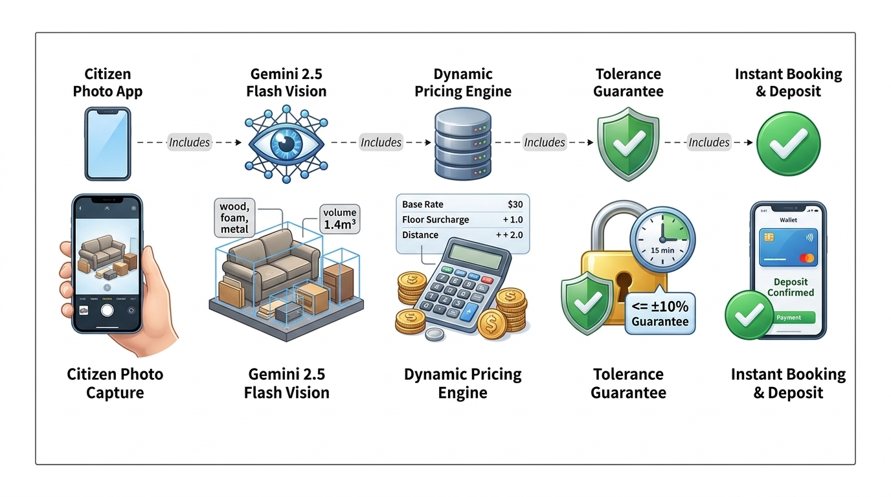

# 📱 Phân Hệ 3: Citizen Bulky Waste & AI Vision Platform

**Thư mục mã nguồn:** [`apps/citizen-bulky-app`](../../apps/citizen-bulky-app)  
**Phụ trách kỹ thuật:** **Lê Quốc Anh** (`EnglandLee`)

Phân hệ đóng vai trò giao diện tiền tuyến tiếp xúc trực tiếp với các hộ gia đình đô thị. Bằng việc kết hợp camera trí tuệ nhân tạo nhận diện đồ vật và quy trình đặt dịch vụ đơn giản hóa, người dân có thể giải quyết các món phế thải cũ cồng kềnh (sofa, nệm cũ, tủ gỗ, bàn ghế hỏng...) nhanh chóng, minh bạch về giá cả và không lo bị ép giá tại hiện trường.

---

## 1. Kiến Trúc Phân Hệ Cư Dân

  

<i>Hình: Quy trình quét ảnh AI Gemini Flash, tính cước 4 thành phần và cam kết dung sai</i>

### 1.1. Cấu Trúc Mã Nguồn Ứng Dụng Di Động (Flutter):
Phân hệ di động được xây dựng theo kiến trúc Clean Architecture phân tầng rõ ràng:
* `mobile/lib/core/domain/models/`: Các mô hình thực thể miền (`bulky_item.dart`, `bulky_quote.dart`, `bulky_order.dart`, `bounding_box.dart`).
* `mobile/lib/core/domain/pricing/`: Động cơ tính giá thuần túy (`pricing_engine.dart`).
* `mobile/lib/features/request_wizard/`: Quy trình 3 bước đặt xe thu gom (Chụp ảnh AI -> Kiểm tra & Bổ sung thông số -> Xác nhận lịch & Giữ cọc).
* `mobile/lib/features/quote/`: Các thành phần hiển thị chi tiết cước và biểu ngữ cam kết bảo vệ giá (`tolerance_guarantee_banner.dart`).
* `mobile/lib/features/driver/`: Màn hình dành cho tài xế với danh sách các điểm dừng gom (`driver_stops_screen.dart`).

---

## 2. AI Vision Scanner & Ước Lượng Kích Thước 3D (Gemini 2.5 Flash)

Thay vì yêu cầu người dân tự nhập kích thước centimet phức tạp, hệ thống sử dụng camera điện thoại kết hợp mô hình thị giác máy tính **Gemini 2.5 Flash**:

1. **Phát Hiện Hộp Bao Bọc 2D (Normalized Bounding Box):**
   * Xác định chính xác vị trí và tọa độ chuẩn hóa $[y_{min}, x_{min}, y_{max}, x_{max}] \in [0, 1000]$ của từng vật phẩm trong khung hình.
   * Cho phép nhận diện đồng thời nhiều đồ vật trong một bức ảnh duy nhất (ví dụ: vừa có 1 bàn ăn và 4 ghế tựa).

2. **Phân Loại Danh Mục & Ước Lượng Kích Thước Thực Tế:**
   * Tự động ánh xạ vào các nhóm danh mục chuẩn: `SOFA`, `MATTRESS`, `CABINET`, `TABLE`, `OTHER`.
   * Đối chiếu với mô hình tham chiếu không gian nhằm ước tính chiều dài ($L$), chiều rộng ($W$), chiều cao ($H$) tính bằng centimet, từ đó tính ra thể tích hình học $V = \frac{L \times W \times H}{1.000.000} \text{ (m}^3\text{)}$.

3. **Phân Tích Tỷ Lệ Vật Liệu (Material Composition Breakdown):**
   * Phân tích bề mặt vật liệu để xác định tỷ trọng các thành phần: Gỗ tự nhiên/MDF, đệm mút, kim loại, nhựa/thủy tinh.
   * Tỷ lệ vật liệu giúp hệ thống phân loại mức độ dễ tái chế và dự đoán khối lượng tương ứng của món đồ.

---

## 3. Live Dynamic Pricing Engine & Cam Kết Dung Sai

Một trong những rào cản lớn nhất khiến người dân ngần ngại gọi dịch vụ thu gom đồ cồng kềnh là tình trạng phát sinh chi phí khó lường khi tài xế đến nơi. NaN-EcoNet giải quyết triệt để vấn đề này bằng mô hình định giá 4 thành phần minh bạch:

$$P_{\text{total}} = P_{\text{items}} + P_{\text{volume}} + P_{\text{floor}} + P_{\text{alley}}$$

*Trong đó:*
* **$P_{\text{items}}$ (Cước vật phẩm cơ sở):** Tính theo danh mục và hệ số vật liệu:
  $$P_{\text{items}} = \sum_{i} \text{BasePrice}_i \times \text{MaterialFactor}_i \times \text{Quantity}_i$$
* **$P_{\text{volume}}$ (Cước thể tích bổ sung):** Áp dụng cho các kiện hàng lớn vượt định mức ($250.000\text{ VNĐ/m}^3$).
* **$P_{\text{floor}}$ (Phụ phí vận chuyển tầng cao):** Nếu không có thang máy, tính $20.000\text{ VNĐ/tầng}$ từ tầng 2 trở lên.
* **$P_{\text{alley}}$ (Phụ phí hẻm sâu):** $30.000\text{ VNĐ}$ cho các ngõ hẻm sâu trên $50\text{m}$ xe tải không tiếp cận trực tiếp được.

### Chính Sách Cam Kết Dung Sai $\le \pm 10\%$ & Khóa Giá 15 Phút:
* **Khóa Giá Giữ Chỗ (15-Minute Price Hold Lock):** Sau khi camera AI quét xong, mức báo giá Min-Max được hệ thống bảo lưu cố định trong vòng 15 phút để người dân an tâm kiểm tra và xác nhận.
* **Cam Kết Không Bị Ép Giá Tại Hiện Trường:** Nếu kích thước hoặc trọng lượng thực tế tại hiện trường sai lệch trong biên độ **$\pm 10\%$** so với kết quả quét AI ban đầu, người dân được **miễn phí hoàn toàn phụ thu phát sinh**.
* Nếu phát sinh sai lệch vượt quá $10\%$ (ví dụ: khai báo bàn gỗ rỗng nhưng thực tế là bàn đá nguyên khối), ứng dụng tài xế sẽ chụp ảnh đối soát và gửi yêu cầu phê duyệt giá mới tới màn hình người dân với sự giám sát của hệ thống.

---

## 4. Cổng Quản Lý Web Đa Vai Trò (Citizen & Municipal Web Portal)

Xây dựng trên nền tảng React 18, TailwindCSS và Vite tại thư mục `apps/citizen-bulky-app`:
* **Cổng Thông Tin Hộ Dân (`/citizen`):** Tra cứu tiến độ đơn gom rác cồng kềnh theo thời gian thực, xem vị trí xe tải trên bản đồ số, đánh giá chất lượng phục vụ của tài xế.
* **Cổng Điều Phối Viên Đô Thị (`/admin`):** Theo dõi bản đồ nhiệt các điểm ùn ứ rác cồng kềnh theo phường/quận, phê duyệt các đơn hàng có tính chất đặc biệt và xuất dữ liệu báo cáo vận hành.

---

## 5. Hợp Đồng Dữ Liệu & Định Danh Phiên Bản (Data Contracts & Schema Versioning)

Để đảm bảo tính toàn vẹn và khả năng tương thích ngược khi trao đổi dữ liệu đơn gom phế thải cồng kềnh giữa **Ứng dụng Cư dân (Flutter/Web)**, **Động cơ Định tuyến Thu gom Thông minh (C++ OpenMP Engine)** và **Hệ sinh thái EcoPass Enterprise**, hệ thống áp dụng chuẩn đặc tả **JSON Schema Draft-07** nghiêm ngặt.

### 5.1. Đặc Tả Hợp Đồng `BulkyOrderPayload v1.0.0`:
* **Vị trí định nghĩa schema:** [`schemas/v1/bulky_order.schema.json`](../../schemas/v1/bulky_order.schema.json)
* **Schema URI:** `https://nan-econet.org/schemas/v1/bulky_order.json`
* **Cấu trúc trường bắt buộc:**
  * `order_id`: Mã định danh đơn hàng duy nhất (`ORD-YYYY-LOC-XXXXX`).
  * `version`: Phiên bản hợp đồng dữ liệu (`"1.0.0"`).
  * `customer_id`: Mã định danh tài khoản công dân / hộ gia đình.
  * `pickup_location`: Tọa độ WGS84 (`lat`, `lng`), địa chỉ chi tiết (`address`), cờ cảnh báo hẻm (`is_alley`), và cự ly hẻm sâu tính bằng mét (`alley_depth_meters`).
  * `items`: Danh sách tối thiểu 1 vật phẩm cồng kềnh kèm danh mục chuẩn (`category`), thể tích hình học (`volume_m3`), khối lượng ước tính (`weight_kg`), và phân rã tỷ lệ vật liệu (`material_breakdown`).
  * `pricing`: Chi tiết cước phí 4 thành phần (`base_fee`, `volume_fee`, `floor_surcharge`, `alley_surcharge`, `total_vnd`) và mốc thời gian hết hạn khóa giá 15 phút (`locked_until_epoch`).
  * `time_window`: Khung giờ hẹn thu gom mong muốn (`earliest`, `latest`).

### 5.2. Kiểm Thử Hợp Đồng Tự Động (Contract Testing):
Bộ kiểm thử tích hợp tại [`tests/contracts/test_schemas.py`](../../tests/contracts/test_schemas.py) thực thi tự động qua CI/CD để đảm bảo mọi payload phát sinh từ ứng dụng Flutter hay Web Portal đều tuân thủ 100% schema trước khi gửi tới IPC Queue hoặc backend C++.

