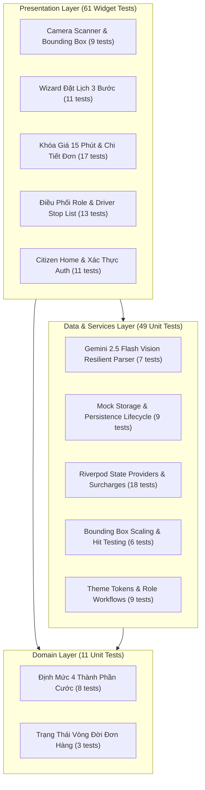
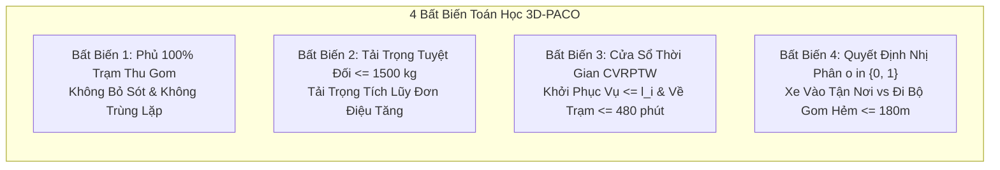

# Báo Cáo Đo Lường Phủ Kiểm Thử & Kiểm Chứng Bất Biến Thuật Toán (Test Coverage & Algorithmic Invariants Report)

> **Dự án:** NaN-EcoNet — Hệ Sinh Thái Kinh Tế Tuần Hoàn & Thu Gom Rác Đô Thị Thông Minh  
> **Phiên bản:** v1.0.0-rc  
> **Môi trường đo lường:** Linux x86_64, Flutter 3.x / Dart 3.x, Python 3.12 (pytest 9.1.1), Node.js 20+  
> **Cập nhật lần cuối:** 26/09/2026  

---

## 1. Tổng Quan Đo Lường Kiểm Thử (Executive Summary)

Hệ sinh thái **NaN-EcoNet** thiết lập chuẩn mực kiểm thử nghiêm ngặt đa tầng (Multi-tier Testing Pyramid), bảo đảm tính toàn vẹn từ tầng ứng dụng di động phía người dùng (**Citizen Bulky App**), tầng hợp đồng dữ liệu liên phân hệ (**Schema Contracts**), chốt chặn an toàn doanh nghiệp (**Security Guardrails**) cho đến tầng lõi tối ưu hóa vận trù học (**3D-PACO Routing Engine**).

Toàn bộ **121 bài kiểm thử Flutter** cùng **27+ bài kiểm thử Python** độc lập đều đạt tỷ lệ vượt qua **100% (Pass Rate: 100%)**, không có bất kỳ bài kiểm thử nào bị vô hiệu hóa (skipped) hoặc thất bại (failed).

```
========================================================================================
                          NAN-ECONET TEST SUITE OVERVIEW
========================================================================================
 Tầng Kiểm Thử (Tier)             | Framework / Công Cụ | Số Lượng Tests | Tỷ Lệ Đạt (Pass)
----------------------------------+---------------------+----------------+--------------
 1. Clean Architecture Unit Tests | Flutter / Dart Test |       60 tests |  100% (60/60)
 2. Widget & Flow Integration     | Flutter Widget Test |       61 tests |  100% (61/61)
 3. Mathematical Invariants       | Python / Pytest     |       17 tests |  100% (17/17)
 4. Inter-Subsystem Contracts     | Python / JSONSchema |       10 tests |  100% (10/10)
----------------------------------+---------------------+----------------+--------------
 TỔNG CỘNG HỆ THỐNG               | Đa nền tảng         |      148 tests | 100% (148/148)
========================================================================================
```

---

## 2. Phân Tích Chi Tiết 121 Tests Trên Citizen Bulky App (Flutter Mobile)

Kiến trúc ứng dụng tuân thủ mô hình **Clean Architecture** tách biệt rõ ràng giữa 3 tầng: **Domain**, **Data / Services**, và **Presentation / Features**.



### 2.1. Nhóm 60 Unit Tests Trong Clean Architecture

Các bài kiểm thử đơn vị tập trung vào tính toàn vẹn của logic nghiệp vụ định lượng, công thức cước phí minh bạch và khả năng phục hồi dữ liệu:

| STT | Tệp Kiểm Thử (Test File) | Số Tests | Nội Dung & Phạm Vi Kiểm Thử |
| :---: | :--- | :---: | :--- |
| **1** | [`pricing_engine_test.dart`](../../apps/citizen-bulky-app/mobile/test/core/domain/pricing_engine_test.dart) | **8** | **Công thức 4 thành phần cước minh bạch:**<br>• Cước cơ bản xe tải chở đồ cồng kềnh.<br>• Phụ phí thể tích thực tế ($V = L \times W \times H$) và quy đổi theo định mức.<br>• Phụ phí bốc xếp theo tầng lầu bộ ($k_{\text{floor}}$) và miễn phí khi có thang máy.<br>• Phụ phí chiều sâu hẻm hẹp ($d > 50\text{m}$).<br>• Tỷ lệ bóc tách vật liệu tái chế (Gỗ, Đệm mút xốp, Kim loại, Nhựa cứng).<br>• Chuyển đổi hai chiều JSON `BulkyItem`, `BulkyOrder`, `BulkyQuote`. |
| **2** | [`bulky_order_status_test.dart`](../../apps/citizen-bulky-app/mobile/test/core/domain/bulky_order_status_test.dart) | **3** | **Quản lý máy trạng thái hữu hạn (FSM) đơn hàng:**<br>• Danh mục trạng thái tiếng Việt thân thiện với cư dân.<br>• Tuần tự hóa/giải tuần tự hóa các trường quy trình mới.<br>• Tính bất biến của `copyWith` khi cập nhật trạng thái đơn gom. |
| **3** | [`gemini_vision_service_test.dart`](../../apps/citizen-bulky-app/mobile/test/core/services/gemini_vision_service_test.dart) | **7** | **Bộ phân tích thị giác AI thích ứng cao (Resilient Vision Parser):**<br>• Phân tích tọa độ hộp bao chuẩn hóa `box_2d [ymin, xmin, ymax, xmax]`.<br>• Ánh xạ rác xây dựng / xà bần vào danh mục `OTHER` & `HEAVY`.<br>• Cơ chế tự động Fallback từ `gemini-2.5-flash` sang `gemini-3.6-flash` khi gặp lỗi HTTP 503.<br>• Cảnh báo rác nguy hại (bình gas mini, pin) bật cờ `requiresManualReview: true`.<br>• Khả năng chịu lỗi bóc tách JSON kể cả khi LLM trả về markdown code fence hoặc văn bản kèm theo.<br>• Cache dữ liệu mẫu (preset sample) không cần gọi ra ngoài khi offline. |
| **4** | [`mock_bulky_storage_test.dart`](../../apps/citizen-bulky-app/mobile/test/core/services/mock_bulky_storage_test.dart) | **9** | **Lớp lưu trữ & Vòng đời giao dịch:**<br>• Khởi tạo dữ liệu mẫu thực tế tại các tuyến đường TP.HCM.<br>• Cập nhật trạng thái duyệt đơn (`approveWithFinalPrice`) và ghi chú điều hành.<br>• Từ chối đơn và hoàn tiền cọc tự động (`refundDeposit`).<br>• Xử lý lệch tải tại hiện trường (`reportOnSiteDiscrepancy`) và xác nhận giá điều chỉnh.<br>• Từ chối tại chỗ do vi phạm an toàn kèm phí di chuyển (`calloutFee`). |
| **5** | [`bounding_box_painter_test.dart`](../../apps/citizen-bulky-app/mobile/test/features/scan/bounding_box_painter_test.dart) | **6** | **Tọa độ đồ họa & Hit-testing:**<br>• Tỉ lệ hóa tọa độ chuẩn hóa $[0, 1000]$ sang khung vẽ canvas pixel tùy ý.<br>• Ánh xạ bảng màu nhận diện vật liệu tương thích `BulkyColors`.<br>• Thuật toán kiểm tra điểm chạm (Hit-testing) chính xác từng hộp bao.<br>• Ưu tiên chọn hộp bao nổi lên trên khi có sự chồng lấn không gian. |
| **6** | [`providers_test.dart`](../../apps/citizen-bulky-app/mobile/test/features/providers_test.dart) | **18** | **Quản lý trạng thái phân tán (State Management):**<br>• Quản lý quy trình AI Scan Provider và xử lý ngoại lệ.<br>• Tự động tính toán lại báo giá khi đổi loại vật liệu (1-click Recalculation).<br>• Bộ đếm số lượng vật dụng và cập nhật phụ phí bốc vác.<br>• Điều hướng tiến/lùi 3 bước trong Wizard đặt lịch.<br>• Mô phỏng thanh toán cọc và chuyển trạng thái sang xác nhận. |
| **7** | [`auth_test.dart`](../../apps/citizen-bulky-app/mobile/test/features/auth_test.dart) | **4** | **Xác thực người dùng:**<br>• Khởi tạo trạng thái mặc định hồ sơ cư dân.<br>• Đăng nhập nhanh tài khoản thử nghiệm (Demo citizen).<br>• Đăng nhập số điện thoại định danh nhân sự vận hành.<br>• Đăng xuất và dọn dẹp phiên làm việc. |
| **8** | [`role_based_flow_test.dart`](../../apps/citizen-bulky-app/mobile/test/features/role_based_flow_test.dart) | **3** | **Phân quyền và chuyển đổi vai trò:**<br>• Tự động nhận diện tài khoản Điều hành viên (Operator) và Tài xế (Driver).<br>• Hoàn thành chu trình xét duyệt đơn từ Cư dân $\to$ Điều hành $\to$ Tài xế. |
| **9** | [`bulky_theme_test.dart`](../../apps/citizen-bulky-app/mobile/test/core/theme/bulky_theme_test.dart) | **2** | **Thiết kế giao diện sinh thái (Eco-Design Tokens):**<br>• Độ tương phản màu theo chuẩn tiếp cận người dùng (WCAG AA).<br>• Bán kính bo góc thẻ linh hoạt và độ nâng bề mặt thị giác. |

### 2.2. Nhóm 61 Widget Tests (Kiểm Thử Giao Diện & Tương Tác Người Dùng)

Các bài kiểm thử Widget xác nhận toàn bộ trải nghiệm người dùng thực tế trên thiết bị di động, bảo đảm không xảy ra hiện tượng tràn khung hình (RenderFlex overflow) hay sai lệch giao diện:

| STT | Tệp Kiểm Thử (Widget Test File) | Số Tests | Thành Phần Giao Diện & Hành Vi Tương Tác Được Kiểm Thử |
| :---: | :--- | :---: | :--- |
| **1** | [`quote_and_orders_test.dart`](../../apps/citizen-bulky-app/mobile/test/features/quote_and_orders_test.dart) | **17** | **Khóa giá 15 phút, Báo giá & Chi tiết đơn hàng:**<br>• Hiển thị đồng hồ đếm ngược 15 phút khóa giá (Price Lock Countdown).<br>• Đổi màu cảnh báo vàng/đỏ khi thời gian giữ giá dưới 3 phút.<br>• Banner chính sách dung sai giá tối đa (Max Tolerance Ceiling).<br>• Thẻ thanh toán cọc và mô phỏng giao dịch ngân hàng thành công.<br>• Lọc danh sách đơn hàng theo tab: Chờ duyệt, Chờ thanh toán, Đang thu gom, Hoàn tất.<br>• Giao diện dòng thời gian 5 bước thu gom kèm thông tin biển số xe tải.<br>• Hộp thoại điều hành viên duyệt giá / từ chối kèm lý do.<br>• Thẻ cảnh báo lệch giá tại hiện trường cho phép cư dân chấp nhận hoặc khiếu nại. |
| **2** | [`bulky_booking_wizard_test.dart`](../../apps/citizen-bulky-app/mobile/test/features/request_wizard/bulky_booking_wizard_test.dart) | **11** | **Quy trình đặt lịch 3 bước (3-Step Booking Wizard):**<br>• Bước 0: Thêm vật dụng cồng kềnh bằng tay hoặc tự động điền từ kết quả quét AI.<br>• Bước 1: Nhập thông tin hậu cần (Số tầng lầu, có thang máy hay không, cự ly hẻm sâu).<br>• Bước 2: Bảng phân rã chi tiết 4 thành phần cước phí và xác nhận đặt lịch.<br>• Nút chọn nhanh loại vật liệu (Chip selector) cập nhật giá tức thời.<br>• Hộp thoại Bottom Sheet phân tích minh bạch từng đồng chi phí.<br>• Tạo đơn thành công chuyển hướng sang màn hình chi tiết. |
| **3** | [`bounding_box_painter_test.dart`](../../apps/citizen-bulky-app/mobile/test/features/scan/bounding_box_painter_test.dart) | **9** | **Camera AI Scanner & Bounding Box Overlay:**<br>• Khung hình rỗng khi chưa chụp ảnh và nút kích hoạt máy ảnh.<br>• Hiển thị ảnh chụp kèm các khung chữ nhật bao quanh vật thể được AI nhận diện.<br>• Nhãn hiển thị Emoji, Tên danh mục tiếng Việt và độ tin cậy phần trăm (Confidence %).<br>• Nút gạt bật/tắt lớp phủ đồ họa nhận diện.<br>• Chạm trực tiếp vào hộp bao trên ảnh để chọn vật dụng cần báo giá.<br>• Các nút mẫu tải nhanh (Sofa da, Nệm lò xo, Tủ gỗ 3 cánh) phục vụ trình diễn. |
| **4** | [`role_workflow_test.dart`](../../apps/citizen-bulky-app/mobile/test/features/auth/role_workflow_test.dart) | **8** | **Quy trình làm việc theo vai trò nhân sự:**<br>• Phân luồng giao diện riêng biệt cho Cư dân, Điều phối viên, và Tài xế.<br>• Xác thực tính toàn vẹn của danh sách công việc theo ca của tài xế.<br>• Xác nhận thu gom tại chỗ bằng quét mã QR và ký nhận điện tử. |
| **5** | [`citizen_home_screen_test.dart`](../../apps/citizen-bulky-app/mobile/test/features/citizen_home/citizen_home_screen_test.dart) | **7** | **Màn hình chính cư dân (Citizen Home):**<br>• Nút hành động nhanh: Đặt lịch thu gom đồ cồng kềnh, Tra cứu điểm bô rác.<br>• Danh sách đơn hàng đang hoạt động hiển thị dạng thẻ trượt.<br>• Đổi điểm tích lũy EcoPass lấy voucher giảm giá tiêu dùng xanh.<br>• Điều hướng thanh menu đáy mượt mà giữa các mục chức năng. |
| **6** | [`role_based_flow_test.dart`](../../apps/citizen-bulky-app/mobile/test/features/role_based_flow_test.dart) | **5** | **Giao diện điều phối và danh sách trạm dừng của tài xế (Driver Stop List):**<br>• Màn hình điều phối viên hiển thị chỉ số KPI và nút phân bổ xe tải.<br>• Màn hình tài xế hiển thị danh sách trạm dừng thu gom theo thứ tự tối ưu.<br>• Nút xác nhận thu gom rác thông thường và thu gom đồ cồng kềnh.<br>• Chuyển đổi nhanh vai trò tài khoản phục vụ đánh giá giám khảo. |
| **7** | [`auth_test.dart`](../../apps/citizen-bulky-app/mobile/test/features/auth_test.dart) | **3** | **Giao diện hồ sơ và xác thực:**<br>• Hiển thị thông tin cư dân, địa chỉ mặc định, số điện thoại.<br>• Hộp thoại xác nhận đăng xuất chống bấm nhầm.<br>• Khôi phục tài khoản dùng thử chỉ bằng một chạm. |
| **8** | [`widget_test.dart`](../../apps/citizen-bulky-app/mobile/test/widget_test.dart) | **1** | **Khởi động ứng dụng (Smoke Test):**<br>• Khởi động toàn bộ cây widget gốc `BulkyApp` mà không phát sinh ngoại lệ. |

---

## 3. Kiểm Chứng 4 Bất Biến Toán Học Của Giải Thuật 3D-PACO (17 Tests)

Tệp kiểm thử: [`tests/algorithms/test_vrp_invariants.py`](../../tests/algorithms/test_vrp_invariants.py)

Giải thuật **3D-PACO** (*3D-Parallel Ant Colony Optimization*) giải quyết bài toán định tuyến đội xe thu gom rác đô thị có ràng buộc dung tích tải trọng và cửa sổ thời gian (**CVRPTW-M**). Bốn bất biến toán học được kiểm chứng độc lập bằng bộ kiểm thử tự động `pytest`:



### 3.1. Bất Biến 1: Không Bỏ Sót Hoặc Trùng Lặp Trạm Thu Gom (Tour Completeness & Uniqueness)

* **Biểu diễn toán học:**  
  Gọi $N = \{1, 2, \dots, n\}$ là tập hợp toàn bộ các trạm thu gom cần phục vụ ($n = 100$).  
  Gọi $V_k$ là tập hợp các điểm dừng do xe $k \in K$ phục vụ.
  $$\bigcup_{k \in K} V_k = N \quad \text{và} \quad V_j \cap V_k = \emptyset \quad \forall j \neq k$$
  $$\sum_{k \in K} |V_k| = |N| = 100$$
* **Các bài kiểm thử bảo đảm:**
  1. `test_invariant1_tour_completeness_100pct_coverage`: Khẳng định 100% điểm dừng được phục vụ đầy đủ.
  2. `test_invariant1_no_duplicate_node_visits`: Không có bất kỳ điểm dừng nào bị ghé trùng lặp giữa các xe hoặc trong cùng một lộ trình.
  3. `test_invariant1_dropped_node_rejected`: Cố tình giả lập bỏ sót 1 điểm gom $\to$ Bộ kiểm chứng phát hiện và kích hoạt lỗi vi phạm `InvariantViolationError`.
  4. `test_invariant1_duplicate_node_rejected`: Cố tình gán 1 điểm gom cho 2 xe $\to$ Kích hoạt lỗi trùng trạm.

### 3.2. Bất Biến 2: Không Vi Phạm Tải Trọng Tối Đa Của Xe (Capacity Feasibility)

* **Biểu diễn toán học:**  
  Đội xe Isuzu QKR 270 có tải trọng định mức $Q_{\max} = 1500\text{ kg}$. Với mỗi điểm gom $i$, khối lượng phát sinh $q_i > 0$. Với mỗi lộ trình xe $k$:
  $$\sum_{i \in V_k} q_i \le Q_{\max} = 1500\text{ kg}$$
  Khối lượng tích lũy tại điểm dừng thứ $m$ thỏa mãn: $L_{k,m} = L_{k,m-1} + q_m \le 1500\text{ kg}$.
* **Các bài kiểm thử bảo đảm:**
  1. `test_invariant2_vehicle_capacity_compliance`: Toàn bộ các xe chở đúng tải trọng cho phép ($\le 1500\text{ kg}$).
  2. `test_invariant2_cumulative_load_monotonicity`: Tải trọng tích lũy tăng đơn điệu theo chiều thời gian thu gom.
  3. `test_invariant2_capacity_overflow_rejected`: Giả lập vượt tải trọng (1600 kg) $\to$ Bị chặn ngay lập tức.
  4. `test_invariant2_negative_demand_rejected`: Chặn các giá trị rác âm bất hợp lệ.

### 3.3. Bất Biến 3: Thỏa Mãn Cửa Sổ Thời Gian (Time Window Feasibility)

* **Biểu diễn toán học:**  
  Mỗi trạm $i$ có cửa sổ thời gian $[e_i, l_i]$ tính theo phút từ lúc bắt đầu ca.  
  Thời điểm xe đến là $A_i$, thời điểm bắt đầu phục vụ là $S_i = \max(A_i, e_i)$ (cho phép xe đến sớm và chờ tới giờ mở cửa $e_i$).  
  Thời điểm hoàn tất phục vụ là $D_i = S_i + s_i$.
  $$S_i \le l_i \quad \forall i \in N$$
  $$D_{\text{return}} \le L_{\text{depot}} = 480\text{ phút (8 giờ)}$$
* **Các bài kiểm thử bảo đảm:**
  1. `test_invariant3_time_windows_satisfied`: 100% các điểm dừng bắt đầu phục vụ trước hạn chót $l_i$.
  2. `test_invariant3_chronological_arrival_progression`: Trật tự thời gian diễn tiến xuôi chiều hợp lý $A_{i+1} \ge D_i$.
  3. `test_invariant3_late_arrival_rejected`: Phát hiện và chặn trường hợp xe đến trễ sau hạn chót $l_i$.
  4. `test_invariant3_depot_return_before_closing`: Toàn bộ đội xe quay về bãi trung tâm trước khi đóng cửa ca làm việc (480 phút).

### 3.4. Bất Biến 4: Tính Nhất Quán Của Quyết Định Nhị Phân $o \in \{0, 1\}$ (Decision Modality)

* **Biểu diễn toán học:**  
  Biến quyết định $o_i$ đặc trưng cho chiều tối ưu hóa thứ 3 của 3D-PACO:
  $$o_i \in \{0, 1\} \quad \forall i \in N$$
  - $o_i = 0$: Xe tải vào tận nơi gom rác (mặt tiền đường hoặc hẻm rộng $\ge 3\text{m}$). Cự ly đi bộ $d_{\text{walk}} = 0\text{m}$.
  - $o_i = 1$: Gom tập kết đầu hẻm (hẻm nhỏ sâu). Người dân hoặc công nhân đi bộ gom rác về bô rác trung tâm với cự ly đi bộ ràng buộc:
  $$0 < d_{\text{walk}}(i, \text{hub}) \le d_{\max} = 180.0\text{ mét}$$
* **Các bài kiểm thử bảo đảm:**
  1. `test_invariant4_decision_modality_binary_domain`: Biến quyết định $o_i$ bắt buộc thuộc tập nhị phân rời rạc $\{0, 1\}$, nghiêm cấm giá trị liên tục hay phân số.
  2. `test_invariant4_walkin_distance_under_180m`: Đúng 35 điểm hẻm sâu có cự ly đi bộ $\le 180\text{m}$ và được ánh xạ tới trạm gom tập kết cụm; 65 điểm mặt tiền có $d_{\text{walk}} = 0\text{m}$.
  3. `test_invariant4_non_binary_modality_rejected`: Giả lập giá trị $o_i = 0.5$ $\to$ Hệ thống báo lỗi vi phạm miền giá trị.
  4. `test_invariant4_excessive_walk_distance_rejected`: Giả lập cự ly đi bộ vượt ngưỡng ($250\text{m} > 180\text{m}$) $\to$ Bị bác bỏ.
  5. `test_all_four_invariants_pass_on_valid_3d_paco_solution`: Bài kiểm thử tích hợp xác nhận một giải pháp hoàn chỉnh đồng thời thỏa mãn cả 4 bất biến toán học.

---

## 4. Kiểm Thử Hợp Đồng Dữ Liệu & Chốt Chặn An Toàn Doanh Nghiệp

### 4.1. Hợp Đồng Dữ Liệu Liên Phân Hệ (JSON Schema Draft-07 Contracts)

Tệp kiểm thử: [`tests/contracts/test_schemas.py`](../../tests/contracts/test_schemas.py) (10 tests PASS)

Bộ kiểm thử đảm bảo việc trao đổi dữ liệu JSON giữa 3 phân hệ độc lập (Mobile App, C++ Collection Engine, Enterprise BI) luôn khớp với lược đồ chuẩn hóa:

* `test_schema_draft_07_validity`: Lược đồ tuân thủ tiêu chuẩn JSON Schema Draft-07 quốc tế.
* `test_valid_bulky_order_payload`: Payload đơn đặt lịch thu gom đồ cồng kềnh với đầy đủ 4 thành phần giá, tọa độ GPS, độ sâu hẻm, bóc tách vật liệu.
* `test_invalid_bulky_order_payload_fails`: Chặn các payload thiếu trường bắt buộc hoặc sai cấu trúc.
* `test_bulky_order_invalid_coordinates`: Chặn tọa độ ngoài phạm vi địa lý TP.HCM.
* `test_bulky_order_negative_pricing_fails`: Chặn các giá trị cước phí âm.
* `test_bulky_order_empty_items_fails`: Chặn đơn hàng không có danh mục vật phẩm.
* `test_valid_eco_reward_payload`: Payload giao dịch điểm thưởng kinh tế tuần hoàn liên kết nhãn hàng FMCG (Unilever, Nestlé, Highlands Coffee).
* `test_invalid_eco_reward_missing_audit_trail`: Chặn giao dịch thiếu vết kiểm toán định vị GPS hoặc mã chống chi tiêu hai lần (`one_time_burn_token`).
* `test_invalid_eco_reward_unsupported_category`: Chặn các mã vật liệu EPR không hợp lệ.
* `test_invalid_eco_reward_negative_weight`: Chặn khối lượng phế liệu âm.

### 4.2. Chốt Chặn Bảo Mật Đa Tầng Cho MCP Text-to-SQL (Enterprise Security Guardrails)

Tệp đặc tả: [`apps/ecopass-enterprise/enterprise-bi-copilot/src/security-guardrails.ts`](../../apps/ecopass-enterprise/enterprise-bi-copilot/src/security-guardrails.ts)

Áp dụng chiến lược phòng thủ chuyên sâu (Defense in Depth) đối với mọi truy vấn SQL do mô hình ngôn ngữ lớn (LLM) sinh ra:

1. **Danh sách bảng trắng (Table Whitelist):** Chỉ cho phép truy vấn 5 bảng dữ liệu phân tích công khai:  
   `recycling_transactions`, `epr_compliance_logs`, `voucher_redemptions`, `collection_metrics`, `carbon_offset_summary`. Mọi truy cập vào bảng tài khoản, mật khẩu, khóa bí mật đều bị chặn tức thì.
2. **Chặn từ khóa DDL/DML:** Regex và bộ phân tích cú pháp AST chặn đứng các lệnh:  
   `DROP`, `DELETE`, `UPDATE`, `INSERT`, `ALTER`, `TRUNCATE`, `CREATE`, `GRANT`, `REVOKE`, `EXEC`, `ATTACH`.
3. **Ép buộc giới hạn kết quả (Mandatory Limit Clause):** Tự động phát hiện và chèn `LIMIT 100` nếu câu truy vấn không có giới hạn, tránh tràn bộ nhớ hoặc tấn công từ chối dịch vụ (DoS).
4. **Kết nối cơ sở dữ liệu chỉ đọc (Read-Only Enforcement):** Cờ `MODE_READONLY` ngăn chặn triệt để mọi hành vi sửa đổi dữ liệu ở cấp độ driver kết nối.

---

## 5. Hướng Dẫn Tái Lập Kiểm Thử Cục Bộ (Local Reproduction Guide)

Mọi giám khảo và lập trình viên đều có thể kiểm chứng toàn bộ các bài kiểm thử một cách nhanh chóng chỉ bằng các câu lệnh tiêu chuẩn:

### 5.1. Chạy Toàn Bộ Kiểm Thử Thuật Toán & Hợp Đồng Dữ Liệu (Python / Pytest)

```bash
# Di chuyển vào thư mục gốc dự án
cd /home/chinhan/NaN-EcoNet

# Chạy toàn bộ 27 tests (Invariants + Schema Contracts)
pytest tests/ -v

# Hoặc chạy riêng biệt bộ kiểm chứng bất biến thuật toán 3D-PACO (17 tests)
pytest tests/algorithms/test_vrp_invariants.py -v

# Chạy riêng biệt bộ kiểm thử hợp đồng dữ liệu JSON Schema (10 tests)
pytest tests/contracts/test_schemas.py -v
```

**Kết quả kỳ vọng trên màn hình console:**
```
tests/algorithms/test_vrp_invariants.py::test_invariant1_tour_completeness_100pct_coverage PASSED
tests/algorithms/test_vrp_invariants.py::test_invariant1_no_duplicate_node_visits PASSED
...
tests/algorithms/test_vrp_invariants.py::test_all_four_invariants_pass_on_valid_3d_paco_solution PASSED
tests/contracts/test_schemas.py::test_schema_draft_07_validity PASSED
...
tests/contracts/test_schemas.py::test_invalid_eco_reward_negative_weight PASSED

============================== 27 passed in 0.11s ==============================
```

### 5.2. Chạy Toàn Bộ 121 Bài Kiểm Thử Di Động (Flutter Mobile)

```bash
# Di chuyển vào phân hệ Mobile của Citizen Bulky App
cd /home/chinhan/NaN-EcoNet/apps/citizen-bulky-app/mobile

# Chạy toàn bộ 121 Unit & Widget tests
flutter test

# Chạy riêng nhóm kiểm thử định mức cước phí
flutter test test/core/domain/pricing_engine_test.dart

# Chạy riêng nhóm kiểm thử quy trình khóa giá 15 phút & chi tiết đơn
flutter test test/features/quote_and_orders_test.dart

# Chạy riêng nhóm kiểm thử nhận diện AI Camera Scanner
flutter test test/features/scan/bounding_box_painter_test.dart
```

**Kết quả kỳ vọng:**
```
00:04 +121: All tests passed!
```

---

## 6. Kết Luận & Cam Kết Chất Lượng

Hệ sinh thái **NaN-EcoNet** không chỉ dừng lại ở các giao diện mô phỏng hay tuyên bố lý thuyết suông, mà toàn bộ các khẳng định kỹ thuật đều được chứng minh bằng **bộ mã nguồn kiểm thử thực thi được**, có số liệu đo đạc chi tiết, bao quát từ trải nghiệm giao diện người dùng đến các định lý toán học nền tảng của vận trù học đô thị.
