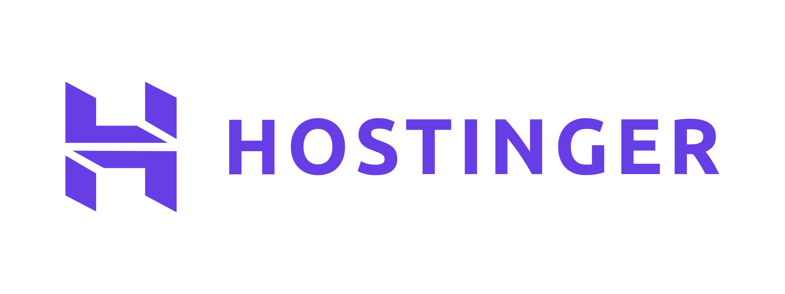

# 🚀 NaN-Team MMO — Automated Social Content & Video AI Engine

> Phân hệ tự động hóa sản xuất video ngắn (TikTok, YouTube Shorts, Facebook Reels), biên tập video giữ chân người xem (Retention Engineering), đồng bộ phiên tài khoản và đăng tải đa kênh tự động trong hệ sinh thái **NaN-EcoNet**.

---

## 📌 Tổng Quan Hệ Thống

`nan-team` là nền tảng kết hợp giữa hệ thống lập lịch đăng bài đa kênh mã nguồn mở (Postiz) và các engine AI tiên tiến do đội ngũ phát triển:
1. **AI Video Studio**: Trực tiếp tạo video ngắn từ kịch bản văn bản hoặc tái cấu trúc từ video dài (Source Video) với kỹ thuật Retention Hook.
2. **Vietnamese Whisper & ASR**: Nhận diện giọng nói, tách phụ đề tiếng Việt chính xác và đồng bộ thời gian từng từ (word-level timestamps).
3. **Programmatic Remotion**: Render chuyển động mượt mà với hoạt họa chữ động kiểu MrBeast / Alex Hormozi (Neon, Pop, Box, Classic).
4. **Native Tooling & Automation**: Bộ script đăng nhập visual (Chrome Profile), tự động sync cookie và điều khiển upload trực tiếp.

---

## 🏗️ Cấu Trúc Mã Nguồn & Các Gói (Monorepo)

```text
nan-team/
├── apps/
│   ├── frontend/             # Giao diện Web (Next.js 14, TailwindCSS, SWR) - Port 4200
│   │   └── src/components/agents/  # AI Video Studio Modal, Source Video Studio Modal
│   ├── backend/              # Core API Server (NestJS, Prisma, PostgreSQL) - Port 3000
│   └── orchestrator/         # Background Queue & Workflow Runner (Temporal/BullMQ)
├── packages/
│   ├── openshorts-engine/    # Động cơ cắt ghép video, ASR tiếng Việt, re-framing 9:16
│   ├── remotion-engine/      # React Video Rendering, dynamic caption templates, audio SFX
│   └── agy-mcp-runner/       # MCP Adapter tích hợp AI Agents (Codex/Antigravity/Claude)
├── libraries/
│   ├── nestjs-libraries/     # Module dùng chung cho NestJS (Database, Auth, Videos, AI)
│   └── helpers/              # Utility dùng chung cho frontend và backend
├── scripts/                  # Bộ script automation: upload, login Chrome, sync cookie
├── Makefile                  # Quản lý toàn bộ tiến trình native (không cần Docker)
└── .env.example              # Cấu hình biến môi trường mẫu
```

---

## ⚡ Hướng Dẫn Cài Đặt & Khởi Chạy (Native Dev Stack)

Toàn bộ hệ thống có thể chạy trực tiếp trên môi trường máy chủ / máy cá nhân mà không phụ thuộc Docker nhờ bộ `Makefile` tối ưu:

### 1. Yêu cầu hệ thống
- **Node.js**: v20+
- **pnpm**: v9+ (`npm i -g pnpm`)
- **Python**: v3.10+ (cho OpenShorts & ASR)
- **ffmpeg**: Đã cài trên hệ thống (`sudo apt install ffmpeg`)
- **PostgreSQL & Redis**: Chạy dịch vụ cục bộ hoặc container nền

### 2. Thiết lập cấu hình
```bash
cp .env.example .env
# Chỉnh sửa DATABASE_URL, REDIS_URL và JWT_SECRET nếu cần
```

### 3. Cài đặt thư viện
```bash
pnpm install
```

### 4. Các lệnh điều khiển hệ thống (`Makefile`)

| Lệnh | Ý nghĩa |
|---|---|
| `make dev` | Khởi động toàn bộ stack native: Backend, Frontend, Worker, Proxy pool |
| `make stop` | Dừng tất cả tiến trình và giải phóng các cổng mạng |
| `make restart` | Khởi động lại toàn bộ hệ thống sạch sẽ |
| `make status` hoặc `make ps` | Kiểm tra trạng thái các port, dịch vụ và healthcheck |
| `make seed-admin` | Khởi tạo tài khoản sandbox demo: `admin` / `123456` tại org "NaN Demo" |
| `make db-shell` | Mở trực tiếp terminal truy vấn PostgreSQL cục bộ |
| `make tunnel` | Khởi chạy Cloudflare quick tunnel tạo public URL truy cập từ xa |
| `make tunnel-url` | Xem public URL Cloudflare hiện tại |
| `make tunnel-stop` | Đóng kết nối Cloudflare tunnel |

### 5. Quản lý tài khoản mạng xã hội (Cookie & Profile)

Để duy trì phiên đăng bài ổn định không bị checkpoint:
```bash
make login-fb       # Mở Chrome với profile Facebook để đăng nhập trực quan
make login-yt       # Mở Chrome với profile YouTube Studio
make login-tiktok   # Mở Chrome với profile TikTok Creator Center
make sync-cookies   # Tự động xuất và đồng bộ cookie vào cơ sở dữ liệu
```

---

## 🌐 Danh Sách Cổng Kết Nối Mặc Định

| Dịch vụ | Cổng | Ghi chú |
|---|---|---|
| **Frontend Web App** | `4200` | Giao diện điều khiển chính (Dashboard, Studio, Lên lịch) |
| **Backend REST API** | `3000` | API hệ thống, GraphQL, webhook callback |
| **Voice Clone Server** | `8002` | API nhân bản và sinh giọng đọc AI (OmniVoice) |
| **AGY Image Gateway** | `8080` | Proxy sinh ảnh minh họa AI |
| **PostgreSQL** | `5432` | Cơ sở dữ liệu chính |
| **Redis** | `6379` | Quản lý hàng đợi và cache trạng thái |

---

<p align="center">
  <a href="https://postiz.com/" target="_blank">
  <picture>
    <source media="(prefers-color-scheme: dark)" srcset="https://github.com/user-attachments/assets/765e9d72-3ee7-4a56-9d59-a2c9befe2311">
    
  </picture>
  </a>
</p>

<p align="center">
<a href="https://opensource.org/license/agpl-v3">
  
</a>
</p>

<h3 align="center"><strong><a href="https://github.com/gitroomhq/postiz-agent">Postiz Core Platform Integration</a></strong></h3>
<div align="center">
  <strong>
  <h2>Your ultimate AI social media scheduling tool</h2><br />
  <a href="https://postiz.com">Postiz</a>: An alternative to: Buffer.com, Hypefury, Twitter Hunter, etc...<br /><br />

  </strong>
  Postiz offers everything you need to manage your social media posts,<br />build an audience, capture leads, and grow your business.
</div>

<div class="flex" align="center">
  <br />
  
  
  
  
  
  
  
  
  
  
  
  
  
  
</div>

<p align="center">
  <br />
  <a href="https://docs.postiz.com" rel="dofollow"><strong>Explore the docs »</strong></a>
  <br />

  <br />
  <a href="https://youtube.com/@postizofficial" rel="dofollow"><strong>Watch the YouTube Tutorials»</strong></a>
  <br />
</p>

<p align="center">
  <a href="https://platform.postiz.com">Register</a>
  ·
  <a href="https://discord.postiz.com">Join Our Discord (devs only)</a>
  ·
  <a href="https://docs.postiz.com/public-api">Public API</a><br />
</p>
<p align="center">
  <a href="https://www.npmjs.com/package/@postiz/node">NodeJS SDK</a>
  ·
  <a href="https://www.npmjs.com/package/n8n-nodes-postiz">N8N custom node</a>
  ·
  <a href="https://apps.make.com/postiz">Make.com integration</a>
</p>

<br /><br />

## 🔌 See the leading Postiz features

<p align="center">
  <a href="https://www.youtube.com/watch?v=BdsCVvEYgHU" target="_blank">
    
  </a>
</p>

## ✨ Features

|  |  |
| ------------------------------------------------------------------------------------------- | ------------------------------------------------------------------------------------------- |
|  |  |

### Our Sponsors

| Sponsor |                                  Logo                                   | Description     |
|---------|:-----------------------------------------------------------------------:|-----------------|
| [Hostinger](https://www.hostinger.com/vps/docker/postiz?ref=postiz) |  | Hostinger is on a mission to make online success possible for anyone – from developers to aspiring bloggers and business owners |
| [Virlo](https://dev.virlo.ai/?ref=postiz) |  | Virlo is the #1 social media trend spotting and all-in-one GTM tool for teams leveraging short-form video |
| [ChatbotX](https://chatbotx.io/?ref=postiz) |  | The ManyChat alternative that you can self-host, white-label, and resell to your clients. Bring your own OpenClaw, Hermes, or Claude agents! |


# Intro

- Schedule all your social media posts (many AI features)
- Measure your work with analytics.
- Collaborate with other team members to exchange or buy posts.
- Invite your team members to collaborate, comment, and schedule posts.
- At the moment, there is no difference between the hosted version and the self-hosted version
- Perfect for automation (API) with platforms like N8N, Make.com, Zapier, etc.

## Tech Stack

- Pnpm workspaces (Monorepo)
- NextJS (React)
- NestJS
- Prisma (Default to PostgreSQL)
- Temporal
- Resend (email notifications)

## Quick Start

To have the project up and running, please follow the [Quick Start Guide](https://docs.postiz.com/quickstart)

## Sponsor Postiz

We now give a few options to Sponsor Postiz:
- Just a donation: You like what we are building, and want to buy us some coffee so we can build faster.
- Main repository: Get your logo with a backlink from the main Postiz repository. Postiz has over 7M downloads and 20k views per month.

Link: https://opencollective.com/postiz

## Postiz Compliance

- Postiz is an open-source, self-hosted social media scheduling tool that supports platforms like X (formerly Twitter), Bluesky, Mastodon, Discord, and others.
- Postiz hosted service uses official, platform-approved OAuth flows.
- Postiz does not automate or scrape content from social media platforms.
- Postiz does not collect, store, or proxy API keys or access tokens from users.
- Postiz never asks users to paste API keys into our hosted product.
- Postiz users always authenticate directly with the social platform (e.g., X, Discord, etc.), ensuring platform compliance and data privacy.

## License

This repository's source code is available under the [AGPL-3.0 license](LICENSE).

<br /><br />

<p align="center">
  
</p>
