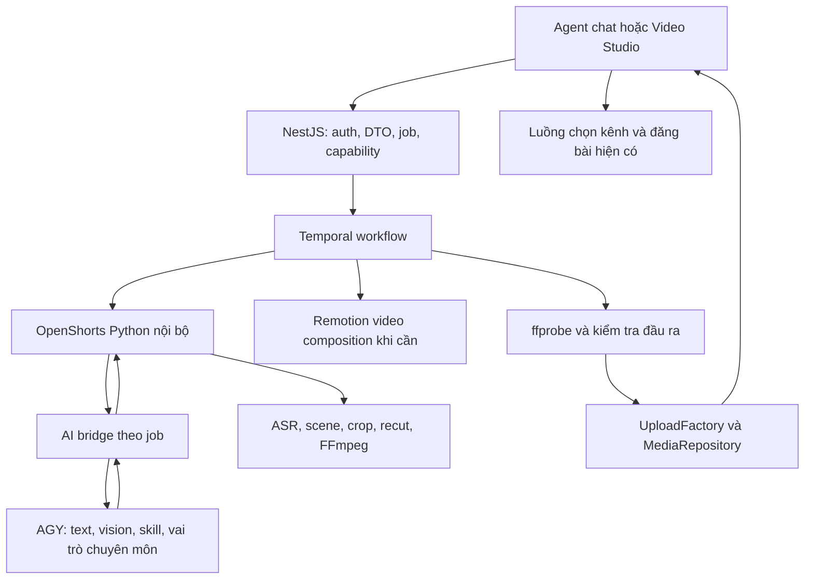

# Tích hợp OpenShorts Core vào agent video của NaN-Team

Ngày: 28/09/2026. Trạng thái: người dùng đã yêu cầu triển khai; đang thực hiện trong các writing checkout riêng. Phần AGY gateway trong thiết kế ban đầu được thay bằng [AGY native MCP](2026-09-28-openshorts-agy-native-mcp.md), gồm native model chat, skill/subagent runtime, auth và contracts chi tiết. Kết quả phải dựa trên receipts kiểm thử.

**Mục tiêu:** Agent trong NaN-Team nhận video có sẵn, phân tích nội dung bằng AI của hệ thống, cắt/chỉnh thành video phù hợp TikTok, Facebook và YouTube, lưu kết quả vào Media và tiếp tục luồng đăng bài hiện có.

**Kiến trúc:** Đưa một snapshot có kiểm kê của `/home/chinhan/openshorts-core` vào package Python trong NaN-Team, chạy dưới dạng dịch vụ nội bộ. NestJS quản lý người dùng, job, AI và lưu Media; Python thực hiện ASR, phân cảnh, crop, recut và FFmpeg. Remotion tiếp tục tạo video từ ý tưởng, đồng thời có composition riêng cho thiết kế trên video thật.

**Stack hiện có:** NestJS/TypeScript, Mastra tools/MCP, Prisma/PostgreSQL, Temporal, React/Next.js, AGY gateway, Voice Clone, Remotion; core Python/FastAPI/FFmpeg/Whisper.

## 1. Kết quả đọc source và các vấn đề phải giải quyết

| Bằng chứng source | Kết luận cho thiết kế |
| --- | --- |
| `chat/tools/generate.ai.video.tool.ts`, `videos/remotion/remotion.service.ts` | Tool hiện tại nhận topic, tạo storyboard rồi render; chưa nhận video nguồn hoặc trả nhiều clip. |
| `videos/remotion/dto/ai.video.dto.ts` | DTO hỗ trợ Voice Clone và 3 tỉ lệ; schema tool chat mới chỉ có hai giọng Edge và thiếu aspectRatio. Phải đồng bộ khi tích hợp. |
| `upload/upload.factory.ts`, `database/prisma/clipping/clipping.service.ts` | Luồng clipping cũ phụ thuộc Cloudflare, RunPod, Deepgram, OpenAI; không dùng làm điều kiện bật OpenShorts local. |
| `chat/tools/tool.list.ts`, `chat/load.tools.service.ts`, `chat/start.mcp.ts` | Phải nối cả registry, instructions và MCP. Một số tool clipping cũ bị ẩn ở server Claude; không tự thay chính sách của những server đó. |
| `openshorts-core/app.py` | Có ingest, status, transcript, recut, reframe, subtitle, hook, effects, projects, ZIP. Đã bỏ auth; static output và các API không có tenant boundary của NaN-Team. Chưa thấy API hủy job. |
| `openshorts-core/main.py` | `process_video_to_vertical(input_video, final_output_video, ...)` chỉ reframe; không phải hàm end-to-end như ví dụ trong manual. Pipeline đầy đủ hiện ở CLI. |
| `openshorts-core/llm_backend.py` | OpenAI-compatible backend chỉ thay phần text; vision không tự chuyển sang AI hệ thống. |
| `main.py`, `moment_picker.py`, `layout_picker.py`, `screencast_layout.py`, `hook_grounding.py`, `editor.py` | Có đường gọi Gemini trực tiếp, kể cả bản logic trùng trong main. Phải kiểm tra đường chạy thực tế, không chỉ patch module rời. |
| `videos/remotion/agy.gateway.ts` | Có khóa tuần tự vì gateway dùng sandbox/session chung. Không bỏ khóa để ép ba HTTP request song song. |
| `/home/chinhan/agy-image-gateway/main.py` | Có content với nhiều image_urls và chat-completions; chưa có contract provider JSON/vision phục vụ OpenShorts với job identity và kiểm tra schema. |

Đường dẫn ở cột trái nếu không có prefix là dưới `libraries/nestjs-libraries/src/` của NaN-Team. Các tuyên bố hoàn thành trong session AGY và manual là thông tin bàn giao, không thay bằng chứng thực thi source.

## 2. Trải nghiệm người dùng và định tuyến agent

Trong nút tạo video hiện có, thêm lựa chọn **Từ ý tưởng/ảnh** và **Từ video có sẵn**. Nhánh video nguồn có hai mục tiêu:

1. **Cắt thành clip ngắn:** tải video/chọn từ Media/dán URL được hỗ trợ; chọn số clip, khoảng thời lượng, tỉ lệ, bố cục và phụ đề. AI đề xuất đoạn và hook; người dùng có thể xem/chỉnh trước khi xuất.
2. **Chỉnh video:** dùng toàn bộ video hoặc các đoạn chỉ định, chỉnh bố cục, phụ đề, hook, hiệu ứng; thêm nhạc hoặc giọng đọc khi được yêu cầu. Không tự cắt video thành nhiều clip nếu người dùng chỉ muốn chỉnh.

Ví dụ nghiệm thu: “Lấy video bài giảng này, chọn 3 đoạn 30–45 giây, giữ slide và mặt giảng viên, thêm phụ đề Việt cho TikTok”; “Chỉnh video PR này thành khung ngang cho YouTube, giữ tiếng gốc”; “Cắt clip thứ hai từ giây 4 đến 22, đổi phụ đề sang neon”.

Agent tự chọn tool theo đầu vào/mục đích; các yêu cầu thiếu dữ liệu cần thiết mới hỏi lại. Mặc định giữ tiếng gốc, chưa thay bằng Voice Clone. Đầu ra có thể gồm nhiều clip, mỗi clip có preview, mediaId, thời lượng, tỉ lệ, tiêu đề và mốc nguồn. Giao diện chỉ hiển thị tiến độ đã biết, không suy đoán % từ log.

Định dạng là lựa chọn của người dùng và quy tắc kênh: 9:16 cho video dọc, 16:9 cho video ngang, 1:1 cho feed vuông. Không mặc định mọi video Facebook hoặc YouTube đều phải dọc.

## 3. Ranh giới kiến trúc



- Source Python quản lý trong `packages/openshorts-engine/core/`; adapter mới trong `packages/openshorts-engine/src/`. Snapshot có file manifest, SHA-256 và thông tin nguồn. Runtime không phụ thuộc đường dẫn home của tác giả.
- Không chép `.env`, token, output/uploads, cache, `.git` hoặc model weights vào package. Model/working data có thư mục runtime riêng.
- Dịch vụ có base URL cố định từ cấu hình, bind loopback hoặc private network. Port được kiểm tra và cấu hình riêng; không chọn 8002 vì Voice Clone đang dùng mặc định đó.
- Dùng API adapter có allowlist operation và service authentication. Không mount nguyên API/static/MCP không có auth của core ra frontend hoặc public MCP.
- NestJS là nơi quyết định org/job/clip ownership. Python chỉ nhận job identity và capability do backend cấp; người dùng không truyền đường dẫn file, callback URL hay base URL dịch vụ.
- Temporal là bộ điều phối bền vững cho nhánh video nguồn. Không kéo toàn bộ pipeline video ý tưởng sang Temporal trong cùng task.
- Các API `app.py` cũ là nguồn để tái sử dụng logic/đối chiếu; contract mới là phiên bản có schema và kiểm thử, không phụ thuộc parsing stdout để xác định kết quả cuối.

## 4. Contract đề xuất

Các tên sau là **API mới cần triển khai**, không phải API đang có trong source.

```ts
type Source = { mediaId: string } | { sourceUrl: string };
type VideoSourceRequest = {
  source: Source;
  operation: 'clips' | 'edit';
  aspectRatio: '9:16' | '16:9' | '1:1';
  selection?: { count: number; minSeconds: number; maxSeconds: number };
  segments?: Array<{ startSeconds: number; endSeconds: number }>;
  layout: 'auto' | 'general' | 'screencast' | 'wide' | 'speaker-cut';
  captions: { enabled: boolean; style: string };
  hook: { enabled: boolean; text?: string; style?: string };
  audio: {
    mode: 'keep' | 'mix-narration' | 'replace-narration';
    voice?: string; narrationText?: string; bgmMediaId?: string;
  };
  designBrief?: string;
};
type VideoJobState =
  'queued' | 'analyzing' | 'awaiting-review' | 'rendering'
  | 'saving-media' | 'completed' | 'partial' | 'failed' | 'cancelled';
type VideoResult = {
  jobId: string; status: VideoJobState; stage: string; progress?: number;
  clips: Array<{
    clipId: string; revision: number; mediaId?: string; url?: string;
    title: string; durationSeconds: number;
    segments: Array<{ startSeconds: number; endSeconds: number }>;
    aspectRatio: '9:16' | '16:9' | '1:1';
    status: 'planned' | 'rendering' | 'ready' | 'failed';
  }>;
  warnings: string[]; error?: { code: string; message: string };
};
```

- `POST /ai-video/source-jobs`, `GET /ai-video/source-jobs/:id`, `DELETE /ai-video/source-jobs/:id`.
- `POST /ai-video/source-jobs/:id/approve`: xác nhận bản kế hoạch cắt/chỉnh và bắt đầu render khi chọn review.
- `POST /ai-video/source-jobs/:id/clips/:clipId/revisions`: recut/reframe/subtitle/hook/effects; có expectedRevision để tránh ghi đè chỉnh sửa song song.
- `GET /ai-video/source-jobs`, `GET .../:id/transcript`, `GET .../:id/download-all`: lịch sử, transcript, ZIP theo organization.
- Tool mới: `processSourceVideoTool`, `sourceVideoStatusTool`, `editVideoClipTool`, `cancelSourceVideoTool`, `sourceVideoProjectsTool`. Tool edit thao tác trên clip/version có ownership, không nhận Python filename.
- Tool tạo video ý tưởng vẫn gọi Remotion; cập nhật schema giọng, aspectRatio và hướng dẫn routing để không nhầm với nhánh video nguồn.

Job có orgId lấy từ auth context, source fingerprint, request fingerprint, engine snapshot hash, workflowId, engineJobId và idempotencyKey. Python response/AI response đều được validate trước khi sử dụng.

## 5. Bảng bảo toàn 18 chức năng đã bóc

| # | Chức năng | Nối vào NaN-Team và kiểm chứng |
| --- | --- | --- |
| 1 | Phân cảnh | Core scene_detection; lưu boundaries, kiểm tra cut gần đổi cảnh. |
| 2 | Chọn đoạn hay | Transcript/window scoring qua AGY; kiểm tra số clip, duration, chống trùng và không cắt cụt câu. |
| 3 | Video không lời | Sample frame có timestamp qua vision bridge; không báo “đã phân tích hình” nếu không có frame được dùng. |
| 4 | Hook bám slide | Frame + transcript gửi vision; hook dựa đúng nội dung màn hình. |
| 5 | Screencast/wide | Slide/camera regions được validate; kiểm tra slide còn đọc được, mặt không bị crop sai. |
| 6 | General nền mờ | Giữ toàn bộ khung gốc với backdrop; crop/layout khác nhau được giải thích rõ. |
| 7 | Speaker cut | Core active_speaker; fixture hai người, kiểm tra nhảy góc và chống giật. |
| 8 | Punch-in | Option riêng; kiểm tra keyframe zoom và giới hạn không che slide/chủ thể. |
| 9 | Vertical passthrough | Nguồn vốn đúng tỉ lệ không crop lại vô ích; overlay vẫn có thể cần encode. |
| 10 | Fast recut | Rebase segment/transcript; source fallback khi vượt đoạn hiện tại. Đo tốc độ thực, không hứa 1–3 giây mọi clip. |
| 11 | Manual layout | Người dùng sửa region/crop, tạo revision; không âm thầm đổi về auto nếu engine thất bại. |
| 12 | Karaoke captions | ASR word timestamps cho tiếng gốc; styles lấy từ implementation và kiểm tra tiếng Việt có dấu. |
| 13 | Hook overlay | Dùng hook/style/duration được validate; giữ bản clean để không burn chồng. |
| 14 | AI effects | AGY trả config whitelist; renderer áp dụng thật và có preview, không chỉ trả JSON. |
| 15 | MCP | Tools chạy qua NaN-Team auth; khả dụng được kiểm tra trên server MCP mà agent thực sự kết nối. |
| 16 | CLI | CLI trong package phục vụ smoke/debug có input/result contract; không là cửa cho agent chạy shell tùy ý. |
| 17 | REST + webhook | Nest public API, Python private API; mặc định polling. Nếu dùng webhook nội bộ, cấu hình cố định và xác minh chữ ký/replay. |
| 18 | History + ZIP | Theo orgId, đủ các revision đã sẵn sàng; ZIP không chứa temp/source trái quyền hoặc secrets. |

Voice Clone, BGM ducking và Remotion video composition là **phần tích hợp bổ sung**, không ghi là chức năng đã có sẵn trong core chỉ vì manual nói tới edit video.

## 6. Thay toàn bộ điểm gọi AI bằng provider hệ thống

Provider mới có `generateJson(prompt, schema, context)` và `analyzeFrames(frames, schema, context)`. Context chứa org/job/task/role, deadline và skill identifiers; capability xác thực ở bridge. Một request vision gửi batch frame và timestamp, không một lần gọi cho mỗi frame.

Phải nối đủ: transcript scoring/detail, silent-video moments, hook grounding, layout picking, screencast detection, effects planning. Kiểm tra cả call site trong `main.py` và module tách; adapter dùng một implementation chuẩn hoặc wrapper delegating để tránh hai nhánh khác nhau.

`AgyGateway.content()` hiện chỉ nhận một seed image; thêm method batch vision riêng có kiểm tra số frame, tổng bytes và schema. Frame do job tạo được chuyển qua asset staging có quyền đọc cho gateway; không public hóa vô thời hạn hoặc bỏ URL guard để gửi đường dẫn tùy ý.

Không cho Python gọi vòng trở lại `processSourceVideoTool`: callback AI chỉ xử lý text/vision, không được tạo job con vô hạn. AI trả dữ liệu có schema, không shell command, arbitrary code hoặc FFmpeg filter do model tự viết.

Giới hạn clip, timestamps, crop region, overlay, effect intensity đều validate theo duration/dimensions thật. Transcript và chữ trong frame là dữ liệu nguồn, không được coi là instruction vận hành.

Dùng skill theo vai trò: lựa chọn nội dung/hook, phân tích ảnh/layout, thiết kế/motion. Kiểm tra skill tồn tại và đưa nội dung cần thiết vào task; lưu hash, role và đầu ra đã validate. Không chỉ lưu tên skill rồi tuyên bố đã áp dụng.

### Đa agent trong runtime

- Content editor: transcript, chọn đoạn, hook, title/caption theo kênh.
- Visual editor: frames, slide/camera, crop/layout và design brief.
- Render reviewer: ghép EditDecision, kiểm tra constraints, render/QA.

Content và visual có thể đồng thời sau bước ingest; render chờ hai đầu ra hợp lệ. Ba vai trò không chứng minh ba subagent thực sự. Task phải kiểm tra AGY runtime có API điều phối, isolated session và cleanup an toàn; nếu có, chạy task với taskId/subagentId và ghi receipts. Nếu chưa có, bổ sung adapter điều phối trong package tích hợp hoặc đưa ra limitation rõ, không bỏ khóa sandbox hiện tại. Chỉ nghiệm thu “3 subagent chạy ngầm trên hệ thống” khi trace từ yêu cầu chat/Studio chứng minh điều đó.

## 7. Các bước triển khai và tiêu chí kết thúc

### Task 1 — Kiểm kê core và khóa baseline

- [ ] Tạo `packages/openshorts-engine/core/`, source manifest dưới package và `tests/openshorts/feature-inventory.json`.
- [ ] Kiểm kê module/entrypoint/dependency của đủ 18 chức năng; sửa guide theo signature thật, ghi khác biệt với manual.
- [ ] Smoke CLI bằng video local nhỏ với lựa chọn thủ công, thu transcript/frame/output thật; đánh dấu rõ chức năng chưa chạy được.
- [ ] Ghi Python/FFmpeg/CUDA/dependency/model versions; model downloads/setup tách khỏi startup và khai báo dung lượng/tài nguyên cần thiết.

**Xong khi:** package import và smoke chạy được trong venv/container độc lập, source có hash; chưa gọi đó là tích hợp NaN-Team.

### Task 2 — Python adapter, job lifecycle và private API

- [ ] Tạo `packages/openshorts-engine/src/{api,contracts,worker,artifacts,capabilities}.py`, `tests/openshorts/` và config chạy.
- [ ] Operation allowlist: analyze/render/recut/reframe/subtitle/hook/effects/status/cancel/export; reuse core, không reimplement thuật toán.
- [ ] Per-job workdir, structured status/result/checkpoint; source fingerprint ràng buộc checkpoint. Cancel dừng process group, timeout dừng FFmpeg/ASR worker và không để GPU lock treo.
- [ ] Idempotent submission; request trùng trả cùng job, trạng thái submit mất kết nối tra cứu được. Lock theo clip revision; file final được ghi nguyên tử.
- [ ] Persist đủ trạng thái; sau restart resume stage an toàn hoặc chuyển interrupted rõ ràng, không để queued/running treo mãi.

**Xong khi:** job thật chạy và hủy được; retry không tạo render thứ hai; unauthenticated request không đọc artifact.

### Task 3 — AI/vision/skills bridge

- [ ] Tạo `videos/openshorts/openshorts.ai.service.ts`, `apps/backend/src/api/routes/video-ai-internal.controller.ts`, `src/ai_provider.py` trong Python package.
- [ ] Mở rộng `videos/remotion/agy.gateway.ts` bằng batch vision/structured result; giữ serialization và deadline của request.
- [ ] Patch provider ở các call site nêu trong mục 6. Có capability health phân biệt text, vision, model assets; health “ok” không đồng nghĩa đủ tính năng.
- [ ] Validate AI JSON và retry có giới hạn; không tự chọn random clip hay âm thầm thay vision bằng transcript.
- [ ] Ghi role/skill/session trace; nối điều phối đa agent với API thực tế, kiểm chứng các session không xóa lẫn nhau.

**Xong khi:** bài giảng, video không lời, hook grounding và effects chạy với Gemini key không có; mock chặn mọi direct Gemini call và live receipts xác nhận AI hệ thống được dùng.

### Task 4 — Job/clip storage và Temporal orchestration

- [ ] Tạo `videos/openshorts/{openshorts.client,source.video.service,source.video.repository}.ts` và DTO dưới `videos/openshorts/dto/`.
- [ ] Thêm models `SourceVideoJob`, `SourceVideoClip`, `SourceVideoRevision` trong Prisma với migration riêng, orgId/index/unique key. Integration owner là người sửa schema/manifest/lockfile.
- [ ] Tạo `apps/orchestrator/src/workflows/source.video.workflow.ts`, `activities/source.video.activity.ts`; đăng ký theo worker hiện có.
- [ ] Workflow ingest → analyze → optional review → render → verify → save Media; activities có timeout/cancellation/idempotency, input lớn để ở artifact storage.
- [ ] Retry upload/save dùng unique publication record theo job/clip/revision; compensation xóa file upload mồ côi nếu lưu DB thất bại. State completed chỉ sau Media ready.

**Xong khi:** job sống qua backend/worker restart, clip Media không bị nhân đôi; org khác không xem/sửa/hủy được.

### Task 5 — Nest API và tools của agent

- [ ] Tạo `apps/backend/src/api/routes/source-video.controller.ts`, đăng ký trong `api/api.module.ts`; provider trong `videos/video.module.ts`.
- [ ] Tạo năm tool ở mục 4, đăng ký `chat/tools/tool.list.ts`; bổ sung routing và output rules trong `chat/load.tools.service.ts`.
- [ ] Sửa `generate.ai.video.tool.ts` để dùng voice/aspect schema chung với DTO hiện có.
- [ ] Capability flag cho OpenShorts độc lập `UploadFactory.clippingEnabled()`. Tool local unavailable trả lý do rõ; không tự gọi RunPod/Deepgram/OpenAI clipping cũ.
- [ ] Xác minh tools trên agent chat và MCP endpoint đang dùng; directory/server-specific restrictions được giữ và công bố khả năng tương ứng.

**Xong khi:** câu lệnh tiếng Việt từ agent tạo job thật, trả progress và nhiều Media thật, không lẫn source mode với storyboard mode.

### Task 6 — Render video thật, audio và hiệu ứng

- [ ] Core giữ clean source/cut/reframed clip, transcript và EditDecision. Một pipeline quyết định overlay cuối: FFmpeg cho preset core; Remotion khi cần motion/design theo brief.
- [ ] Tạo `packages/remotion-engine/src/compositions/SourceVideo.tsx` và schema riêng; reuse typography/theme/components phù hợp, không ép clip vào storyboard ảnh.
- [ ] Recuts, hook/subtitle changes tạo revision từ clean clip; timestamps rebase đúng, không burn caption hai lần hoặc làm trôi hook.
- [ ] Voice Clone tái sử dụng `tts.service.ts`; khi thay giọng phải tạo lại timing theo audio thật và validate text/video budget. Tiếng gốc dùng ASR, không giả định đó là timing TTS.
- [ ] BGM dùng mediaId có ownership, mix/duck đúng chế độ giữ/thay lời. Codec/delivery verifier hỗ trợ duration variable và nguồn ngang; không ép mọi clip 30 giây/1080×1920.
- [ ] Map hiệu ứng AI qua config whitelist tới FFmpeg hoặc Remotion thật, đo frame/audio trước/sau.

**Xong khi:** các output 9:16/16:9/1:1 phát được; source speech/captions và audio mới đồng bộ; hiệu ứng thể hiện trên file output.

### Task 7 — Video Studio trong agent

- [ ] Mở rộng `apps/frontend/src/components/agents/ai-video-studio.modal.tsx`; thêm `source-video-studio.{tsx,state.ts}`, `source-video-results.tsx` và clip editor nhỏ dưới cùng thư mục.
- [ ] Upload qua media flow hiện có, source selector, mục tiêu edit/clips, số lượng/duration, layout/aspect, subtitle/hook/audio.
- [ ] Preview EditDecision và source ranges, progress/reconnect/cancel, xem nhiều clip, revision history; attach clip qua callback Media hiện có.
- [ ] Đọc Next guide local theo `apps/frontend/AGENTS.md` trước khi code. UI tiếng Việt, dùng màu xanh lá theo yêu cầu trước, keyboard/mobile/empty/error states rõ.

**Xong khi:** từ toolbar Agent có thể upload video → chỉnh/cắt → xem preview → attach Media, đóng/mở modal không mất job.

### Task 8 — Projects/ZIP và sử dụng kết quả trên nhiều kênh

- [ ] Lịch sử theo org, đọc transcript/EDL và revision; ZIP streaming từ file đã verify, có manifest.
- [ ] Agent dùng mediaId đã sẵn sàng cho tool đăng bài hiện có, validate quy tắc kênh. Không tự nhân nhiều bài từ tất cả clip khi người dùng chưa yêu cầu.
- [ ] Thời gian đăng được quyết định sau render, xử lý lịch đã qua và authorization theo flow đang có; không lấy timestamp cũ từ lúc bắt đầu job dài.

**Xong khi:** preview/attach/scheduling contract đủ Facebook, YouTube và TikTok khi có kênh tương ứng; tests scheduling không tuyên bố đã publish mạng xã hội.

### Task 9 — Vận hành local và regression

- [ ] Thêm `config/openshorts.env.example`, `config/openshorts.jest.config.cjs`, `scripts/openshorts-smoke.py`, `scripts/test-source-video-browser.cjs`, config service start/stop riêng.
- [ ] Config có feature flag, fixed service URL, auth secret references, workdir/model paths, resource limits và capability health. Không dùng lệnh dev hiện tại có thể kill port khác để start sidecar.
- [ ] Concurrency Python mặc định 1 job nặng; org quota, input bytes/duration và disk limits có cấu hình. Tăng concurrency dựa trên số đo RAM/VRAM; AGY global lock là giới hạn riêng.
- [ ] Logs verbose trong dev với job/stage/revision; redact token/signed URL, đo stage time/AI calls/RAM/VRAM/output SHA. Cleanup có retention, không xóa file active.
- [ ] Feature flag rollback chỉ tắt source mode mới; job đang chạy có trạng thái rõ, video ý tưởng hiện tại vẫn được regression test.

**Xong khi:** cold start/setup và restart được hướng dẫn, shutdown sạch; không có hardcoded home path hoặc secret trong source/config mẫu.

### Task 10 — Nghiệm thu và bàn giao

- [ ] Chạy contract/unit cho schema/provider, temporal state, tenant, idempotency, cancellation, media-save rollback và caption rebase.
- [ ] Chạy live fixtures: bài giảng slide+webcam; podcast hai người; video không lời; video PR; nguồn 9:16; 3 tỉ lệ output; edit giữ toàn bộ video; recut nhiều đoạn; thay giọng+BGM.
- [ ] Failure paths: AI sai JSON/timeout, thiếu vision, download lỗi, private URL/redirect, sai org, hủy lúc ASR/render/upload, GPU OOM, worker restart, clip render lỗi một phần, stale revision.
- [ ] Full decode/ffprobe và nghe/xem mẫu, browser live từ Agent, Media DB thật. Partial chỉ rõ clip nào thất bại; không ghi completed khi thiếu clip đã cam kết.
- [ ] Benchmark source-bound baseline core và candidate tích hợp dùng cùng input/model/assets; báo cold/warm cache riêng, duration từng stage, chất lượng và tài nguyên. Không thay input để công bố nhanh hơn.
- [ ] Viết receipt dưới `reports/openshorts-integration/`: source snapshot, dependency versions, source video hash, request/AI role+skill trace, EditDecision, workflow/job/revision ids, verification, output hash, Media ids và hạn chế còn lại.

**Xong khi:** đủ 18 hàng inventory có contract và bằng chứng phù hợp; source mode chạy thật qua Agent/Studio, không cần Gemini key riêng và không phụ thuộc các provider của clipping cũ.

## 8. Thứ tự và phân công khi triển khai

Dependencies: T1 → T2; T1 → T3; T2+T3 → T4 → T5; T2+T3 → T6; T5+T6 → T7 → T8; T9 phát triển cùng các contract đã khóa; T10 sau integration.

Theo AGENTS.md, implementation nhiều file dùng nhóm chuyên môn với integration owner. Có thể phân ba worker: Python engine/provider; Nest/Temporal/tools; UI/Remotion. Chỉ khởi động writer sau khi có checkout/worktree và claim riêng được harness chấp nhận. Không có hai writer trong cùng worktree; shared schema/manifest/lockfile do integration owner sửa. Việc kế hoạch này không khởi động writer hoặc thay source sản phẩm.

Mốc A: engine+AI chạy trên video thật (T1–T3). Mốc B: chat agent tạo clip và Media thật (T4–T6). Mốc C: Studio, editing, history, ZIP và các kênh (T7–T9). Mốc D: failure-path/benchmark/receipts (T10). Mốc A/B là tiến độ, không phải nghiệm thu toàn bộ yêu cầu.

Không auto-commit/push/merge/publish. Schema migration áp dụng qua quy trình migration có kiểm tra dữ liệu; không dùng script `prisma-db-push --accept-data-loss` hiện có làm bước mặc định.

## 9. Tiêu chí nhận bàn giao

- [ ] Video nguồn → AI hệ thống → clip/edit → Media thật, chạy từ agent NaN-Team.
- [ ] Chức năng vision/effects được nối provider, không chỉ phần transcript.
- [ ] Đủ chức năng đã chọn trong core, mapping và tests có dấu vết thực tế.
- [ ] Job, clip, revision và artifacts cách ly org; status/cancel/restart/idempotency đúng.
- [ ] 3 tỉ lệ; giữ tiếng gốc hoặc Voice Clone theo yêu cầu; caption/hook/effects/audio hợp lệ.
- [ ] Skill runtime có trace; nếu claim đa agent thì có subagent/session trace từ hệ thống.
- [ ] Luồng ý tưởng/ảnh hiện tại và luồng đính kèm/lịch đăng vượt qua regression.
- [ ] Báo cáo phân biệt mock, live API, browser thật và publish; không dựa vào “100%” trong session cũ.

## 10. Receipt của thao tác lập kế hoạch

Decision: cho phép đọc source và tạo tài liệu theo yêu cầu trực tiếp của người dùng. Phạm vi write: tài liệu này; chưa cấp hoặc thực hiện release, thay schema, cài dependency hay chạy pipeline AI. Validation: 10 task, 18 hàng inventory, dưới 500 dòng. Không chạy tests sản phẩm vì chưa sửa code.

Fingerprint ghi lúc `2026-09-28T16:01:12Z`, dùng để phát hiện source thay đổi trước khi triển khai; đây là tập file tham chiếu, chưa phải snapshot bất biến của toàn repository. AGY có thể còn sửa source; executor phải đọc lại file thay đổi và cập nhật plan trước khi code.

| Source tham chiếu | SHA-256 |
| --- | --- |
| NaN-Team: `chat/tools/generate.ai.video.tool.ts` | `2270c5f79f56cbc82db1cef8b16acc5c14d595e75f386f2bb750bceb22e20374` |
| NaN-Team: `chat/tools/tool.list.ts` | `5b28be7fa6243b660c403ad5903e91ee4ea57f9a2c858f9dc2cb9e45c44044ed` |
| NaN-Team: `chat/load.tools.service.ts` | `6968ad6dda65e4822fbcdb624608c6e0f488a1b708f503630814126197eb876c` |
| NaN-Team: `videos/remotion/agy.gateway.ts` | `547cae94a0ba21125243b9acc89b241814fbbdcd0f3005991ead1930389beec2` |
| NaN-Team: `videos/remotion/remotion.service.ts` | `8d2f5304fdc21caaec575211991c6936e63a6f97093a0c970a94f76c4af6e153` |
| NaN-Team: `upload/upload.factory.ts` | `e9863f791c95b5838d2e4330b5f1f408addfa558553e0c0d1eb0802ad3c77cfd` |
| OpenShorts: `app.py` | `f8f803580f7cf67c515ad2187f680d6ef71e6ed08a0051208d87e7613eaf4f85` |
| OpenShorts: `main.py` | `c969620783906f4516345213573f999b17adf17de0d2a9a2c72dbbf05297caf8` |
| OpenShorts: `llm_backend.py` | `c471baba2b38b3418fa161ecaae14b4b99c6ae4944872ab5164975ee47043dac` |
| OpenShorts: `moment_picker.py` | `21f2c4f5d0baf4a7b229336af4f774f83021c197b27fc1a7e9bbfdf11bc9326c` |
| OpenShorts: `recut.py` | `6a737cd28a5407e71253282f9fc1c9a2cbefe7c5ad8decf9724710bef7d96f9d` |

Prefix NaN-Team trong bảng này là `libraries/nestjs-libraries/src/`.
