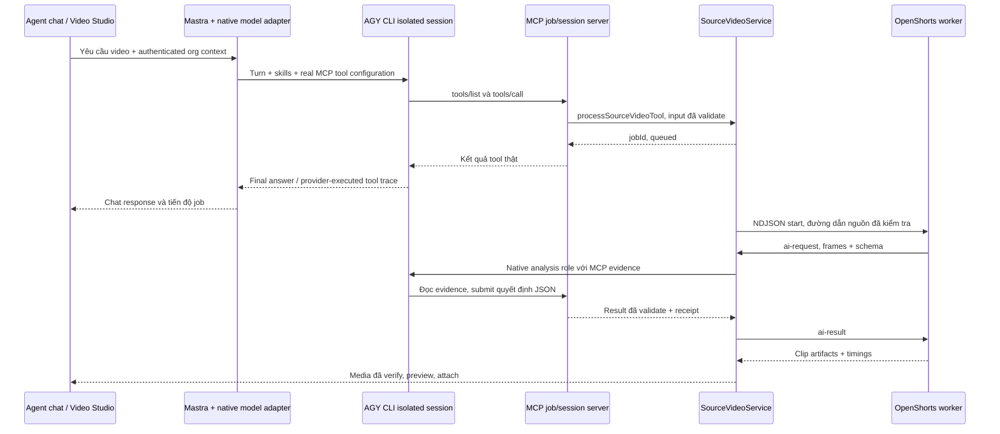

# AGY CLI gọi MCP thật trong Agent video NaN-Team

**Plan thực hiện chi tiết:** [OpenShorts → Agent video qua AGY CLI MCP, 29/09/2026](2026-09-29-openshorts-agy-mcp-execution-plan.md). Có ngữ cảnh hai session, cấu hình MCP, thứ tự công việc, bảng kiểm 18 chức năng và tiêu chí nghiệm thu cho các phần còn thiếu.

Đây là phần triển khai chi tiết thay thế phần gateway của [plan tích hợp](2026-09-28-openshorts-agent-integration.md). Người dùng đã yêu cầu triển khai và chia agent thực hiện ngày 28/09/2026. Tài liệu mô tả contract/tiêu chí; trạng thái thực thi nằm trong receipts, không suy ra từ checklist.

## 1. Đường chạy trước và sau

Source hiện tại trước thay đổi: Agent Mastra gọi `OPENAI_BASE_URL=http://127.0.0.1:8080/v1`; gateway chạy AGY ở print mode, thêm mô tả tool vào prompt rồi parse khối `tool_call`. Nhánh đó tắt slash-command/skill expansion. Đây không phải bằng chứng native AGY kết nối và gọi MCP của NaN-Team.

Đường chạy mới:



MCP server theo task là adapter thực thi cùng tool/service của NaN-Team trong auth context; không có vòng HTTP gọi lại model gateway. MCP public `/mcp` tiếp tục phục vụ AGY kết nối ngoài giao diện, cũng dùng các tool này. Không tạo hai bộ nghiệp vụ khác nhau.

Native CLI vẫn cần tuyến truy cập model/tài khoản của người dùng. Hai AGY session đang chạy được quan sát có `CLOUD_CODE_URL=http://127.0.0.1:8899`; đây là provider route, khác endpoint gateway tạo content/image ở 8080. Runtime có cấu hình rõ cho provider route, không gọi `/v1/content/generate` hoặc `/v1/chat/completions` của gateway cũ.

## 2. Quyền và cấu hình MCP

`start.mcp.ts` có `/mcp` Bearer auth, `/mcp/:id` API key trong path, các OAuth endpoint và SSE cũ. Với AGY mới, ưu tiên HTTP MCP + header Bearer; không đưa token vào URL, stdout, event hoặc receipt.

Job/session server bind loopback, token random ngắn hạn theo session. Chỉ expose tool có schema, allowlist và auth callback. Token scoped cho đúng org/job/role, hết hiệu lực khi task đóng. Session không dùng API key rộng của người dùng để giao cho subagent.

CLI có `agy mcp add --type http --header ... NAME URL`; flags phải đứng trước name. Runner gọi argv array, không shell interpolation. Registration diễn ra trong profile riêng; không sửa `~/.gemini` hoặc thay MCP toàn hệ thống của người dùng.

Profile có directory 0700 và các credential file cần thiết 0600. Bootstrap chỉ copy authentication và model/provider preferences cần thiết; không copy global hooks, unrestricted tool permissions hoặc toàn bộ settings. Không lưu credentials trong source/snapshot/reports. Child environment dùng profile riêng, không đổi môi trường của shell hay service cha.

Model mặc định giữ lựa chọn người dùng. Override chỉ qua `AGY_MCP_MODEL`; không hardcode một model rẻ hoặc ép low effort cho mọi vai trò. Task dùng structured result schema và timeout thực. Runtime không thêm `--disable-slash-commands`.

## 3. Contract native runner

Package `packages/agy-mcp-runner/index.cjs` export:

```ts
runTask({
  kind: 'chat' | 'content' | 'analysis' | 'image',
  prompt: string,
  schema: Record<string, unknown>,
  role?: string,
  frames?: Array<{ path: string; timestampSeconds: number }>,
  seedImageUrl?: string,
  tools?: Array<{
    name: string; description: string; inputSchema: Record<string, unknown>;
    execute(input: Record<string, unknown>): Promise<unknown>;
  }>,
  onEvent?: (event: unknown) => void,
}, { signal?: AbortSignal; publishImage?: Function });
// => { result: schema-validated data, receipt: owned-session evidence }
```

Nest `AgyMcpService` expose `chat`, `content`, `image`, `analyzeJson`. Chat nhận messages + injected tool callbacks; các tác vụ phân tích chỉ có evidence/result tools. `image` chỉ xuất ảnh đã tạo trong artifact path của session, kiểm tra bytes và chuyển vào UploadFactory.

Runner phải nhận MCP `submit_result` thực, validate JSON schema, ghi native event/task identity. Final prose hoặc khối JSON trong stdout không đủ để tự tuyên bố đã gọi MCP. Nếu cần extract CLI final text để hiển thị chat, vẫn phải giữ evidence riêng cho tool execution.

## 4. Native model trong Agent chat

`chat/agy.mcp.model.ts` implement LanguageModelV2 của SDK đã cài; `LoadToolsService` lấy model động theo requestContext. Authenticated org được bind vào callback tool, không lấy orgId từ model input.

1. Mastra cung cấp instructions/messages và schema các tool của turn.
2. Adapter đăng ký những tool đó trên MCP session server. Native AGY discovery/gọi tool thật.
3. Backend callback validate input, gọi chính tool/service đang đăng ký, nhận kết quả thật.
4. SDK nhận `tool-call` + `tool-result` với `providerExecuted:true`. Mastra không chạy lại cùng hành động một lần nữa.
5. Tool phía trình duyệt không có backend executor được trả lại CopilotKit như deferred call với `providerExecuted:false`; AGY không được nói browser action đã xong.
6. Chat không yêu cầu OPENAI_API_KEY/HTTP gateway cũ. Memory/thread vẫn qua Mastra store hiện có, org context giữ nguyên.

Các bài đăng vẫn theo quyền và flow xác nhận hiện có. Evidence/task tools không được quyền đăng bài hoặc khởi động source job mới. Hủy chat abort CLI process group và MCP server; job video đã tạo chỉ được hủy qua tool/job operation được xác thực.

## 5. Tools video agent phải thực sự nhìn thấy

| Tool | Khi gọi | Kết quả thực |
| --- | --- | --- |
| generateAiVideoTool | Tạo từ ý tưởng/ảnh | Job storyboard/Remotion, giọng và aspect schema chung |
| aiVideoStatusTool | Theo dõi video ý tưởng | Media id/path sau khi hoàn tất |
| processSourceVideoTool | Video nguồn cần cắt/chỉnh | Source jobId, operation, trạng thái |
| sourceVideoStatusTool | Tiến độ và clip | Clip/revision/media, error/warnings riêng |
| editVideoClipTool | Chỉnh lại clip đã có | Revision job mới, expectedRevision |
| cancelSourceVideoTool | Người dùng hủy | State đã hủy/cancelling, không giả hủy thành công |
| sourceVideoProjectsTool | Lịch sử theo org | Projects/clip list có ownership |

Registry trong `tool.list.ts`, Nest providers và `available()` phải khớp. Nhánh OpenShorts không phụ thuộc flag clipping cloud cũ. Khả dụng phải phản ánh core setup và native runtime; không chỉ tồn tại tên tool.

MCP public server/direct client có đủ tools; các endpoint directory có tool filtering riêng cần giữ đúng chính sách hiện có. Smoke phải kiểm tra endpoint thực client dùng, không lấy tool list từ file rồi coi discovery đã thành công.

## 6. AI của OpenShorts chỉ dùng native MCP

Worker Python gửi NDJSON `ai-request {requestId,prompt,schema,frames,role}`. Node gọi `analyzeJson`; trả `ai-result` đúng id. Frames là path backend/worker tạo trong workDir đã được cấp quyền, kèm timestamp; không cho model yêu cầu đọc arbitrary filesystem.

Evidence MCP tools có thể trả text/schema và image content khi CLI hỗ trợ; nếu dùng file artifact thì chỉ file được staging vào owned workspace. Live test phải chứng minh CLI nhìn được ảnh, không chỉ đọc filename/transcript.

Phải thay tất cả điểm Gemini trong scoring/detail, silent-video, layout, screencast, hook grounding và effects. `main.py` có logic trùng với module tách, nên call graph phải xác định đường dùng thực. Mock direct Gemini calls fail test; live fixture không lời bắt buộc nhận quyết định vision thật.

Mỗi kết quả có source duration/dimensions, timestamp hợp lệ, các bounds được validate. AI trả edit config whitelist; engine map config sang thuật toán/FFmpeg/Remotion đã có. Lỗi vision không được silently chuyển sang đoán layout; thông báo capability/warnings cụ thể.

## 7. Skills và native subagents

Nạp theo task các skill đang có trên máy, giữ content hash, role và task id. Skills không cấp thêm filesystem/network/publish quyền. Cần tách project coding instructions khỏi content video prompt; không tự cho AGY sửa source khi người dùng yêu cầu tạo video.

Các vai trò:

- Content editor: lời thoại/transcript, chọn đoạn, hook, title/caption theo nền tảng; copywriting/content-strategy/retention phù hợp.
- Visual editor: evidence frames, slide/camera/layout, màu/font/theme; frontend-design/visual-design/style-library phù hợp.
- Render reviewer: EditDecision, timing/audio/captions/safe zones, motion; Remotion/design-engineering phù hợp.

Với task có thể độc lập, native orchestrator giao content và visual trước; reviewer chỉ nhận đầu ra validate. AGY phải gọi native delegation tool có thật trong runtime. Không gọi ba prompt bằng Promise.all rồi báo đó là ba subagent AGY.

Agent profile tách allowlist MCP và native tool permissions. Subagent chỉ kế thừa quyền cần thiết; analytical agent không có tool đăng bài, shell sửa code hoặc broad MCP credential. Worker/session cleanup theo exact owned session id; không so snapshot rồi xóa mọi conversation mới.

Receipts phải có parentTaskId, subagent/session ids, role/skill hashes, MCP tool calls, validated output references, wall time và warnings. Nếu CLI không thể enforce hoặc hỗ trợ delegation ở profile đang dùng, trạng thái là chưa đạt phần native swarm; tiếp tục bổ sung adapter/cấu hình thay vì đổi tên acceptance.

## 8. Worker/render lifecycle

`SourceVideoService` nhận source bằng mediaId/URL hợp lệ; tạo workdir, source fingerprint và private receipt. Node giữ stdout NDJSON riêng, stderr legacy logs riêng. AI request ids không được trùng/cross-job; process group và deadline kiểm soát subprocess con.

States queued/analyzing/rendering/saving-media/completed/partial/failed/cancelled thể hiện công việc thật. Progress % chỉ có khi stage báo được. Canceled/failed không được save file như completed. Job receipt phục hồi sau restart; job interrupted không được tự submit lại và publish trùng.

Clip revisions giữ clean source và transcript rebased, một lớp overlay cuối. Captions nguồn dùng ASR thật; narration mới dùng Voice Clone timing thật. Audio mặc định giữ nguồn, thay lời/mix/BGM chỉ khi request có option. Verification theo duration/aspect thật, không ép 30s hay frame count storyboard.

## 9. Phân công implementation hiện tại

Ba writing checkout được cấp trước khi khởi động agent:

| Worker | Scope | Integration boundary |
| --- | --- | --- |
| agy_mcp_runtime | Runtime/service MCP, native profile, skills, structured results | Export AgyMcpService/runTask; cung cấp live receipt |
| openshorts_engine | Snapshot core/provider RPC/worker và core tests | NDJSON contract, feature inventory, artifacts |
| source_video_integration | DTO/repository/service/controller/tools/Studio | SourceVideoService và SourceVideoStudioModal |

Root sửa native model, registry/shared modules, existing video integration, manifests/config và kiểm thử end-to-end. Không có hai writer trên cùng checkout; root chỉ ghép danh sách file đã báo xong, kiểm tra source drift trước copy. Không commit/push/merge/publish.

## 10. Acceptance tests bắt buộc

1. Native AGY initialize/discovery/call thật trên MCP task server; wrong/expired token bị chặn, no secret logs.
2. Authenticated Agent chat thực thi tool đúng một lần; SDK tool trace/memory phù hợp, browser action deferred đúng.
3. Không gọi port8080 gateway generation trong luồng mới; provider route/native auth được ghi rõ.
4. Skill content được đưa vào task và có trace; native subagent invocation/session được kiểm chứng trực tiếp.
5. Video nguồn thoại + không lời + slide + hai người; đủ 3 ratios, recut/reframe/caption/hook/effects theo option.
6. Voice Clone và BGM option trên video thật, caption/audio sync và clean-source revision.
7. Job cancel/timeout/restart, stale revision, org khác, AI JSON lỗi/vision thiếu, upload/DB failure; không tạo Media trùng.
8. Agent toolbar → source Studio → render thật → Media → attach vào composer; scheduling contract theo kênh hiện có.
9. Regression video ý tưởng/ảnh đi qua native MCP, output file thật và lịch sử chat không mất.
10. Source/build/input/model/role/MCP/output SHA receipts; tách mock, live API, UI và publish evidence.

Definition of done là tests và live evidence bao phủ các mục trên, không chỉ build/typecheck hoặc có tên MCP trong prompt.

## 11. Receipt lập tài liệu và triển khai

Authorization: yêu cầu trực tiếp đổi gateway thành AGY MCP và chia agent thực hiện. Decision: allow isolated source edits/read-only inspections/validation. Production release, commit/push/merge không thuộc thao tác hiện tại. Coordination receipt: `agy-mcp-integration-coordination.json`; source/task/test/output receipts được thêm khi có kết quả thật.

## 12. Ghi nhận tích hợp ngày 29/09/2026

Đường chạy thực tế của backend là Nest `SourceVideoService` → Temporal `sourceVideoWorkflowV1`/`SourceVideoActivityV1` → worker Python NDJSON chạy trong Docker riêng `--network none` → AGY MCP native với ba specialist → Remotion `SourceVideo` khi yêu cầu motion → publication journal/Media. Các bản build/test chỉ chứng minh phần tương ứng; receipt job live nằm dưới `reports/openshorts-integration/`.

Cài đặt local dùng [mẫu biến môi trường](../../../config/openshorts.env.example). Model faster-whisper và YOLO phải được tải trước vào đường dẫn được cấu hình. `config/dev-native.sh` dùng model đã provision, không tải ở startup. Docker image tham chiếu bằng immutable SHA. `SOURCE_VIDEO_ENABLED=false` dừng job mới/chỉnh sửa mới nhưng cho phép theo dõi và hủy job hiện có. Backend và orchestrator phải cùng `SOURCE_VIDEO_JOB_DIRECTORY` và cùng biến runtime, chạy với PostgreSQL/Temporal đã migrate schema.

Job source có schema Prisma Job/Revision/Clip/Publication và migration `20260929103000_source_video_jobs`. Kế hoạch phân tích được lưu cùng revision trong một transaction, approval có version, render dùng đúng approved plan. Fencing epoch/lease và publication key cố định nhằm chặn retry tạo media trùng. Reconciliation thử lại start/cancel/finalization sau restart. Ngưỡng mặc định: tối đa một heavy stage toàn cục, 10 job chờ toàn hệ thống, hai job chờ mỗi org; các ngưỡng thay được bằng biến môi trường. Audio mặc định giữ nguồn. Caption của lời mới chỉ lấy từ ASR căn thời gian trên audio thật; caption do Voice Clone server trả hiện là phân bổ theo độ dài chữ, không được xem là forced alignment.

Nghiệm thu live phải ghi rõ: endpoint authenticated, org và job ID, Temporal workflow, nguồn SHA, AGY receipt/role/skill/frame evidence, renderer output SHA, Media ID, ffprobe/full decode. Fixture tổng hợp chứng minh cơ chế xử lý, không đại diện độ chính xác chung trên video thật. Các mục chưa có live evidence trong inventory gốc vẫn để mở và không suy ra hoàn tất từ test đơn vị.

### Kiểm chứng gần nhất

- `GET /ai-video/source-jobs/capabilities` trả về trạng thái feature flag, worker executable, model ASR, YOLO và Docker image của môi trường chạy. Endpoint yêu cầu org auth. `prerequisitesPresent=true` chỉ nói các thành phần local đã tồn tại; `nativeModel` vẫn ghi chưa xác minh cho tới khi có lượt AGY thật.
- Test MCP với schema Pydantic `$defs` xác nhận `submit_result` kiểm tra object đầu ra ở job boundary; MCP transport chỉ kiểm tra hình dạng `{result: object}` để `$ref` giữ đúng gốc. Kết quả sai `score` vẫn bị từ chối.
- MCP client thật đã xác thực qua `/mcp`: `tools/list` trả 24 tool, gồm đủ 5 source-video tool; `tools/call` gọi `sourceVideoStatusTool` và nhận đúng job thử nghiệm. API key tạm của org fixture được gỡ ngay sau smoke. Receipt: `reports/openshorts-integration/public-mcp-discovery.json`.
- Browser Agent đã mở Source Studio bằng org thử nghiệm, gọi API history/status, mở clip đã lưu và đính kèm video vào composer. Một lượt chat thật đã gọi `sourceVideoStatusTool` đúng một lần qua AGY MCP, nhận Media ID thật, trả lời UI và lưu cả user/assistant trong thread `Na3jGKZoLscz`; receipt: `browser/agent-chat-receipt.json` và `browser/agent-chat-memory-receipt.json`. PostgreSQL sáu test recovery/idempotency/lease/plan/publication qua; 24 test engine Python/FFmpeg, 13 test AGY runtime/service, 26 focused Jest và 55 regression video cũ qua. Typecheck backend/orchestrator qua.
- Native scoring live sau bản vá `$defs` đã thành công: AGY đọc skill, gọi `get_job_evidence` và `submit_result` qua MCP thật; receipt nằm ở `reports/openshorts-integration/native-scoring-smoke.json`. Lỗi xác thực trước đó là tạm thời; lượt thành công dùng `AGY_MCP_PROVIDER_URL=http://127.0.0.1:8899`.
- Video source job `0775dad6-6d50-4346-9551-fa5b5dd30d26` đã chạy qua authenticated API, Temporal, ASR tiếng Việt, AGY native, render và publication. Media `66aa00c8-faa2-55c6-a829-9a24d9a14686` có SHA `b632d763fa2dbe1484b4408d563877f55de436b43514f6507b6dc242a61cfe46`; `ffprobe` báo 18.005 giây, 640×360, H.264/AAC, full video/audio decode qua. Receipt: `reports/openshorts-integration/live-source-job.json`, `live-artifact-verification.json`, `browser/browser-receipt.json`. Đây là fixture tổng hợp ngắn, chưa đại diện độ chính xác ASR hoặc mọi loại video.
- Job trước đó lộ edge case ASR không có dấu câu. Worker giờ chỉ giữ nguyên toàn bộ nguồn khi video ngắn nằm trong giới hạn yêu cầu; nguồn dài thiếu ranh giới vẫn báo lỗi không retry thay vì cắt giữa lời nói. Một AGY detail task từng yêu cầu frame ngoài manifest; MCP từ chối đúng quyền và visual task sau đó có evidence đọc frame thật. Tiếp tục kiểm tra chất lượng lựa chọn/ASR trên video đa dạng trước khi coi inventory gốc hoàn tất.
- Lượt chat đầu mất thời gian vì tool status gửi kèm transcript/plan quá lớn, khiến AGY lưu output ra file tạm rồi không thể đọc dưới policy chat. Tool status dành cho Agent đã rút còn state, cảnh báo, plan cần duyệt và Media clip đã lưu; không trả transcript. Chat không ảnh không cấp `read_frame` hay skill copywriting. Lượt sau đã hoàn tất theo đúng `get_job_evidence → sourceVideoStatusTool → submit_result`.
- Revision 9:16 có motion design từ clean clip của job trên đã hoàn tất ở job `899f26ca-71a4-4115-9d45-736c6d0cc9d7`, revision 3 của cùng project. Media mới `f1e77384-1077-5ca9-a625-e15fcb649192` có SHA `5ee26f21e6b5c87910e1dbd0c00b7d47c74af42febe568716660804eeaa0c573`, 1080×1920, 18.091 giây, H.264/AAC và full decode qua. Lượt revision trước bị hủy khi motion gặp hai token ASR 0 ms; `recut.virtual_transcript` đã bỏ các token không có khoảng thời gian, giữ timestamp các từ khác. Motion validation giờ phân loại lỗi input xác định là không retry. Receipt: `live-revision-job.json` và `live-revision-artifact-verification.json`.
- Revision 1:1 tiếp theo `dab120dc-50b8-4410-b2c7-1da83e659074` dùng Voice Clone giọng `Thuyết Minh`, `mix-narration` và BGM Media `d9b2d596-dbf5-4f4a-a121-4fe523bcf6e1`. Media `dfb29592-0a74-5397-a37e-abb30c50f6b9` có SHA `8f6bfcf357435f46492a5a00ed4283227a6ced811f3999e721708b46ad6d4df9`, 1080×1080, 18.005 giây, H.264/AAC và full decode qua. Audio cuối khớp PCM audio sau mixer, khác audio nguồn; WAV giọng clone dài 3.52 giây và BGM staging khớp SHA fixture. Cùng với source 16:9 và revision 9:16, ba tỉ lệ đã có output thật trên fixture này. Receipt: `bgm-fixture.json`, `live-voice-bgm-square.json`, `live-voice-bgm-square-artifact-verification.json`.

### Kiểm chứng video không lời và cổng nghiệm thu tiếp theo

Fixture bốn slide không có audio, 16 giây, đã chạy qua authenticated API và Temporal ở job `e26dc41f-05d2-4bdd-9f33-2332c8ab2a7e`. AGY visual-editor task `55fe60b6-ed14-467f-a444-4761ab62fa02` gọi `get_job_evidence`, đọc đủ 8 frame bằng `read_frame`, thực hiện native `view_file` trên cả 8 ảnh rồi `submit_result`. Task AGY visual-editor kế tiếp `3c742928-7858-4032-a916-2f48ae8daa28` dừng trước MCP do CLI báo `native authentication unavailable`; Temporal phân loại lỗi không retry và job thất bại ở analyzing. Receipt: `reports/openshorts-integration/live-silent-job-attempt-1.json` và private source-job/AGY receipts.

Lần chạy lại `5e6cac09-e4c7-478e-a05d-59d9f0565cd8` hoàn tất: ba AGY visual-editor task `06b7f6ab-c38c-4481-aa16-d502c12c28d8`, `eba493bc-6119-47c7-a533-dc3b6d55bd79`, `707a58e0-f81c-423b-933b-1b41f88bbcab` đều đọc frame và submit qua MCP. Task thứ hai thử frame index 6 khi manifest chỉ có 0–5; MCP từ chối, AGY vẫn dùng sáu frame hợp lệ và hoàn tất. Prompt/response MCP sau đó được chỉnh để nêu rõ dải index hợp lệ cho lượt chạy mới; lần chạy thành công này dùng runtime hash trước chỉnh sửa. Media `b974e82f-015a-57f1-afb2-0666f451e290`, SHA `64b519c27f04bd6cbfa51f3c2c71689b4663c90d1d377da7d09d013d159ceecd`, 1080×1920, 12 giây, H.264 không audio, full decode qua. Receipt: `reports/openshorts-integration/live-silent-job.json` và `live-silent-artifact-verification.json`. Fixture tổng hợp này chứng minh đường vision/silent end-to-end; chất lượng chọn đoạn với video thật vẫn cần kiểm tra.

Revision hook từ fixture silent ban đầu lộ lỗi `hooks.add_hook_to_video` ghi PNG tạm vào CWD chỉ đọc của Docker (`live-silent-hook-attempt-1.json`). Core đã chuyển PNG tạm sang thư mục output của job; test thực với CWD `/proc` qua. Retry của cùng workflow từ chối plan cũ vì engine fingerprint đổi, đúng ràng buộc source snapshot. Attempt tiếp theo dừng ở auth AGY trước MCP (`live-silent-hook-attempt-2.json`), không xuất Media. Sau khi khởi động lại app và dùng cùng source snapshot, revision `4accd942-2c78-4cda-93ab-8e13b65d7f0e` hoàn tất. AGY content-editor task `148c2790-d7c0-4859-aad4-5fa76e5cd048` đọc đủ 6 frame bằng MCP/native `view_file`, submit hook “Turn off taps and reuse rainwater to save water” đúng nội dung slide. Media `13bcf728-c8bf-5552-a277-def603b01301`, SHA `e0825be9e787b96180752ea6542f5cf37c45102208299853d5a72b3742082c50`, 1080×1920, 12 giây, không audio, full decode qua; hash frame giây thứ nhất khác clean clip nên overlay đã được burn vào video. Receipt: `live-silent-hook.json`, `live-silent-hook-artifact-verification.json`. Đây là live synthetic proof cho tính năng hook bám slide, chưa đánh giá chất lượng trên screencast thực.

Frame giây thứ nhất của hook đã được xem trực quan: hook đọc được ở phía trên, dòng “SAVE WATER” của slide vẫn nhìn thấy. Ảnh kiểm tra: `reports/openshorts-integration/live-silent-hook-frame-1s.png`.

Revision AI effects đầu tiên `1bac5b90-fbd0-4d50-8d7e-fff16f9e4f19` đã hủy đúng job thử nghiệm sau khi native policy từ chối `invoke_subagent`: AGY CLI tự thêm `Model: "inherit"` cho hai editor. Policy nay chấp nhận duy nhất giá trị `inherit`, vẫn từ chối model override khác; reviewer native mặc định có deadline 10 phút để đủ thời gian đọc frame và nhận ba report. Attempt lỗi lưu ở `live-silent-effects-attempt-1.json`. Revision mới `f51d5310-338f-45ca-ad87-89a7141d7f0c` hoàn tất trên cùng source snapshot. AGY render-reviewer task `6cbb6558-39b8-49f0-aa71-957d0d53ee84` đã khởi chạy content/visual editor, nhận cả hai report rồi khởi chạy render reviewer; cả ba specialist đọc 6 frame, dùng native `view_file` và gửi report thành công. Plan lưu `color_pop` từ 0,5–4 giây, strength 0,6. Media `5a923825-5928-5c6a-afcb-db45e64559f5`, SHA `f4c5954bb11a5729f41f9c3cfb4c616cf4fd8c619b00ce94a88ea4762410b655`, 1080×1920, 12 giây, không audio, full decode qua. So sánh frame trước/sau effect trên cùng revision: mean RGB absolute difference tại giây 2 là 0,714, tại giây 6 là 0,009; hiệu ứng chỉ tác động rõ trong khoảng đã duyệt. Receipt: `live-silent-effects.json`, `live-silent-effects-artifact-verification.json`. Đây là bằng chứng live synthetic cho AI effects và native AGY delegation, chưa đại diện chất lượng trên footage thật.

Revision `punch_in` riêng `b6a4bc60-331f-449c-ae16-4202cc0df559` cũng đã hoàn tất từ source silent. AGY render-reviewer task `0cfd8724-451e-4ca5-9309-ee465d03ac3e` có đủ ba specialist native với frame/vision evidence; plan đã lưu đúng một `punch_in` 0,5–2,5 giây, strength 0,09. Media `215c4a70-94af-5a79-a925-e1149bc05629`, SHA `885bb88994cc45b2063a90e8a0ff3b0fc59fc81f514be9a3fab36f9dcdb21e27`, 1080×1920, 12 giây, không audio, full decode qua. So sánh framed/effected file: mean RGB difference tại giây 2 là 2,508, tại giây 6 là 0,006. Ảnh đối chiếu hai frame tại giây 2 trong `live-silent-punch-comparison-2s.png` đã được xem trực quan: chữ "SAVE WATER" lớn hơn trong frame effected và vẫn nằm trọn trong khung. Receipt: `live-silent-punch.json`, `live-silent-punch-artifact-verification.json`. Tính năng punch-in nay có bằng chứng render live trên fixture tổng hợp; chất lượng chọn khung trên footage thật vẫn mở.

Lịch sử/ZIP được kiểm tra qua authenticated REST với hai user fixture ở hai organization khác nhau. Tenant nguồn thấy đủ source/hook/effects revisions đã hoàn tất; tenant kia không thấy source job trong history và nhận 404 khi tải ZIP. ZIP chỉ chứa `clip-1.mp4`, SHA file bên trong khớp SHA clip đã publish; path traversal trả 404. Controller nay dọn ZIP tạm khi response `finish`/`close`, service dọn ZIP từng tạo nếu nén lỗi. Request live sau rebuild xác nhận không có ZIP mới còn lại trong private job directory. Receipt: `reports/openshorts-integration/live-history-zip.json`. Middleware hiện chọn organization đầu tiên của user nếu `showorg` không hợp lệ; kiểm thử cross-org vì thế dùng user fixture thực sự thuộc tenant khác, không suy luận từ một header giả.

Restart ở ranh giới plan approval đã qua live API/Temporal: revision `2a28f9e8-21fa-4471-856e-4c2404205f68` vào `awaiting_approval` với plan version 1, sau khi backend/orchestrator restart vẫn giữ cùng plan SHA `580c86b272decbbc804fa493c5a882b89537dc8d7e2add2af5b5f07d4d83c131`. Approve bằng version sai trả 409; version đúng đánh thức workflow, render và publish Media `72e80ee4-59cf-57c9-ac3d-4e62d45d13a6`. Output 1080×1920, 12 giây, H.264 không audio, full decode qua; DB có đúng một committed publication và một Media của job. Receipt: `live-approval-restart.json`, `live-approval-restart-artifact-verification.json`. Bước này chứng minh recovery tại approval boundary; restart giữa AGY analysis, render hoặc publish dưới tải vẫn để mở.

Benchmark giới hạn ở `recut.run_cut_concat` đã chạy trên cùng fixture `vietnamese-source-18s.mp4` (source SHA `aee671c6001c1237c4bf9c254d8d348c2e8d5294df10f064ac1f7bf3326e22bb`) và EDL hai đoạn 1–3, 7–9 giây. Baseline đọc trực tiếp `/home/chinhan/openshorts-core`; candidate đọc snapshot `packages/openshorts-engine/core`, mỗi bên chạy lần đầu trong process Python mới và lần thứ hai trong cùng process. Cả bốn output 4,010667 giây đều byte-identical và decoded video framemd5 trùng nhau. Wall time baseline 0,462/0,451 giây; candidate 0,443/0,444 giây; có CPU/RSS/FFmpeg/Python version và hash từng module/harness trong `reports/openshorts-integration/recut-benchmark.json`. Đây chỉ là parity của recut trên fixture tổng hợp; thứ tự chạy và OS page cache chưa kiểm soát, nên không diễn giải chênh lệch nhỏ thành cải thiện hiệu năng. Benchmark toàn pipeline với cùng footage thực, model, asset và chi phí AGY còn mở.

Runner hiện ghi `failureCategory` có giới hạn vào failed receipt, phân biệt eligibility, chưa đăng nhập, provider unreachable và lỗi process mà không lưu stderr/credential. Kiểm thử process giả lập eligibility qua; nhánh failure mới chưa có live receipt từ provider thật sau thay đổi này.

Audit đọc mã phát hiện khoảng hở giữa Temporal `workflow.start` và DB `markStarted`: nếu backend chết sau khi workflow đã chạy, job có thể ở `running` nhưng `workflowStarted=false`. `pendingStarts` nay phục hồi cả `queued/running/awaiting_approval`, vẫn bỏ qua finalizing và cancellation; ID workflow cố định và `REJECT_DUPLICATE` giữ một execution. Đường hủy trực tiếp và outbox luôn yêu cầu Temporal cancel theo workflow ID, không dùng cờ DB trễ làm bằng chứng workflow chưa tồn tại. Chỉ finalize tại API khi Temporal xác nhận `WorkflowNotFoundError`; workflow đang chạy tự chờ activity cancellation rồi finalize. Dispatch cũng kiểm tra yêu cầu hủy sau khi ghi nhận start để xử lý yêu cầu đến trong khoảng hở. Regression giả lập start thành công nhưng mất DB acknowledgement chứng minh direct cancel và reconciliation đều gọi Temporal, không finalize job đang chạy. PostgreSQL test xác nhận job running thiếu acknowledgement vẫn nằm trong pendingStarts và được xóa khỏi outbox sau markStarted. Teardown DB chỉ cleanup khi đã tạo được org fixture, kể cả setup thất bại.

Live cancellation sau khi tiến trình AGY native xuất hiện đã qua hai lượt. Receipt mới có hash harness/service/repository/worker/workflow/runtime: `reports/openshorts-integration/live-cancel-analysis.json`, job `98722ceb-f0d7-4242-85d7-ded63467ab43`. Script dùng marker riêng của design brief để tìm đúng AGY process trong workspace job, rồi gửi authenticated DELETE. Job kết thúc cancelled, clips rỗng, DB không có publication hay Media của job, leaseOwner/leaseUntil null; Temporal execution đã đóng (`COMPLETED` vì workflow bắt cancellation và hoàn tất finalization). AGY process biến mất và workspace tạm bị dọn. Lượt đầu giữ tại `live-cancel-analysis-attempt-1.json`. Đây là cancellation sau native process startup, chưa yêu cầu task đã gọi MCP hoặc đang giữa ba specialist review; không thay thế restart/kill giữa render hoặc upload. Validation bản sửa: 19 focused source tests, 28 AGY integration tests (7 DB tests chạy riêng), 7 PostgreSQL tests, backend/orchestrator typecheck và build qua.

Live managed restart giữa native AGY analysis được thử ở `85637548-47bc-490a-a3f9-65e26a88fac0`: workflow phục hồi và completed nhưng workspace AGY cũ còn trên disk sau khi PID cũ chết, nên verifier từ chối. Receipt giữ tại `live-analysis-restart-attempt-1.json`; chỉ workspace đúng của lần thử được dọn sau khi kiểm tra không process nào còn dùng nó. `AgyMcpService` nay triển khai `OnModuleDestroy`, đóng nhận task mới, abort task đang chạy và chờ runner settle sau cleanup process group/MCP/profile trước khi Nest thoát. Regression chặn cleanup có chủ đích xác nhận shutdown không trả về sớm; 5 native service tests và backend/orchestrator typecheck/build qua.

Lần thử lại `561980c7-8f15-4174-bd77-189409591781` quan sát AGY child trực tiếp của orchestrator và DB lease ở analyzing, chạy `config/dev-native.sh restart-app` (SIGTERM có quản lý, không dừng PostgreSQL/Temporal), rồi theo dõi cùng workflow. Job hoàn tất với epoch 7, Temporal history ghi analysis started attempt 2, đúng một committed publication và một Media `11ef1b36-dfe8-5ac6-a091-3f573ca01ac5`; lease released và workspace cũ biến mất. Output SHA `b2297058c18c6de87792b07c328fed26e5db01a769f6fce54b296d9a60f067de`, 1080×1920, 12 giây, H.264 không audio, full decode qua. Hook "Save water: turn off taps and reuse rainwater" có native AGY frame evidence và frame hash khác clean. Receipts: `live-analysis-restart.json`, `live-analysis-restart-artifact-verification.json`. Đây là managed restart sau native process startup tại analysis; chưa chứng minh SIGKILL, restart giữa render/upload hay phục hồi dưới tải.

Audit runtime bổ sung: chat chính, image/storyboard và source-video dùng `AgyMcpService`/native runner; configured cloud-code provider 8899 là route của CLI. Hai endpoint cũ `/posts/separate-posts` và `/posts/generator` vẫn dùng `OpenaiService` hoặc `AgentGraphService` với ChatOpenAI/DallE; cấu hình OpenAI cũ trỏ gateway 8080 đã dừng. Đây là phần migration thực sự còn thiếu ngoài đường video native. Makefile đã bỏ health check/targets của image gateway và thêm `agy-version`; CLI installed không đồng nghĩa auth/provider khỏe, cần live task receipt. Bước tiếp theo giữ nguyên `{posts:string[]}` và NDJSON generator `data.output`, chuyển inference/image sang AGY MCP, giữ nghiên cứu Tavily qua custom MCP khi được cấu hình và tránh upload URL đã publish hai lần.

Các bước còn lại, theo đúng thứ tự phụ thuộc:

1. Chuyển hai endpoint bài đăng cũ sang AGY MCP, giữ contract API/NDJSON, tool research được cấu hình và Media registration. Kiểm tra khả năng phục hồi auth ở task boundary: giả lập provider mất sau một AGY task thành công, yêu cầu job fail với lỗi cụ thể, không publish Media; khi provider trở lại, chỉ job mới/retry do người dùng chủ động mới chạy tiếp. Ghi sanitized error category vào receipt để phân biệt provider unreachable, eligibility và timeout mà không lưu credential.
2. Chạy video thật đa dạng gồm lời thoại dài, hai người, slide/screencast và im lặng. Với mỗi case, kiểm tra clip bounds, quyết định layout/visual có frame evidence, phụ đề với audio thật, aspect, full decode và so sánh chất lượng thủ công. Fixture tổng hợp chỉ kiểm tra đường chạy, không thay thế bước này.
3. Dùng một source snapshot cố định để chạy baseline OpenShorts và candidate NaN-Team trên cùng inputs/options của bảng 18 tính năng. Ghi tỉ lệ hoàn tất, thời gian, CPU/RAM, chất lượng kiểm duyệt, chi phí AGY/provider và mọi phần chưa có parity. Chỉ đánh dấu feature đạt khi có artifact và receipt của chính feature đó.
4. Chạy hủy/timeout/restart giữa analyze, render và publish với DB/Temporal thật; kiểm tra fencing, revision journal, lease, không có Media trùng và trạng thái sau restart. Sau đó đối chiếu lại toàn bộ acceptance 1–10 trước khi tuyên bố hoàn tất tích hợp.
