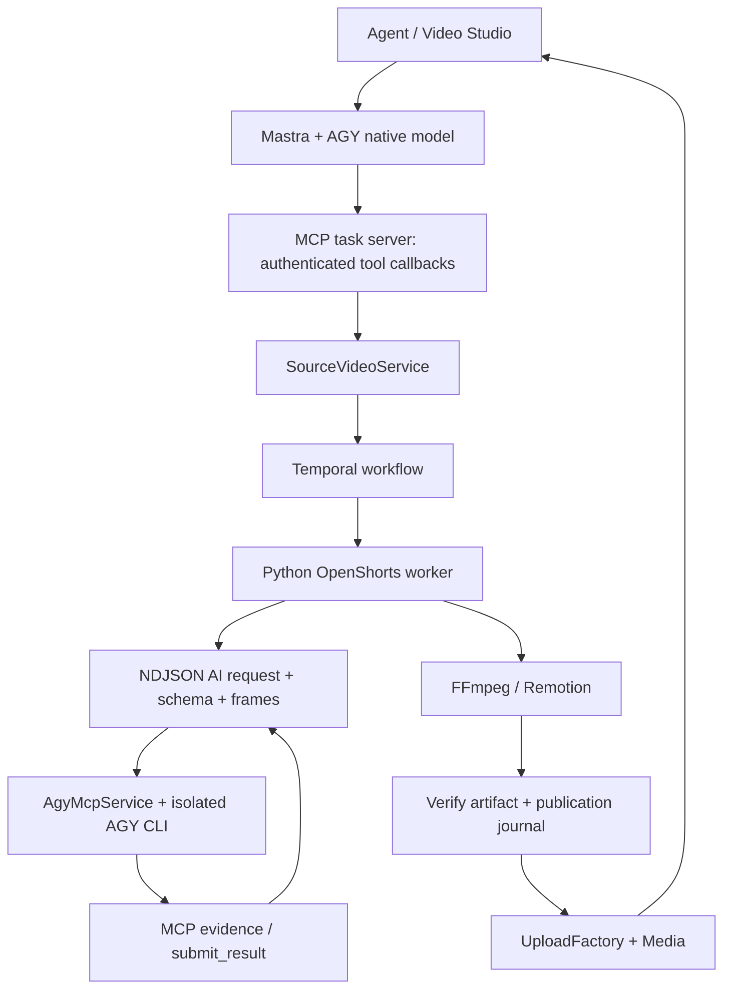

# Plan chi tiết: OpenShorts Core trong agent video qua AGY CLI MCP

Ngày: 29/09/2026. Đây là kế hoạch và tài liệu bàn giao; các hạng mục chưa có kiểm chứng vẫn giữ trạng thái cần làm. Đặt cùng [thiết kế AGY native MCP](2026-09-28-openshorts-agy-native-mcp.md) và [plan tích hợp tổng thể](2026-09-28-openshorts-agent-integration.md).

## 1. Ngữ cảnh từ hai session

- `089eee1e-3558-42e8-9ee9-56da142eb61e`, **Analyzing NaN-Team Project**, 1747 steps tại thời điểm ảnh: hệ thống có agent, storyboard, hình ảnh, Voice Clone và Remotion; yêu cầu thao tác local, không push Git. Artifact liên quan: `CONTENT_AND_VIDEO_TEACHING_FRAMEWORK.md` trong brain của session.
- `99fce621-635c-4397-9e5c-bd040d5ad089`, **Tìm Repo AI Edit Video**, 989 steps: người dùng chọn 18 chức năng, yêu cầu bóc backend không cần UI nguồn. Bàn giao tại `/home/chinhan/openshorts-core`, gồm `AGENT_INTEGRATION_MANUAL.md`, `AI_INTEGRATION_GUIDE.md` và source Python.

Các session là nguồn yêu cầu. Tuyên bố về tốc độ, độ đầy đủ hoặc chất lượng trong session/manual cần đối chiếu source và artifact thực trước khi nghiệm thu.

Kết quả mong muốn: agent hiện có vừa tạo video từ ý tưởng/ảnh, vừa nhận video nguồn để cắt/chỉnh; tất cả dùng AI hệ thống qua AGY native MCP. Clip hoàn tất vào Media của đúng tổ chức, có preview và dùng tiếp trong luồng đăng bài.

## 2. Hiện trạng để không triển khai trùng

Đã có source cho native runner `packages/agy-mcp-runner`, `AgyMcpService`, model chat native, Python engine snapshot, source-video service/repository/worker, Temporal workflow và Studio. Tham chiếu bằng chứng trong `reports/openshorts-integration/integration-state.json` và các receipt đi kèm.

Đã có receipts cho fixture tổng hợp, các tỉ lệ, revision, hook/effects, Voice Clone/BGM, history/ZIP, hủy khi phân tích và restart có quản lý. Cần kiểm tra hash source của receipt khi dùng để kết luận về bản hiện tại.

Chưa đủ bằng chứng để tuyên bố parity toàn bộ 18 tính năng: cần video thật đa dạng, benchmark toàn pipeline, failure tests ở render/upload và dọn session khi process chết đột ngột. Hai endpoint bài đăng `/posts/separate-posts` và `/posts/generator` đang có thay đổi migration; phải review, typecheck và kiểm thử contract trước khi coi hoàn tất.

## 3. Kiến trúc và trách nhiệm



NestJS sở hữu auth, org, job, revision, storage và quyền thao tác. Python sở hữu ASR, scene detection, tracking và render. AGY quyết định nội dung/bố cục từ evidence, trả dữ liệu có schema. Temporal sở hữu điều phối bền vững. MCP public và MCP task dùng cùng service nghiệp vụ, tránh hai bộ logic.

## 4. Cấu hình AGY CLI MCP

Runtime gọi `agy` qua argv array; dùng HTTP MCP thực với header Bearer, profile/workspace riêng cho từng task. Lệnh đăng ký hiện dùng:

```text
agy mcp add --type http --header "Authorization: Bearer <ephemeral-token>" video-job <owned-loopback-url>
```

Token do task server tạo, không ghi vào log/receipt và không đưa vào URL. Không chạy ví dụ với token literal. Runner chịu trách nhiệm đăng ký/thu hồi, không sửa cấu hình AGY toàn hệ thống.

| Cấu hình | Vai trò / kiểm chứng |
| --- | --- |
| `AGY_MCP_BINARY` | Binary CLI; kiểm tra version và thực thi task thật. |
| `AGY_MCP_AUTH_HOME` | Nguồn bootstrap auth/preferences; không đưa credentials vào repo. |
| `AGY_MCP_PROVIDER_URL` | Provider route của CLI. Dev mặc định dùng route riêng 8901 do hệ thống quản lý; 8899 thuộc các phiên CLI tương tác. Override rõ ràng vẫn được giữ. Kiểm tra reachability và một task thật. |
| `AGY_MCP_PROVIDER_SCRIPT` | Script provider route cho dev local; mặc định `~/antigravity-switcher/proxy.py`. Chỉ route mặc định 8901 được dev stack tự quản lý; không khởi động/dừng route override của người dùng. |
| `AGY_MCP_MODEL` | Override có chủ ý; khi bỏ trống giữ model lựa chọn trong account/profile. |
| `AGY_MCP_TIMEOUT_MS` | Deadline task; runner hiện giới hạn tối đa 600000 ms. |
| `AGY_MCP_SKILLS_DIRECTORY` | Skill allowlist; ghi hash skill thực nạp. |
| `AGY_MCP_RECEIPT_DIRECTORY` | Evidence private theo task; cấu hình quyền đọc và retention. |
| `AGY_MCP_RUNNER_PATH` | Bundle runner mà backend/orchestrator load khi triển khai. |

Provider route và gateway generation cũ 8080 có trách nhiệm khác nhau. Kiểm tra chat/video mới thực sự đi qua native runner; CLI installed hoặc HTTP health xanh chưa chứng minh auth/model/vision hoạt động.

## 5. Contract cần giữ

**Agent tools:** `generateAiVideoTool`, `aiVideoStatusTool`, `processSourceVideoTool`, `sourceVideoStatusTool`, `editVideoClipTool`, `cancelSourceVideoTool`, `sourceVideoProjectsTool`, `approveSourceVideoTool`, `sourceVideoCapabilitiesTool`, `sourceVideoEvidenceTool`. Registry, Nest provider, instructions và discovery endpoint thực phải khớp.

**Source:** chỉ nhận `mediaId` thuộc org hoặc URL qua kiểm tra ingest; model không cung cấp local path, orgId hay callback URL. Phân biệt `clips` và `edit`; default giữ tiếng gốc. Hỗ trợ 9:16, 16:9, 1:1 theo yêu cầu.

**AI bridge:** request có requestId, prompt, schema, role, frames/timestamps. Kết quả phải đến qua MCP `submit_result` và validate; không nhận prose/stdout như bằng chứng gọi tool. Validate clip bounds, timeline, effect/layout allowlist trước render.

**Media:** chỉ publish artifact đã kiểm tra, trả Media id/path dùng được trong composer. Revision giữ clean source; rebase transcript sau recut, không chồng nhiều lớp caption/hook qua các lần sửa.

**Bài đăng:** split giữ `{posts: string[]}` và không viết lại nội dung. Generator giữ NDJSON events và terminal `data.output` gồm hook/content/date; ảnh là saved Media. Parser frontend phải giữ buffer qua chunk UTF-8/JSON. Abort từ client đi đến graph, AGY và research callback.

## 6. Các gói công việc theo thứ tự

### P0 — Chốt inventory và nguồn

1. Đối chiếu 18 chức năng trong manual với `tests/openshorts/feature-inventory.json`.
2. Xác nhận snapshot manifest/hash, license, dependencies và model assets; không copy uploads/output/cache/credentials từ core.
3. Trace entrypoints thực, đặc biệt logic trùng trong `main.py` và module tách.
4. Lưu từng feature: entrypoint, options, fixture, expected output, receipt, limitation.

Hoàn tất khi inventory truy được đến source và không còn tính năng chỉ được ghi tên mà thiếu đường gọi.

### P1 — Xác nhận native runtime và auth

Scope: `packages/agy-mcp-runner/*`, `videos/agy-mcp/agy.mcp.service.ts`, `chat/agy.mcp.model.ts`.

1. Smoke initialize → tools/list → tools/call → submit_result trên task MCP thật.
2. Test wrong/expired token, tool ngoài allowlist, schema sai, task timeout và client abort.
3. Xác nhận model/account dùng đúng cấu hình và vision đọc bytes/frame thật.
4. Kiểm tra profile isolation, shutdown đợi cleanup, không đụng session đang làm việc của người dùng.
5. Ghi receipt runtime/skill hashes, task identity, tool traces và lỗi đã bỏ secrets.

Hoàn tất khi native call có receipt và negative tests chặn được truy cập vượt quyền.

### P2 — Hoàn tất migration inference còn lại

Scope: `agent/agent.graph.service.ts`, `agent/separate.posts.ts`, `posts.service.ts`, `posts.controller.ts`, generator DTO, NDJSON helper và frontend generator.

1. Review các thay đổi hiện có; thay text inference bằng `analyzeJson`, image bằng `agy.image`.
2. Giữ Tavily qua host MCP callback khi được cấu hình; khi thiếu Tavily vẫn giữ nguyên yêu cầu nghiên cứu để sinh nội dung.
3. Validate kết quả bằng schema và kiểm tra split giữ từ/ngữ cảnh, giới hạn độ dài.
4. Ảnh đã publish chỉ đăng ký Media một lần; không upload URL lần nữa.
5. Giữ stage events/frontend translations và kiểm tra terminal output; stream lỗi/disconnect không ghi tiếp.
6. Test text-only, thread, picture, optional/null website, lỗi provider, chunk tiếng Việt và abort.
7. Chạy authenticated live request để xác nhận DI, MCP execution và output người dùng dùng được.

Hoàn tất khi contract frontend/API qua kiểm thử và receipt live chứng minh native AGY, không chỉ mock.

### P3 — Đóng các khoảng trống engine

Scope: `packages/openshorts-engine/core`, `src/agy_compat.py`, worker/analysis/timelines adapters.

1. Kiểm tra mọi AI decision đi qua bridge: moments, silent selection, layout, screen hook và effects.
2. Chặn direct Gemini/provider calls trong test để lộ đường chưa migrate.
3. Kiểm tra source/clip transcript timestamps, ASR word timing, scene boundaries và speaker tracking.
4. Test malformed NDJSON, requestId trùng, frame ngoài workdir, AI result sai schema/bounds.
5. Kiểm tra toàn bộ options cùng artifact thay vì chỉ xác nhận endpoint trả 200.

Hoàn tất khi từng feature có output kiểm chứng và mọi fallback được công bố rõ.

### P4 — Job lifecycle, revision và publish

Scope: `videos/openshorts/source-video.*`, workflow/activity, Prisma journal và controller.

1. Kiểm tra queued/analyzing/awaiting approval/rendering/publish/final state có ownership và fencing.
2. Test hủy trước dispatch, trong analyze, render và upload; timeout, retry, stale revision.
3. Restart có quản lý rồi abrupt process death ở từng stage; kiểm tra orphan process/profile và lease recovery.
4. Inject lỗi giữa upload và DB commit; đảm bảo không Media/publication trùng, orphan artifact có cleanup hoặc reconciliation xác định.
5. Giữ plan hash/revision tại approval boundary; request cũ bị từ chối.

Hoàn tất khi mỗi failure case có DB/Temporal receipt, cleanup evidence và số publication chính xác.

### P5 — Nối UX, tools và MCP discovery

1. Kiểm tra agent phân biệt tạo từ ý tưởng, cắt highlight và chỉnh toàn video.
2. Studio nhận Media/upload/URL, cho xem plan và chỉnh clip trước render theo flow hiện có.
3. Status hiển thị stage thật, warnings/partial/error; chỉ hiển thị phần trăm khi có số liệu.
4. Browser smoke: mở preview, attach Media vào composer, đổi revision, hủy và mở lịch sử/ZIP.
5. Kiểm tra public MCP Bearer discovery/call và filtering hiện hành; cross-org job/Media/ZIP bị chặn.

Hoàn tất khi một người dùng thực đi hết luồng trong trình duyệt và MCP client gọi được đúng tools.

### P6 — Video thật và benchmark toàn pipeline

| Fixture | Kiểm tra bắt buộc |
| --- | --- |
| Lời thoại tiếng Việt dài | Chọn câu trọn vẹn, ASR, caption/audio sync, recut timestamps. |
| Hai người đối thoại | Speaker cut đúng người, không crop mất mặt, chuyển góc ổn định. |
| Bài giảng/slide/screencast | Nội dung màn hình đọc được, camera inset, hook có frame evidence. |
| Video không lời | Vision chọn đoạn hợp lý, không bịa thoại, âm thanh giữ theo request. |
| Video đã đúng tỉ lệ | Passthrough, không crop/render thừa, duration đúng. |

Với các case phù hợp, chạy ba aspect và options caption/hook/effects, narration/BGM. Verify ffprobe, full decode, duration, audio presence và xem thủ công nội dung.

Benchmark baseline core và candidate trên cùng immutable source snapshots, input hashes/options/model/hardware. Đo completion rate, thời gian từng stage, CPU/RAM, chi phí provider nếu lấy được, chất lượng thủ công và lỗi. Recut benchmark hiện có chỉ chứng minh recut; không dùng làm kết luận cho toàn pipeline hay hứa tốc độ 1–3 giây.

### P7 — Bàn giao và nghiệm thu

1. Chạy focused suites, backend/orchestrator/frontend typecheck và build phù hợp.
2. Refresh integration-state với source hashes thực; liên kết receipts vào inventory và cập nhật limitations.
3. Ghi runtime config/dependencies, cách chạy, cancel/recovery và các feature chưa parity.
4. Đối chiếu acceptance của hai plan gốc; chỉ đánh dấu đạt khi có bằng chứng của bản source đang xét.

## 7. Bảng kiểm 18 chức năng

| Nhóm | IDs / chức năng | Bằng chứng cần có |
| --- | --- | --- |
| Phân tích | 1 scene; 2 transcript highlights; 3 silent highlights; 4 grounded hook | Timeline/ASR, validated AI output, frame evidence, clip bounds. |
| Bố cục | 5 screencast/wide; 6 blurred general; 7 speaker cut; 8 punch-in; 9 passthrough; 11 manual crop | Video mẫu, crop/layout config, frame checks và review thủ công. |
| Chỉnh sửa | 10 recut; 12 karaoke; 13 hook overlay; 14 effects | Rebased timeline, audio sync, clean revision, overlay/effect frame evidence. |
| Tích hợp | 15 MCP; 16 CLI; 17 REST/webhook; 18 history/ZIP | Discovery/call thực, CLI contract, auth/idempotency, webhook parity, ZIP integrity/cross-org denial. |

Nếu webhook hoặc API nguồn chưa có parity trong adapter, ghi rõ thiếu và triển khai contract xác thực/retry trước khi đánh dấu feature 17 đạt. Không mount API/static không auth của core ra ngoài.

## 8. Quy tắc thực hiện và thứ tự ưu tiên

Ưu tiên hiện tại theo yêu cầu mới của người dùng: P1/P5 kết nối AGY MCP và đi trọn luồng xử lý/duyệt video → P3 hoàn thiện các chức năng OpenShorts đã bóc tách → P4 failure cases → P6 nghiệm thu video thật → P7 bàn giao. P0 inventory là điều kiện đối chiếu xuyên suốt. P2 bài đăng là nhánh phụ, không mở rộng thêm trong khi đường MCP/OpenShorts còn thiếu.

Khi triển khai nhiều scope, phân công runtime, Python engine và backend/UX theo worktree riêng; integration owner giữ shared manifests/lockfiles. Research read-only có thể chia sẻ checkout. Không để hai writer trên cùng worktree. Kế hoạch này không tự khởi động agents hay sửa runtime.

Làm việc local; không tự commit/push/merge/release. Tài liệu plan không là bằng chứng hoàn thành. Nghiệm thu dựa trên source-bound receipts, video artifacts và những giới hạn được công bố.

## 9. Cập nhật kiểm chứng MCP

- Receipt public MCP mới nhất đã discovery đủ 9 source-video tools, gọi status/evidence/history có Bearer auth thành công: `reports/openshorts-integration/public-mcp-discovery.json`. Các tools mới là capabilities, approval và evidence; approval kiểm tra đúng tổ chức, đúng planVersion.
- Revision không còn default ép 9:16/auto/keep khi chỉ đổi caption hoặc BGM; service giữ các trường con audio/captions/hook/motionDesign/selection chưa được sửa. Kiểm thử hồi quy bao gồm giữ narration, framing và từ chối revision cũ.
- `sourceVideoEvidenceTool` đọc transcript/word timings/scenes theo trang, phân biệt timestamp nguồn và clip; projects trả tóm tắt có phân trang trong cửa sổ 100 jobs. Source scenes đọc từ plan nội bộ có kiểm tra tổ chức, vì status công khai không chứa trường này. Focused tools/service/capabilities: 23 tests qua; backend/orchestrator build qua. Live MCP đã đọc source words, trang tiếp theo, clip words, source scenes và bounded history thành công.
- Script `scripts/test-source-video-mcp-live.cjs` lưu idempotency key trước dispatch và tiếp tục cùng job khi chạy lại. Lượt đầu `ad5b8846-46a4-41b1-a4c0-14597139e17a` thất bại vì provider route 8899 không nghe; receipt lỗi được lưu riêng. Lượt tiếp theo `69813f10-0b4e-42c4-989a-7bea38e45b71` đã completed sau một retry: MCP create/status/stale approval 409/correct approval, native frame + submit_result evidence, hook thay đổi frame tại giây 1, 640×360/12s, full decode và đúng một publication. Receipt: `reports/openshorts-integration/live-public-mcp-job.json`. Fixture vẫn là bốn slide tổng hợp, không chứng minh chất lượng footage thật.
- Dev stack quản lý route CLI riêng 8901 theo PID/process group/cwd/argv, giữ nguyên các route override và không dừng route CLI tương tác. Job `b9270c9d-caaf-4185-9da0-ccdd1eee5f38` đã đi hết MCP create/review/stale approval/correct approval/render/Media, không có native failure/retry; providerHash trong native receipt khớp chính xác route 8901. Artifact 640×360/12s, full decode, một publication và hook frame thay đổi. Receipt: `live-public-mcp-managed-route.json`. Báo cáo source/build và giới hạn còn lại: `reports/openshorts-integration/mcp-integration-progress.json`.

## 10. Hai luồng video và giới hạn máy local

Agent dùng `generateAiVideoTool` cho ý tưởng/kịch bản mới và `processSourceVideoTool` cho video đầu vào. Revision dùng `editVideoClipTool`; các trường không yêu cầu đổi phải giữ cấu hình trước đó. Cả hai trả Media sau khi job hoàn tất; job ID chưa chứng minh có video.

Theo yêu cầu tránh làm máy đơ: chạy từng tác vụ kiểm chứng, ưu tiên thấp và giới hạn CPU; không build/render đồng thời. OpenShorts mặc định 1 job active, Docker 1 CPU/2 GB RAM, FFmpeg 1 thread. Remotion mặc định 1 render worker, 1 offthread video decoder và encode không chạy song song với render. Dùng `POSTIZ_DEV_SKIP_FRONTEND=true` khi chỉ kiểm tra API/MCP để tránh compile Next.js không cần thiết. Các override tài nguyên phải được đặt có chủ đích.

Kiểm chứng candidate: 32 tests source-video, 29 Python tests, 3 source-motion tests và Remotion typecheck đã qua. Sửa revision để bỏ qua trường DTO có giá trị undefined ở cả cấu hình chính và cấu hình con. Hook duration được truyền tới cả Python và SourceVideo Remotion. Build và live hook/crop/ZIP của candidate đang chờ kiểm chứng; không dùng receipt cũ làm bằng chứng cho bản source mới.

### Kết quả live của candidate chạy giới hạn tài nguyên

- `live-mcp-controls.json`: job `c769dbcb-6914-4802-9095-099ffcce728e` completed, hook 0.75s có chênh lệch pixel lúc hiện 36.32 và sau khi hết 0.048. ZIP có đúng clip/hash, trả 401 khi thiếu auth, 404 cho tổ chức khác, 400 cho ID sai; không nhận organization override và không để lại ZIP tạm. Revision `29400ad5-b2bf-475d-ad92-6f8e4fe2adaf` completed, crop sceneIndex 0/center 0.35/strategy TRACK, 1080×1920, full decode, một publication.
- `live-resource-limits.json`: container đang render được inspect trực tiếp, NanoCPUs=1000000000, memory=2147483648, cpuShares=256.
- `live-public-mcp-low-load.json`: AGY native task `06ae7538-e3bb-46d6-8c10-c515d8690023` đọc frame và submit_result thành công; job `b25a8ab6-174c-4d72-930f-4fe6b2b115dd` đi hết versioned approval/render/Media, không native failure, 640×360/12s, full decode và một publication.
- Backend và orchestrator đã build tuần tự thành công. Kiểm thử luồng ý tưởng qua MCP đang chạy riêng; chỉ cập nhật là đạt khi có video/Media và native content/image receipts tương ứng.

### Kiểm chứng bổ sung và lỗi provider của luồng ý tưởng

- CLI MCP có receipt `live-video-cli.json`: status/evidence/crop-scenes và ZIP đã gọi thực, ZIP khớp hash artifact. `live-cli-local-upload.json` xác nhận đường upload MP4 local có Bearer auth, hash server khớp video gốc, PNG giả MP4 bị từ chối và không tạo Media. CLI nay có `process --file`; cờ font/subtitle legacy vẫn cần đối chiếu riêng.
- `reports/source-motion/live-hook-duration/live-receipt.json` chứng minh renderer Remotion thực truyền hookDurationSeconds=0.75; ảnh lúc 0.25s khác baseline 2.301, sau 1.5s còn 0.333. Đây là fixture màu xanh/âm sine, không chứng minh chất lượng footage thật.
- Job ý tưởng `bcfff182-0d40-4cbd-b9c4-04a63fd25b44` đã terminal failed. Native content và hai image tasks thành công; image thứ ba nhận 503 MODEL_CAPACITY_EXHAUSTED và 502 read timeout trước deadline. Receipt lỗi được giữ trong `live-ai-video-mcp-attempt-bcfff182-0d40-4cbd-b9c4-04a63fd25b44.json`; không coi hai ảnh là video hoàn tất.
- Candidate bổ sung checkpoint storyboard/ảnh với atomic rename và progress theo số ảnh thực. `generateAiVideoTool.resumeJobId` chỉ dùng cho job failed/interrupted cùng org, cùng yêu cầu ban đầu; chỉ ảnh còn thiếu mới gọi AGY. Việc thử lại là một lần dispatch rõ ràng sau khi kiểm tra terminal, không tạo lại job chỉ vì polling hết thời gian. Candidate này đang chờ tests/build/live trước khi coi đạt.

### Checkpoint, video người dùng và Voice Clone

- Candidate checkpoint đã qua 21 storyboard tests, 9 orchestration tests, 4 agent tool tests và build backend/orchestrator tuần tự. Native MCP discovery/call đã chặn resume của job còn chạy và job không có checkpoint mà không dispatch job mới: `live-idea-resume-boundaries.json`.
- Job `40e9efb2-7ebf-44df-b1d9-b0717a3e33d2` có native content và đủ ba native images; checkpoint private đã lưu toàn bộ. Job failed ở synthesizing-voice vì Voice Clone mặc định 8002 chưa chạy. Giữ receipt lỗi; không đổi sang giọng khác khi người dùng chọn Voice Clone.
- Theo đường dẫn người dùng cung cấp, job `c1fe0061-579c-4d92-91c1-4af1d5b809b3` đã chạy full edit 4.73s qua MCP với native layout/hook, ra 1080×1920/4.8s/audio, full decode, một publication. Receipt `live-user-source-video.json` ghi warnings không có speech transcript; không coi clip này là bằng chứng cho ASR tiếng Việt hay karaoke lời thoại. Video nguồn được đọc/copy, không sửa original.
- Người dùng yêu cầu khởi động Voice Clone có sẵn. Server thật là `/home/chinhan/Voice_Clone/server.py`, Python environment cùng project; `config/voice-clone-native.sh start|status|stop` quản lý riêng process group/PID/cwd/script, bind loopback 8002, nice 15/CPU affinity một core, threads=1 và chỉ dùng model đã cache. Health xác nhận OmniVoice/cuda và năm giọng. Dịch vụ dùng GPU; CPU affinity không phải giới hạn VRAM. Không tự bật thêm model song song.
- Job resume mới dùng đúng topic/duration/voice/aspect/seed của job failed và checkpoint ba ảnh. Report đang được quan sát riêng tại `live-ai-video-mcp-resumed.json`; chỉ coi luồng ý tưởng đạt khi artifact và Media qua kiểm chứng. Voice Clone hiện sinh caption theo độ dài từ; word alignment theo audio thực chưa được chứng minh bởi receipt này.

### Kết quả hai luồng trên bản checkpoint

- `live-ai-video-mcp-resumed.json`: job `238f7eff-4fae-419a-b098-6b80b0721404` completed và Media `dfdf4715-bee7-47f9-83a4-66993930f61d` thuộc đúng org. Artifact 1080×1080, 450 frames/15s video (container 15.061333s do audio), full decode, audio thật từ OmniVoice giọng Thuyết Minh và 39 caption tokens. Ba image receipts khớp input hashes của từng prompt storyboard. Checkpoint parent/child bằng nhau, không có native content/image task mới sau resume.
- Video người dùng xuất tại `reports/openshorts-integration/live-user-source-video.mp4`; hash khớp publication và file original không thay đổi. Audio decoded mono 16kHz tương quan 0.9959 với nguồn, không lệch sample ở offset tốt nhất; khung hình đầu ra đã được xem trực tiếp. Clip không có speech transcript nên không chứng minh chất lượng ASR tiếng Việt.
- Hai luồng đã có video/Media qua kiểm chứng backend/MCP. Frontend đang dừng theo giới hạn máy, nên preview/composer của candidate chưa được kiểm chứng trong browser. CLI đã upload file local qua route bảo vệ; CLI font/subtitle parity, failure cases còn lại, footage thoại/screencast và benchmark toàn pipeline vẫn là các điều kiện nghiệm thu chưa đạt; không đánh dấu toàn bộ 18 chức năng hoàn tất.

### Webhook có chữ ký và outbox bền vững

- Source-video nhận `webhook: { url, secret }` qua REST/MCP/CLI. Cấu hình được mã hóa AES-256-GCM trong DB, không nằm trong input worker/revision/export receipt. Callback mới cần public HTTPS/IPv4, kiểm tra IP cả lúc đăng ký và kết nối; không follow redirect hoặc dùng SSRF bypass toàn hệ thống.
- Terminal job và immutable payload được lưu cùng transaction sau publication/compensation. Identical idempotent requests đọc lại job trước khi DNS/key validation; terminal saves không được đổi state đã chốt. Callback không tự kế thừa sang revision.
- Wire contract giữ `X-OpenShorts-Signature` HMAC-SHA256 raw body và completed/failed payload; thêm event ID ổn định. Ba claim, retry sau 5/30 giây, timeout 15 giây, lease/epoch fencing 30 giây; lỗi DNS tạm thời/network/HTTP giữ lịch retry. Receiver cần deduplicate vì sender có thể chết sau receiver accept nhưng trước ack.
- 63 kiểm thử source-video đã qua với heap 1 GiB, bao gồm PostgreSQL/outbox/fencing/rollback và callback wire. Production types được kiểm tra qua build backend/orchestrator tuần tự với heap tối đa 3 GiB. `config/source-video-runtime.jest.config.cjs` dùng transpile riêng từng file để tránh tích lũy type graph trong RAM.
- `live-webhook-process-restart.json`: compiled candidate gửi 503, process nhận SIGKILL sau receiver accept, process mới khôi phục delivery với đúng bytes/signature/event ID và trạng thái `delivered`. Receiver/clock trong fixture được kiểm soát local; public HTTPS/DNS protection có kiểm thử riêng, chưa smoke tới một receiver bên ngoài đã cấu hình.
- `live-webhook-mcp-boundaries.json`: authenticated discovery có webhook schema, status chỉ trả delivery summary, target nội bộ bị từ chối không tạo job, foreign-org status bị chặn. Không render trong phase này. Native Redis startup cũng chờ PONG để tránh báo lỗi trước khi Redis tải xong AOF.
- Contract/hướng dẫn receiver: `docs/openshorts-webhooks.md`. Các dịch vụ kiểm thử được dừng sau kiểm chứng để trả tài nguyên.

### Caption appearance — private adapter evidence (2026-09-30)

Correction after inspecting all upstream entrypoints: main.py argparse has no font/subtitle flags, but cli/openshorts_cli.py subtitle does. Appearance controls also belong to app.py SubtitleRequest; expose their camelCase equivalents through canonical MCP/CLI JSON after both Python and motion implement them. The Python worker now validates and passes position, font, colors, border/background, ASS effect and inactive brightness, and uppercase without modifying canonical transcript evidence. Classic uses SRT burn controls; effect/baseOpacity/highlight are ASS-only. Existing preset string calls remain compatible.

Validation: 33 Python regression tests passed. Real 2-second renders from the user source preserve source hash and audio, with reviewed Vietnamese classic/top and pop/middle frames. Supplied words/timings are a fixture, not recognized speech. Receipt: reports/openshorts-integration/caption-appearance/receipt.json. Public DTO/MCP, source-motion propagation, bundled font selection and motion frame validation remain required; full feature acceptance stays open.

### Caption appearance — public schema, CLI and motion candidate (2026-09-30)

Corrected prior CLI assessment: cli/openshorts_cli.py subtitle owns genuine font/style/position/color/uppercase flags. The equivalent flags now exist on canonical NaN-Team process/revise and map to bounded captions JSON. DTO/MCP, durable input → worker → motion props retain all appearance fields. Source-specific captions use loaded bundled fonts/aliases, virtual-resolution sizing, static classic, upstream grouping and active hold across word gaps, effects/brightness/background/uppercase. Storyboard subtitle defaults remain intact. Unknown motion font needs a local installed face or explicitly fails; Python/libass fallback differs.

Evidence: 55 runtime tests passed, 14 database-dependent tests skipped because database was not started; 5 CLI tests passed; Remotion typecheck and backend/orchestrator builds passed. Five real 2-second motion renders (including long Vietnamese phrase wrapping) passed temporal/gap checks and were visually inspected. Receipt: reports/source-motion/live-caption-appearance/live-receipt.json; exact candidate/build/font hashes in mcp-integration-progress.json. No authenticated appearance request on the new candidate has been claimed yet; that smoke and remaining global acceptance gates stay open.

### Authenticated source + Voice Clone + captions revision (2026-09-30)

39 Python tests and all 69 source-video tests (including PostgreSQL) passed. Actual CLI process/revise requests discovered all caption controls through authenticated MCP. Live checks exposed and fixed three faults: narrower portrait raw bypass for square/landscape, lexical tiny-ASR mistakes on known generated narration, and clean reuse combining parent audio with ASR from a fresh waveform. The latter now binds narration/BGM bytes in base and render-cache fingerprints. Guarded reference mapping preserves original recognized words and exact ASR intervals; it does not claim phoneme or pronunciation verification.

Current job 29fb5285-66ee-41c8-94e4-d88bbb7711cd completed, Media 5e45c2c7-572c-509b-a71d-ae2504b8cffb belongs to fixture org. Artifact1080x1080/4.7s, full decode and Media checksum verified, source untouched, twelve caption words match reference. Fresh Voice Clone waveform correlation 0.9696836471586824 at lag 0.042625s; prior incorrect-reuse counterexample and completed/failed parent receipts are retained. Receipt: reports/openshorts-integration/live-caption-appearance-mcp.json. The test stack is stopped; Voice Clone remains running as requested. Remaining restart/failure stages, representative original dialogue/screencast benchmark, frontend preview/composer and precise clone alignment still prevent full acceptance.
